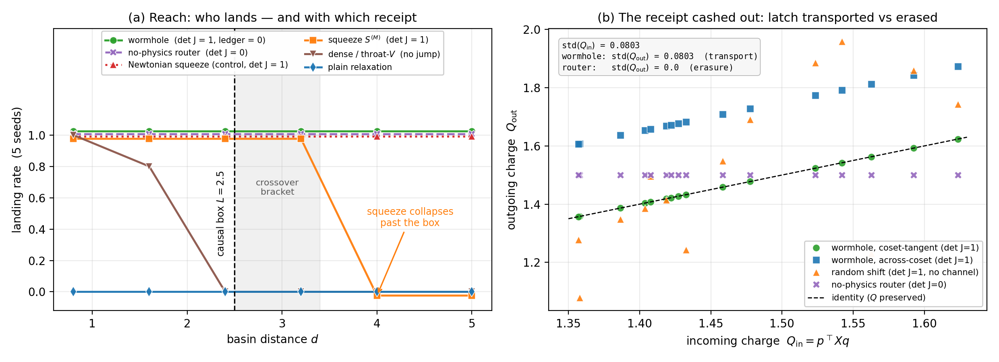
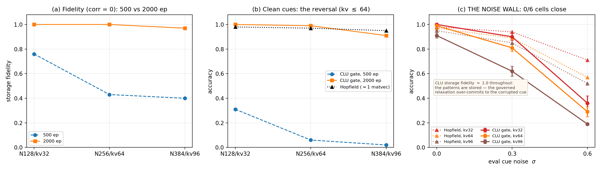
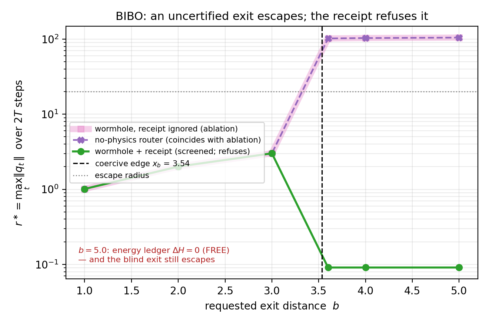
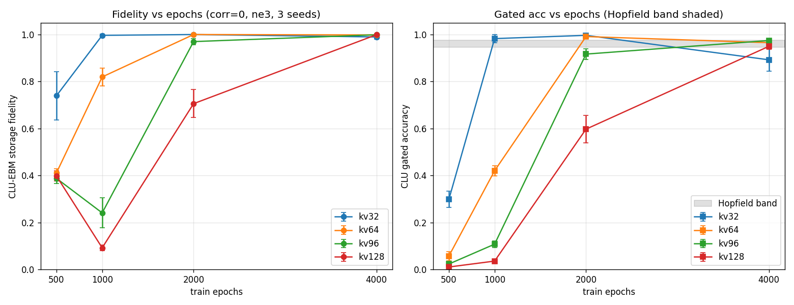

# [WORKING TITLE: Paid Access: Test-Time Compute on a Conservative Memory as a Physically-Metered Resource]

**Authors:** [AUTHORS PLACEHOLDER]

**Venue class:** ML4PS / NeurReps workshop short — *position/theory* paper (4–5 pp + appendices). Final venue pending the Jul-11 scout.

> *Draft status:* canonical markdown draft (`draft.md`). LaTeX build in `draft.tex`. One-line-per-revision history in `CHANGELOG.md`. Every quantitative statement traces to a source report and inherits a flag-provenance table (Appendix A). Headline figure = **Figure 1**: panel (a) the reach/escape crossover, panel (b) *the receipt cashed out* — the $\det J=1$ channel transports a stored charge that the $\det J=0$ router erases. Reporting discipline: results on *designed, architecturally-invariant* testbeds with analytic tilts are labeled **verification** of an exact theory; results on *trained/learned* memories are labeled **evidence**.

---

## Abstract

Test-time compute — retries, escalation, non-local routing — is usually a black box bolted onto a trained model: more forward passes, a learned halting head, no account of what capability the extra compute actually *buys* or what it costs the model's guarantees. We take a **position**: when the underlying memory is a *conservative* (symplectic) associative memory, every mechanism that buys capability at inference can be made to carry an explicit **physical receipt** — a phase-volume Jacobian, a bounded energy ledger, an exact latch-transport law — and the resulting statements are **theorems about the mechanism, not empirical scaling curves**. We develop this "paid access" frame for a single unit whose latent state $(q,p)$ is advanced by a damped symplectic (velocity-Verlet) step of a learned Hamiltonian, and split the reachability question into two provably distinct failure modes: **reach** (the target basin lies outside a kinematic *causal box* $C_T$ whose half-widths $L_i = T\varepsilon c/\sqrt{M_i}$ are set by velocity, not energy) and **escape** (the target is inside the box but behind an energy barrier). A **Lorentz squeeze** cures escape with a bounded, governor-re-absorbable energy injection $\le e^{2|\zeta|}H$ and **prices reach rather than capping it**: applied at the basin bottom it grants an instantaneous displacement $p_0\sinh\zeta/M_0$ that *does* carry the state beyond the (energy-blind) causal box, but at an energy cost growing exponentially in rapidity, so reach beyond the box carries an unbounded, rising price; an **intra-unit wormhole** (a gated canonical translation) cures reach by teleporting across the box at $\det J = 1$ *exactly*, paying only a **fixed** discrete energy ledger $\Delta V = V(b)-V(a)$ independent of distance and **transporting** any latched content by an exact, computable amount $p^\top X \Delta$. This is the load-bearing dichotomy as a **pricing law**: squeeze reach is exponentially priced in distance, wormhole reach is flat-priced. On a designed analytic testbed (dim $2$ and $4$, $5$ seeds, oracle channel placement, laptop-CPU) we *verify* the full certificate stack — squeeze reach steps up and is then priced out past the swept rapidity budget $\zeta\le 2.0$ (its reach is the bracket $[L, L+p_0\sinh\zeta/M_0]$, not a knife-edge; the same bracket predicts the rapidity needed to reach further — e.g. $\zeta\approx 2.01$ for $d=4.0$, at energy $\approx e^{4.0}H$), the wormhole lands flat at all distances with $\det J = 1$ and ledger $=0$ exact, and a Newtonian-mode control reaches past the box (confirming the cap is the constraint). The receipt is not a label: on this same designed testbed it separates **transport** from **state-replacement**. The wormhole's canonical translation *transports* a stored Goldstone charge by the exact $p^\top X\Delta$ (spread preserved, $\mathrm{std}(Q_{\rm out})=\mathrm{std}(Q_{\rm in})=0.0803$); an untrained **state-replacing** map $(q,p)\mapsto(b,p)$ — a no-physics baseline that reaches by *overwriting* the state — has $\det J = 0$ *exactly* (measured) and **erases** it, collapsing a whole capture ball onto one charge ($\mathrm{std}(Q_{\rm out})=0$). Deciding *whether* to take a certified edge is a separate, orthogonal matter: a learned decision head (§4.2) routes *through* the $\det J=1$ channel and inherits its receipt — **decision and transport are orthogonal, and the certificate prices only transport.** We carry the fine print with the claim: volume preservation *alone* is not the latch receipt (a $\det J=1$ random shift also scrambles the charge — the *matched channel* is what preserves it), and a bounded — even *free* — energy ledger is not sufficient for bounded-input-bounded-output behaviour (a $\Delta H = 0$ exit into a non-coercive region escapes with $r^\ast\propto T$; coercive-*component* membership is the operative clause). We then situate three *honest* supporting pillars on **learned** memories, each with its scope and its price stated in-line: a distribution-free calibrated compute-rationing gate whose mechanism is **memory-agnostic** (the CLU-specific asset is being an *escalatable* memory, not a superior confidence signal); a direct one-hop non-local edge whose cost is flat in the number of units where multi-hop diffusion scales; and a settled regime map on which a modern Hopfield network is the cheaper *and* more cue-noise-robust retriever at matched accuracy, with the CLU gate reaching Hopfield accuracy only for clean/correlated cues at small capacity. The paper's contribution is the **certificate stack and its discipline**, not a benchmark win.

---

## 1. Introduction

Adaptive test-time compute is now a standard lever: models spend more inference budget on harder inputs via learned halting (ACT, Graves 2016; PonderNet, Banino et al. 2021), confidence-gated early exit (CALM, Schuster et al. 2022), learned routing (Mixture-of-Depths, Raposo et al. 2024; Mixture-of-Experts, Shazeer et al. 2017), and, most recently, energy-as-verifier "thinking" (Energy-Based Transformers, Gladstone et al. 2025). Across this literature the gate is a *learned scalar* — a softmax response, an entropy, a patience counter, a classifier on query features — bolted onto a feedforward stack, and "more compute" means *more of the same operation* with no structural guarantee on what the extra operation does to the model's state.[^scout]

This paper takes a different starting point and a **position**. When the memory being queried is a *conservative* dynamical system — a latent state $(q,p)$ advanced by a **structure-preserving symplectic integrator** of a learned separable Hamiltonian $H(q,p)=T(p)+V_\theta(q)$, with an optional per-step damping supplying controllable forgetting — then test-time compute becomes **access to a phase space**, and the physics of that phase space *prices every access mechanism explicitly*. We call this **paid access**: each mechanism that buys capability at inference carries a **physical receipt** — the Jacobian determinant $\det J$ that says whether it conserved phase volume, a bounded energy ledger that says how much it injected and where that energy goes, and a latch-transport law that says exactly what it did to any content stored in a protected direction. The receipts are **certificates that follow from the symplectic structure, not curves fit to runs**. Our thesis is that this is the right way to reason about test-time compute on a conservative memory, and that the reasoning is falsifiable: we state each certificate as a theorem and then verify it, to machine precision, on a designed testbed.

**The reference unit.** Our reference memory is the **CLU (Causal Learning Unit), introduced as CHLU in Jawahar & Pierini (2026)**; the exactly-solvable theory whose certificates we verify is developed in a companion note (Anonymous, 2026; hereafter *the theory note*). Nothing below uses a property specific to the reference training objective except where explicitly stated; the claims are for the class of damped symplectic recurrences. **Nomenclature (do not conflate):** two quantities are both loosely called "mass" and run in opposite directions — the learned **inertial mass** $M_i$ (the diagonal of the kinetic term $T$; larger $M \Rightarrow$ slower, smaller light-cone) and the **spectral mass** $\mu_k$ (a normal-mode stiffness). Reach statements use $M$; retention statements use $\mu$.

**Contributions.**

1. **The paid-access frame and its two failure modes (§2–3).** We make reachability falsifiable by splitting it into *reach* (kinematic; the target lies outside the causal box $C_T$, $L_i=T\varepsilon c/\sqrt{M_i}$) and *escape* (energetic; inside the box, behind a barrier), and show the two are cured by *different* mechanisms with *different* receipts. **[proven; theory note + Anonymous 2026.]**

2. **The certificate stack, verified (§3, headline).** On a designed analytic testbed (dim $2$/$4$, $5$ seeds, oracle placement, laptop-CPU) the squeeze cures escape with bounded injection $\le e^{2|\zeta|}H$ and **prices reach** (its reach is the bracket $[L, L+p_0\sinh\zeta/M_0]$ — it exceeds $C_T$ only by its instantaneous displacement, at an energy cost growing exponentially in $\zeta$; the swept $\zeta\le 2.0$ prices out $d\ge 4.0$); the wormhole cures reach at $\det J=1$ and ledger $=0$ *exact* — a **fixed** ledger independent of distance — transporting the latch by exact $p^\top X\Delta$; a dense non-local potential fails reach, and a Newtonian control confirms the relativistic cap is the operative constraint. **[verification of the theory's exactness; oracle placement.]**

3. **The receipt has a measured downstream consequence (§3.2, headline panel).** The certificate is not a decorative label; on the same designed testbed it separates **transport** from **state-replacement**. An untrained **state-replacing** map $(q,p)\mapsto(b,p)$ — the no-physics baseline that reaches by overwriting the state — has $\det J = 0$ *exactly* — volume-annihilating and non-invertible — so it collapses a capture ball of stored states onto a single charge, **erasing** the Goldstone spread ($\mathrm{std}(Q_{\rm out}) = 0$, all $16$ probes bit-identical), where the wormhole's canonical translation **transports** it ($\mathrm{std}(Q_{\rm out}) = \mathrm{std}(Q_{\rm in}) = 0.0803$; $\Delta Q = p^\top X\Delta$ to $1.2\times 10^{-7}$; reconstruction $q_{\rm in} = q_{\rm out}-\Delta$ exact to $2.2\times 10^{-8}$). **The fine print travels with the claim:** volume alone is *not* the latch receipt (a $\det J = 1$ random shift also scrambles the charge), and a bounded — even free ($\Delta H = 0$) — ledger is *not* sufficient for BIBO (§3.1, Appendix B.2). **[verification; designed testbed, oracle placement.]**

4. **Calibrated compute-rationing on an escalatable learned memory (§4.1).** A distribution-free, self-calibrating gate rations relaxation budget on a *trained* memory ($4.81\pm 0.44\times$ fewer relaxation steps **at kv $16$, at a $400$-epoch budget**; the payoff decays with difficulty to $1.57\times$ at kv $24$ and $1.14\times$ at kv $32$; never below always-full accuracy at any level; $5$ seeds, MQAR vocab-$256$, laptop), with Learn-then-Test coverage certificates ($30/30$ valid). The *saving* is the robust invariant; the *accuracy gain* over always-full is a property of the $400$-ep (not-yet-converged) band — at convergence (§4.3, App C.4.a) the gate's accuracy **matches** full-budget rather than exceeding it, and the payoff is rationing, not accuracy (§4.1). The gate **mechanism is memory-agnostic**, and we say so: the CLU-conditional asset is *escalatability*, not a superior energy signal. **[evidence.]**

5. **The one-hop non-local edge, and its honest boundary (§4.2).** A direct wormhole edge has cost flat in the number of units where multi-hop diffusion scales ($1.18\!\times\!10^8$ vs $1.76\!\to\!2.94\!\times\!10^8$ FLOP/query, $N\in\{4,8\}$) and better distant accuracy — but *energy-gating* that edge **loses** to a $449$-param physics-free router in FLOPs and accuracy, which we report plainly as the mechanism's boundary. **[evidence.]**

6. **The regime map, settled, and the corrected cost story (§4.3).** At matched accuracy a modern Hopfield network is the **cheaper** *and* the **more cue-noise-robust** retriever (it reaches its ceiling in $\approx 1$ matvec); the CLU gate's $9$–$10\times$ figure is *intra-CLU* compute rationing measured against a full-budget CLU, never a cost win over Hopfield. On the full grid (198 jobs, $n=8$) the gate's accuracy *reaches or reverses* Hopfield **only on clean/correlated cues at kv $\le 64$** ($\Delta+0.02$; $9$–$10\times$ intra-CLU rationing); the barrier beyond kv $64$ is an **epoch-budget wall, not a capacity wall**, and — the dominant negative we foreground — **no cell closes under cue noise** (gate $0.36$ vs Hopfield $0.71$ at $\sigma=0.6$/kv$32$ despite CLU fidelity $\approx 1.0$). The gate rations *clean retrieval*; noise-robustness is Hopfield's. **[evidence; cost final, accuracy regime-specific and settled.]**

The paper's value is the certificate stack of §3 and the discipline of §4, not a leaderboard result. Everything is laptop-CPU. **We own the shape of this contribution profile explicitly:** the certificate stack is the contribution, and it is verified where we control the testbed; §4 maps precisely where it does and does not translate into a learned-memory advantage over a cheaper black box, and three of our six contributions are boundaries or negatives. Reviewers should read §4 as the paper's honest perimeter, not as an incidental ablation.

[^scout]: Related-work positioning in this paragraph and in §5 is condensed from an internal prior-art sweep; the genre map (learned-halting / confidence-gated / routing / energy-verifier) is not novel to us, and every component genre is crowded. Our defensible territory is the *certificate* layer, not "nonlocal is good" or "energy is a signal."

---

## 2. Setup: a conservative memory and its reachable set

**The map.** One dissipative velocity-Verlet step with step $\varepsilon$ and per-step momentum damping $\gamma\in[0,1)$ advances $(q,p)$ by a kick–drift–kick of $H=T(p)+V_\theta(q)$ followed by $p\mapsto(1-\gamma)p$. The update is **conformally symplectic**: $J^\top\Omega J=(1-\gamma)\Omega$ and $\det J=(1-\gamma)^d$ in dimension $d$; a *position-gated* coupling scales this to $\det J=(1-\gamma\varphi(q'))^d$. $\gamma=0$ is exact symplectic leapfrog. A **kinetic mode** fixes $T$: in *relativistic* mode the per-coordinate velocity is hard-capped, $|\dot q_i| < c/\sqrt{M_i}$; in *Newtonian* mode $\dot q_i = p_i/M_i$ is unbounded. A state-dependent **governor** $\gamma_n = s\cdot\tanh(\max(0, H-E^\star))$ bleeds off excess energy toward a target $E^\star$. The full derivation, all propositions, and machine-precision checks live in the theory note; we restate only what each certificate needs.

**Reachability, made falsifiable.** For the governed map $\Phi_{\varepsilon,\gamma}$, the $T$-step **reachable set** from $z_0=(q_0,p_0)$ is $R_T(z_0)=\{\Phi^n(z_0): 1\le n\le T\}$, and its position shadow $Q_T(z_0)$ is what a read-out sees. A basin $B$ (a sub-level set of $V_\theta$ around a local minimum) is *reachable-in-$T$* iff $Q_T\cap B\neq\varnothing$. **Access** is provably enlarging $Q_T$. The theory note proves (Prop-A2) that in relativistic mode one Verlet drift advances $q$ by at most $\varepsilon c/\sqrt{M_i}$ per coordinate, so

$$Q_T(z_0)\ \subseteq\ C_T(q_0):=\{q:\ |q_i-q_{0,i}|\le L_i,\ \ L_i=T\,\varepsilon\, c/\sqrt{M_i}\}.$$

The **causal box $C_T$ is energy-blind**: injecting arbitrary momentum drives $|\dot q_i|$ toward but never past $c/\sqrt{M_i}$. This gives the load-bearing dichotomy:

- **REACH failure:** $q^\star\notin C_T(q_0)$ (kinematic). Curable *only* by a nonlocal jump.
- **ESCAPE failure:** $q^\star\in C_T(q_0)$ but the trajectory is trapped behind a barrier $\Delta V_b$ the (dissipating) energy budget cannot climb. Curable by any bounded energy injection acting faster than the governor re-brakes.

In Newtonian mode reach is instead energy-limited ($|\Delta q_i|_T \le T\varepsilon\sqrt{2(H-V_{\min})/M_i}$, growing as $\sqrt{\text{budget}}$), so energy *does* buy reach — which is exactly why the safe headline mode (relativistic) is the mode in which energy *cannot* buy *flow* reach (the cap bounds the Verlet drift regardless of budget), motivating a nonlocal mechanism. A squeeze can still buy reach *canonically* — as an instantaneous displacement, not through the flow — but only at the exponential energy price §3 makes explicit; that is the pricing law, not a loophole in the cap. These two failure modes need **separate** predictions: a squeeze that "works" on an escape-limited task tells you nothing about reach, and vice versa (this is the disambiguation §3.3/Appendix D returns to).

---

## 3. The certificate stack, verified

> *Reporting grade: verification.* Every number in §3 is on a **designed, architecturally-invariant** analytic testbed (a symmetric double well along the reach coordinate; an $SO(2)$ sector for the latch), with **oracle channel placement**, dim $2$ (headline) and $4$ (identical), $5$ seeds, laptop-CPU, $\gamma=0$ conservative rollout for a sharp box, mass band $[4.0, 0.25]$ (a $16\times$ inertial contrast making the squeeze directional). These verify the theory's *exactness*; they are not discoveries, and learned entrance-placement is explicitly out of scope (§5). Source: `paid-access-theory` (6 analytic checks, float64), `paid-access-experiments` (build + 5 unit tests + full battery). Flag-provenance: Appendix A.1.

### 3.1 The two mechanisms and their receipts

**Squeeze cures escape (bounded, re-absorbable injection).** A mass-weighted Lorentz squeeze $S^{(M)}_\zeta$ is symplectic ($\det=1$ exactly) and, applied in the local basin frame, delivers *both* amplified velocity and a displacement toward the saddle, $\delta q' = \delta q\cosh\zeta + p_0\sinh\zeta$. The energy it injects is **bounded**, $H(S_\zeta z)\le e^{2|\zeta|}H(z)$ (theory note Prop-12), and the governor re-absorbs it in $\approx 2\zeta/\gamma_c$ steps. *Verified:* on the matched quadratic Hamiltonian the injection ratio tracks the bound at every rapidity — $(\zeta,\text{ratio},\text{bound}) = (0.25,\,1.13,\,1.65),\ (0.5,\,1.55,\,2.72),\ (1.0,\,3.79,\,7.39),\ (2.0,\,27.5,\,54.6)$ — and $\det S^{(M)}=1.000$ ($\pm 4\!\times\!10^{-6}$). **Certificate fine print, stated with the claim (C-6):** the $e^{2|\zeta|}$ bound is a *matched-quadratic-$H$* certificate; on the quartic well the raw energy ratio can exceed it (expected — the bound is stated against the local quadratic approximation, per Prop-12 C2), so we quote it in that scope.

**Wormhole cures reach ($\det J=1$ exact, ledgered, latch transported).** An intra-unit wormhole channel is a learned pair of loci $(a,b)$ with a hard gate frozen at capture, applying the **constant canonical translation** $q\mapsto q+\Delta,\ p\mapsto p$ with $\Delta=b-a$. A constant translation has Jacobian $I_{2d}$, so it is symplectic with $\det J = 1$ **exactly, independent of $\Delta$'s magnitude, direction, or the gate** — it is the time-$\tau$ flow of the linear Hamiltonian $W=\Delta\cdot p/\tau$. Its only cost is a discrete energy jump $\Delta H_{\rm wh}=V_\theta(q+\Delta)-V_\theta(q)$ that must be **ledgered** (theory note §7.4 hard-gate regime); matched loci (equal-depth basins) give free transport. *Verified:* symmetric double well, channel $-a\!\to\!+a$, measured ledger $=0.0$ exactly, state teleports from the left basin to $q=+1.000$; $\det J = 1.000$ over the jump. **Certificate fine print (C-6):** if the gate is instead allowed to vary *during* the jump, $q'=q+g(q)\Delta$, the Jacobian becomes $\det J = 1+\nabla g\cdot\Delta \neq 1$ — an *unpaid* contraction sneaking in through the back door (unit test: $\det J = 2.05$). The receipt is only clean for a gate held constant over the jump epoch; we freeze it, and this design guard is a proven negative (Appendix D, N31).

**Latch transport ($p^\top X\Delta$, exact).** If a protected direction carries a Goldstone charge $Q=p^\top X q$ (the theory note's coset content, $X$ the broken generator), then under the wormhole $Q'-Q = p^\top X\Delta$ *exactly*, for any $\Delta$. The wormhole moves *one* phase point, so it **transports** the latch (it does not copy or erase it): preserved exactly iff $\Delta\perp X^\top p$ (channel tangent to the coset), else shifted by the exact computable $p^\top X\Delta$. *Verified:* zero-shift channel measured $\Delta Q = 0.0$ (predicted $7.5\!\times\!10^{-10}$); across-coset channel measured $\Delta Q = 0.2500 = p^\top X\Delta$ exactly; a raw squeeze preserves $Q$ ($\Delta Q = 1.2\!\times\!10^{-7}$); a random-shift baseline erases it unpredictably ($\Delta Q\in\{0.035, 0.157, -0.143, 0.302, -0.144\}$). The receipt distinguishes *transport* (bounded, computable) from *erase* (uncontrolled) — the certificate that a paid jump **carries** memory rather than destroying it. **Certificate fine print, stated with the claim (C-6):** $\det J = 1$ *alone* is not the latch receipt. The random-shift baseline is itself a volume-preserving ($\det J = 1$) map and still scrambles $Q$; what buys transport is the **matched channel** — $\Delta$ chosen coset-tangent so that $X\Delta\perp p$ — together with the ledger. The full receipt is $\det J = 1$ **and** the channel's $p^\top X\Delta$ accounting, never volume alone.

**BIBO fine print, stated with the wormhole claim (C-6).** $\det J = 1$ certifies *volume*, not *boundedness*. A wormhole exit placed outside the coercive connected component of $V_\theta$ can escape to infinity even though the jump is symplectic and its energy ledger is bounded — and, sharper, **even when the ledger is free**. On a controlled non-coercive well ($V=\tfrac12 k q_0^2-\epsilon q_0^4$, coercive edge $x_b=3.536$) the exit at $b=5.0$ has $\Delta H = V(b)-V(a) = 0.0$ *exactly* — cheaper than the admissible $b=3.0$ exit's $\Delta H = 2.88$ — and an energy-only sub-level test **admits** it, yet the trajectory escapes with $r^\ast\propto T$ (growth ratio $r^\ast(2T)/r^\ast(T) = 1.91$), while the receipt-screened exit stays bounded (ratio $1.000$). **Coercive-*component* membership, not the energy ledger, is the operative BIBO clause**; exits must be screened against it, or the memory can be driven unbounded through a perfectly-certified-looking jump ($6/6$ exits predicted; Appendix B.2, Figure 4).

Table 1 (Appendix B) collects the full receipt for each mechanism (injection bound, $\det J$, governor re-absorption time, latch impact, BIBO survival).

### 3.2 The discriminating experiment: squeeze reach is priced, the wormhole is flat-priced — and only the wormhole hands back a receipt

The falsifiable heart of the frame is a **single controlled reach battery**: a $K$-basin double well with basins placed at distances $d$ spanning below and above the $T$-step box $L=2.5$ ($T=100$, $\varepsilon=0.05$, $c=1$, heavy reach coordinate $M_0=4.0$), the governor fixed so plain relaxation-in-$T$ *provably* cannot leave the start basin (escape-blocked: initial kinetic energy $0.72 < \Delta V_b = 1$). We compare six arms; **Figure 1** is the headline — panel (a) the landing rates, panel (b) the receipt that separates the arms landing rates cannot — and Table 2 (Appendix C) gives the full grid. Landing rate vs. basin distance $d$ (dim $2$, $5$ seeds; $<L=\{0.8,1.6,2.4\}$, $>L=\{3.2,4.0,5.0\}$; dim $4$ reproduces it exactly):

| arm | $d\!<\!L$ | $d\!>\!L$ | $\det J$ (measured) | reading |
|---|---|---|---|---|
| plain relaxation | $0$ | $0$ | $(1-\gamma)^d$ | escape-blocked everywhere |
| **squeeze $S^{(M)}$** | $1$ | $\to 0$ at $\zeta\!\le\!2.0$ | $1.000\pm 4\mathrm{e}{-6}$ | steps up; **reach beyond the box is priced** (needs $\zeta\!\ge\!2.01$ for $d\!=\!4.0$) |
| **wormhole** | $1$ | $1$ | **$1.0$ exact**, ledger $0.0$ | **flat $\approx 1$ at all $d$, fixed ledger, with a receipt** |
| Newtonian-squeeze (control) | $1$ | $1$ | $1.0$ | energy **buys** flow reach — confirms the cap |
| state-replacing map (no-physics) | $1$ | $1$ | **$0.0$ exact** | reaches by *overwriting*, **volume-annihilating** |
| dense/throat-$V$ | $\to 0$ | $0$ | $(1-\gamma)^d$ | helps near, **fails reach** |

**Figure 1 is deliberately two-panel** because the landing-rate axis *cannot* display this paper's thesis: the wormhole, the state-replacing map and the Newtonian control all land at $1.0$ and coincide (panel (a) offsets them vertically for visibility). What distinguishes them is the receipt column — and panel (b) is that column made visible.

**Figure 1 (headline; verification grade).** *(a)* Reach: landing rate vs basin distance $d$ on the designed double-well testbed (dim $2$, $5$ seeds, oracle placement, $L=2.5$; arms offset vertically for visibility — wormhole, router and Newtonian control all land at exactly $1.0$). Plain relaxation is escape-blocked everywhere; the squeeze $S^{(M)}$ steps up and its reach is then **priced out past the swept rapidity budget $\zeta\le 2.0$** (its reach is the bracket $[L, L+p_0\sinh\zeta/M_0]$, shaded — the observed edge is $d\approx 3.2$, not a knife-edge at $L$; the same bracket predicts $\zeta\approx 2.01$ to reach $d=4.0$ and $\zeta\approx 2.64$ to reach $d=5.0$, at exponentially rising energy — reach is *priced*, not capped); the wormhole is flat at all $d$ with $\det J = 1$ and a **fixed** ledger $=0$ exact; the Newtonian-squeeze control reaches past $L$, confirming the relativistic cap is the operative constraint on the *flow*; the dense/throat-$V$ potential fails reach for $d\ge 2.4$. *(b)* **The receipt cashed out.** Outgoing vs incoming Goldstone charge for $16$ states drawn in the capture ball. The $\det J = 1$ wormhole **transports** the charge — slope $1$, exact constant shift $p^\top X\Delta$, spread preserved ($\mathrm{std}(Q_{\rm out}) = \mathrm{std}(Q_{\rm in}) = 0.0803$) — while the untrained $\det J = 0$ **state-replacing** map **erases** it (slope $0$; all $16$ states exit at one common charge, $\mathrm{std}(Q_{\rm out}) = 0$). The fine print is in the figure too: a $\det J = 1$ *random shift* also scrambles $Q$, so volume alone is not the latch receipt — the matched channel is.

**What each arm certifies.** (i) The **squeeze prices reach; it does not fail at the box.** The squeeze is a canonical map, not a flow: applied at the basin bottom it grants an *instantaneous* displacement $(p_0/M_0)\sinh\zeta$ before the capped flow adds at most $L$, so its reachable radius is the bracket $[L,\ L+p_0\sinh\zeta/M_0]$ — it *does* exceed the causal box, by a $\zeta$-controlled amount (the observed landing edge is $d\approx 3.2$, not a knife-edge at $L=2.5$, exactly as the theory predicts). But that excess is bought at the energy cost $\le e^{2|\zeta|}H$ of §3.1, so reach beyond $L$ carries an **exponential price in rapidity**: at the swept $\zeta\le 2.0$ the squeeze reaches $d\lesssim 3.6$ (energy $\le e^4\approx 55\,H$), and the *same, already-verified* bracket predicts $d=4.0$ needs $\zeta\approx 2.01$ and $d=5.0$ needs $\zeta\approx 2.64$ — the price rises without bound as the target recedes. The falsifiable content is **sharpened from a collapse into a pricing law**: *reach via squeeze is exponentially priced in distance; reach via wormhole is flat-priced.* The squeeze's $\to 0$ entries in the table above mean "priced out of the swept $\zeta\le 2.0$ grid," **not** "cannot reach" (App C.1). (ii) The **wormhole** is flat at $\approx 1$ for all $d$ with $\det J=1$ and a **fixed** ledger $=0$ on every jump, independent of $d$ — the flat-priced side of the dichotomy. (iii) The **Newtonian-squeeze control** reaches past $L$ (energy buys *flow* reach in the uncapped mode) — the control that shows the relativistic cap, not a coding artifact, is the operative constraint on the flow. (iv) The **state-replacing map** (the untrained no-physics baseline) matches the wormhole's landing (=1 everywhere) but *by fiat*, by *overwriting* the state. Its map $(q,p)\mapsto(b,p)$ is differentiable with Jacobian $\mathrm{blockdiag}(0_d, I_d)$, so $\det J = 0$ **exactly** (measured by forward-mode autodiff): it is *volume-annihilating and non-invertible*. This is a strictly stronger statement than "carries no certificate," and §3.2.1 cashes it out. **It is not the learned router of §4.2:** that router is a *decision head* that routes *through* the wormhole's own $\det J=1$ edge (§4.2), inheriting the receipt — decision and transport are orthogonal (§3.2.1). (v) The **dense/throat-$V$** arm (a nonlocal *potential* coupling) *fails reach* for $d\ge 2.4$: a smooth nonlocal potential lowers the barrier but the trajectory still traverses it under the Verlet flow, so it stays bound by $C_T$. The wormhole is therefore the *only* arm that reaches all $d$ **at a fixed ledger with a $\det J=1$ receipt** — not a strictly-dominated reparameterization of the dense potential, not the priced squeeze, and not the volume-annihilating state-replacing map.

#### 3.2.1 The receipt cashed out: a state-replacing jump erases the latch a canonical translation transports

A certificate that never changes an outcome is decoration. Here it changes one, and the difference is measured on the same designed testbed (Figure 1b; dim $2$ headline, replicated at dim $4$).

**Decision is not transport — state this once, sharply.** Two objects in this paper are loosely called "router," and they have opposite transport semantics. §4.2's `router_mlp` is a *learned decision head*: it *decides whether* a query should take the non-local edge and, having decided, transports *through* the wormhole's own $\det J=1$ channel (`v1-router-baseline`: "routes via the **same** direct wormhole edge"), inheriting the receipt and erasing nothing. The object in this section is different in kind — an *untrained analytic map* that *is* the transport, and a **state-replacing** one: it overwrites $(q,p)\mapsto(b,p)$, so it annihilates phase volume. **A learned gate bolted onto a certified channel is not a counterexample to the receipt; it is a consumer of it.** The certificate prices only the transport, never the decision. Everything below concerns transport maps.

We draw $16$ incoming states uniformly in the capture ball (radius $0.3$, inside the gate radius $\rho=0.35$) around an entrance on the vacuum circle, at fixed momentum $p$, and read the Goldstone charge $Q=p^\top X q$ of each. The incoming cloud has spread $\mathrm{std}(Q_{\rm in}) = 0.0803$. Then:

| arm | $\det J$ | $\Delta Q$ mean | $\Delta Q$ std | predicted $p^\top X\Delta$ | max err vs prediction | $\mathrm{std}(Q_{\rm out})$ |
|---|---|---|---|---|---|---|
| wormhole, coset-tangent | **$1.0000$** | $-0.0000$ | $0.0000$ | $0.0000$ | $1.2\mathrm{e}{-7}$ | **$0.0803$** |
| wormhole, across-coset | **$1.0000$** | $0.2500$ | $0.0000$ | $0.2500$ | **$0.0$** | **$0.0803$** |
| random shift ($\det J=1$, no channel) | $1.0000$ | $0.0972$ | $0.2465$ | *(no receipt)* | — | $0.2793$ |
| **state-replacing map** (no-physics) | **$0.0000$** | $0.0379$ | $0.0803$ | *(no receipt)* | — | **$0.0$** |

**The guarantee.** The wormhole's canonical translation is *injective*, so it shifts **every** incoming state's charge by the **same exact constant** $p^\top X\Delta$ ($\Delta Q$ std $=0$; error $\le 1.2\times 10^{-7}$). The stored spread therefore survives the jump: $\mathrm{std}(Q_{\rm out}) = \mathrm{std}(Q_{\rm in})$ to all printed digits, and the pre-jump state is exactly recoverable, $q_{\rm in} = q_{\rm out}-\Delta$ (max reconstruction error $2.2\times 10^{-8}$).

**The violation.** The state-replacing map sends the whole capture ball onto a single point, so all $16$ states exit at one common charge (max $|Q_{\rm out}-Q_{\rm out}[0]| = 0.0$, bit-identical) and $\mathrm{std}(Q_{\rm out}) = 0$ **exactly**. The latched coset content is *irrecoverable*. This is $\det J = 0$ cashed out as a measured downstream consequence, and it replicates across every cell we ran (dim $\in\{2,4\}\times$ seed $\in\{0,7\}$: $\mathrm{std}(Q_{\rm out})_{\rm wormhole} = \mathrm{std}(Q_{\rm in})$ in all four — $0.0803/0.0679/0.0533/0.0448$ — and $\mathrm{std}(Q_{\rm out})_{\rm router} = 0$ in all four).

**The claim we make, at its honest altitude.** The receipt separates **transport** from **state-replacement**, and the separation has a measured consequence: at $\det J = 1$ the matched canonical channel *transports* the stored charge; a $\det J = 0$ state-replacing jump *erases* it. The claim is about *maps*, not about ideologies or about learnedness — which is what makes it robust. Three qualifications travel with that sentence and are not relegated to an appendix. (i) **Volume alone is not the latch receipt** — the random-shift arm has $\det J = 1$ and still scrambles $Q$ (out-spread $0.2793$, $3.5\times$ the incoming spread); the *matched channel* is what preserves it. (ii) **This is a mechanism-level violation on a designed testbed with oracle channel placement**, not a learned-system win, and the erased object is the *untrained state-replacing baseline*, not §4.2's learned router. §4.2's `router_mlp` is a **decision head**: it beats the energy-gated edge in FLOPs and accuracy at *choosing* whether to take the non-local edge, and it does so by transporting *through* the wormhole's own $\det J=1$ channel — so it inherits the receipt and erases nothing. Decision and transport are orthogonal; the two facts (a cheap learned gate wins the *decision*; a state-replacing jump destroys phase-space information in the *transport*) are compatible and we assert both. (iii) For the BIBO half of the receipt (Appendix B.2) the honest attribution is narrower still — see §3.1's fine print and Appendix B.2: what buys boundedness is **the receipt, not the jump**, since an unscreened wormhole and the state-replacing map coincide exactly.

### 3.3 Why a prior null does not bear on this claim

A conservative memory of this class was previously reported to gain nothing from squeeze/boost *retries* at single-unit scale (a pooled null; Appendix D, N1). That null tested **selection among already-reachable attractors** (retrieving the wrong stored pattern), an escape/selection problem, with near-uniform learned mass (so $S^{(M)}\approx S$, no directional advantage) and within-basin perturbations sized to the existing scale — none of its targets sat *outside* the reachable set. The reach claim here asks a categorically different question — land in a basin *provably outside* plain relaxation's reach, with a controlled $d/L$ and a $16\times$ mass contrast — and its verification is the crossover of §3.2. We flag this explicitly to preempt the natural objection ("didn't your own retries fail?"): the two share the operator $S^{(M)}$ and nothing else, and the discriminating experiment is exactly the one the earlier null could not run.

---

## 4. Three honest pillars on learned memories

> *Reporting grade: evidence.* §4 leaves the designed testbed for **trained** memories, and each claim is scoped and priced in-line. The unifying thread with §3 is the same one the position makes: we report what the mechanism *is*, and where the receipt says a cheaper black box wins, we say so.

### 4.1 Calibrated compute-rationing — memory-agnostic mechanism, escalatable-memory asset

We equip a trained CLU associative memory (MQAR-style key–value recall, vocab $256$, kv $\in\{16,24,32\}$, $5$ seeds, laptop-CPU) with a self-calibrating gate: at write time the memory runs a jittered-cue self-test and fits a per-model calibration head (Platt scaling; Platt 1999) mapping a relaxation residual to $p_{\rm wrong}$, plus a learned exit threshold selected by **Learn-then-Test** (LTT; Angelopoulos et al. 2021), so the memory "ships with its gate." Deployment queries run a staged-relaxation escalation ladder and exit early when calibrated-confident. Three findings, each load-bearing:

1. **Calibration transfers, and the mechanism is memory-agnostic.** Raw residual energy is *not* cross-model comparable (pooled AUROC $0.431\pm 0.038$, anti-ranked), but the per-model head makes it strongly deployable (pooled AUROC $0.869\pm 0.015$, $5$ seeds). The *identical* stack applied to a modern Hopfield memory (Ramsauer et al. 2021) reproduces the calibration jump (raw $0.18\to$ calibrated $0.88$, matching CLU $0.43\to 0.87$) — **the gate mechanism is not CLU-specific.** We state this as the honest boundary: the value is the calibrated-rationing *apparatus*, not a claim that the CLU's energy is a better confidence signal.

2. **The CLU-conditional asset is escalatability — and the allocation payoff is largest at the easy band.** What does *not* transfer to a one-shot memory is the *allocation payoff*: on the CLU's graded staged relaxation the learned operating point spends $4.81\pm 0.44\times$ fewer relaxation steps **at kv $16$, at a $400$-epoch training budget** ($0.894\pm 0.021$ accuracy @ $629\pm 60$ steps vs always-full $0.847\pm 0.037$ @ $3000$) while landing **above** always-full accuracy — the gate exits early where extra relaxation degrades and escalates where it helps. **The epoch budget is load-bearing and we own it inline (C-7):** §4.1's models are trained $400$ ep, a band §4.3 shows is not yet converged (§4.3's paired $500$-ep cells are the "under-training artifact" it disowns). At convergence (§4.3, App C.4.a: $2000$ ep) the gate's accuracy **matches** full-budget rather than exceeding it — the robust payoff is *rationing* ($9.9\times$ intra-CLU), and the accuracy *headroom* above always-full is a property of an imperfect (under-trained) memory, not of the mechanism. The *saving*, not the accuracy gain, is what CM-2's "escalatable memory" claim rests on. **The magnitude of the saving also does not persist as the band hardens, and we name the levels rather than the band (C-5):** at kv $24$ the saving is $1.57\pm 0.07\times$ ($0.547\pm 0.039$ @ $1919\pm 82$ steps, $+2.2$ pts over always-full) and at kv $32$ it is $1.14\pm 0.06\times$ ($0.286\pm 0.037$ @ $2636\pm 127$, $+0.6$ pts). What survives across all three levels is the weaker, cleaner invariant: **the learned gate never pays full price for less accuracy at any level**, and the savings scale with how much of the workload is confidently easy — a $4.8\times$ headline is a kv-$16$ number, not a property of the mechanism. A one-shot associative memory has no graded compute to ration, so it earns no such payoff at *any* level. This is the CLU-conditional claim, scoped to MQAR vocab-$256$, kv $\in\{16,24,32\}$, $5$ seeds, laptop.

3. **Distribution-free coverage certificates, with the assumption stated.** The LTT wrapper was empirically valid on $30/30$ (level, seed, $\varepsilon$) cells — zero guarantee violations — with, e.g., coverage $0.647\pm 0.063$ at target risk $\varepsilon=0.05$ (measured risk $0.030$) at the easy band, and *graceful refusal* (abstain-everything, vacuously valid) where the memory is too weak to certify. **Certificate fine print, next to the claim (C-6):** LTT's validity rests on an *exchangeability* assumption between the write-time self-test probes and deployment queries, which our jittered-probe protocol only approximates — the measured calibration is *under-confident* (expected calibration error $\approx 0.100\pm 0.021$, on the safe side for abstention but a real shift), so the guarantee is "valid within the stated probe-to-deployment scope," not unconditional.

**Two negatives kept on the record (Appendix D).** (a) The gate does *not* let this memory out-abstain a near-perfect Hopfield: at these kv Hopfield answers correctly $0.983$–$1.000$ of the time, so it has almost no risk to manage and its selective-risk is $\approx 0$ — an imperfect memory cannot out-abstain a near-perfect always-answering one, and we do not claim it does (N2). (b) The residual energy adds essentially nothing over the readout margin as a gate feature ($\Delta\text{AUROC}\in[-0.004, +0.024]$); energy-as-a-superior-confidence-signal is a claim we **do not make** anywhere in this paper (N3). The pillar is the *certified rationing apparatus on an escalatable memory*, full stop.

### 4.2 The one-hop non-local edge, and where energy-gating it loses

A conservative memory can be given a **non-local edge**: a gated wormhole coupling that transports a query key to a distant archive unit, an attention-like long-range access. The mechanism claim that survives scrutiny is a *cost-structure* claim: the **direct one-hop edge has cost flat in the number of units $N$** ($1.18\!\times\!10^8$ FLOP/query at $N\in\{4,8\}$) where **$N$-hop chain diffusion scales** ($1.76\!\times\!10^8 \to 2.94\!\times\!10^8$) *and* loses distant accuracy (distant recall $0.41\to 0.28$) — a direct nonlocal edge beats hop-by-hop diffusion, in FLOPs and in accuracy ($5$ seeds, MQAR-style, $N\le 8$, laptop).

The honest boundary, stated plainly as the section's spine: **energy-*gating* that edge loses.** A parameter-matched ($449$-param, $2$-layer) physics-free learned router on the raw query cue beats the energy-gated wormhole in **both** FLOPs and accuracy — router $1.000/0.948$ (local/distant, $N=4/8$) at $8.81\!\times\!10^7$ FLOP vs gated $0.887/0.715$ at $1.18\!\times\!10^8$ — across all workload mixes $\{50/50, 80/20, 95/5\}$ and both $N$, over $5$ seeds. The per-unit key clusters are near-linearly separable, so the cheap classifier learns local-vs-distant trivially while the energy gate must *rediscover the same partition via relaxation*, more noisily. We report this as a boundary of the frame, not a defect to be hidden: **the direct edge is the mechanism; energy is not the routing signal.** (Scope caveat, in-sentence: this task's linearly-separable cues drive the router's dominance — a harder routing band, where local-only accuracy $< 1$, is the untested fair stress test; Appendix D, N24/N27.)

### 4.3 The regime map and the corrected cost story

Charting the CLU gate against modern Hopfield across capacity (kv $16$–$96$), correlated keys ($\rho\le 0.95$), and noisy cues ($\sigma\le 0.9$) yields the *cost* story cleanly and the *accuracy* story only preliminarily.

**Cost (final).** A modern Hopfield network reaches its accuracy ceiling in **$\approx 1$ matvec** ($0.947$–$0.979$ at $\beta\ge 5$; extra iterations change accuracy by $\le 0.003$), so its cost floor is $O(\text{kv}\cdot d)$ and extra budget buys it nothing. **At matched accuracy, Hopfield is the cheaper retriever.** The CLU gate's "$9$–$10\times$ savings" is therefore an **intra-CLU** number — gate cost vs full-budget CLU cost ($3000$ Verlet steps) — a *compute-rationing* measurement against a full-budget CLU, **not** a cost win over Hopfield. "Matching Hopfield" means the gate's accuracy *reaches* Hopfield's, not that it does so more cheaply. We state this correction next to every accuracy-improvement claim below (the fairness discipline the comparison demands).

**Accuracy (settled — full grid, 198 jobs).** The initial "Hopfield-dominant $26/26$" map was an **under-training artifact** ($500$ ep: gate $0.02$–$0.31$ vs Hopfield $0.95$–$0.98$, confirmed $n=8$). Trained to convergence ($2000$ ep) CLU storage fidelity rises to $\approx 1.0$, and the accuracy reversal appears **but is regime-specific, not general**, and never touches the cost story above (the "$9$–$10\times$" that travels with every accuracy claim here is *intra-CLU* rationing, not a win over Hopfield, which stays the cheaper retriever). Three qualifiers are load-bearing and must travel together:

1. **Clean/correlated cues, kv $\le 64$: the gate reverses Hopfield.** Gated accuracy $0.99$–$1.00$ vs Hopfield $0.97$–$0.98$ ($\Delta+0.02$, $n=8$) at the intra-CLU $9$–$10\times$ rationing — the gate's accuracy *reaches* Hopfield's, not more cheaply. At $\rho=0.9$ the reversal *widens* ($\Delta+0.08$ to $+0.16$) **only because Hopfield collapses on strongly-correlated keys** ($0.72$/$0.59$ — softmax attention degrading), while the CLU gate *also* drops ($0.87$/$0.67$); this is Hopfield fragility, not CLU strength, and we say so.
2. **Beyond kv $64$ is an epoch-budget wall, not a capacity wall.** At a fixed $2000$-ep budget a wall is visible (gate $0.99\to 0.92\to 0.60$ across kv $64/96/128$), but at $4000$ ep **kv $96$ reverses** ($0.975$ vs $0.947$, $\Delta+0.03$, clean axis) and **kv $128$ only ties** ($\Delta+0.004$); required epochs scale with kv (a diagonal compute–fidelity ridge, no hard capacity limit within kv $\in[32,128]$). Small cells **over-train**: kv $32$ gate falls $1.00\to 0.89$ from $2000\to 4000$ ep, below its own Hopfield — so no single epoch has all cells simultaneously beating Hopfield.
3. **THE NOISE WALL — the dominant negative, foregrounded.** Under cue noise $\sigma\in\{0.3,0.6\}$ **no cell closes at any capacity, even kv $32$** (gate $0.36$ vs Hopfield $0.71$ at $\sigma=0.6$/kv$32$; $\Delta$ from $-0.05$ at $\sigma=0.3$ to $-0.35$ at $\sigma=0.6$) — and this holds *despite* CLU storage fidelity remaining $\approx 1.0$ (the patterns are stored; the governed relaxation over-commits to the corrupted cue). **The relaxation gate is markedly less noise-robust than one Hopfield matvec.** This is on-thesis for the position: *the gate's rationing works on clean retrieval; noise-robustness is Hopfield's asset, not the CLU's.* It is also the axis most relevant to real retrieval, so it leads the negatives.

**Tally at $2000$ ep (15 non-frontier cells): $6/15$ close** — all on the correlation axis at kv $\le 64$; the eval-noise axis is $0/6$. **Figure 2** is the honest regime map: panel (a) storage fidelity ($500$ vs $2000$ ep), panel (b) the clean-cue reversal at kv $\le 64$, and panel (c) **the noise wall itself** — the dominant negative is plotted, not merely asserted, and the gate's curves fall *below* Hopfield's at every capacity as soon as $\sigma>0$ while CLU storage fidelity stays $\approx 1.0$. Figure 3 (`fig_frontier_clean.png`) gives the epoch-scaling frontier (gate accuracy + fidelity vs epochs against the Hopfield band); full tables in Appendix C.4.

**Figure 2 (evidence grade; `regime-remap-2000ep`, 198 jobs).** *(a)* Storage fidelity on the paired capacity axis, $500$ vs $2000$ ep ($n=8$): the $500$-ep "Hopfield-dominant" map was an under-training artifact. *(b)* Clean cues: at $2000$ ep the gate reaches/reverses Hopfield for kv $\le 64$ ($\Delta + 0.02$), at $9$–$10\times$ **intra-CLU** rationing (never a cost win over Hopfield, which answers in $\approx 1$ matvec). *(c)* **The noise wall — the dominant negative, plotted.** Under eval cue noise $\sigma\in\{0.3, 0.6\}$ the gate (solid) falls below Hopfield (dotted) at every capacity — $0/6$ cells close — *despite* CLU storage fidelity remaining $\approx 1.0$: the patterns are stored, but the governed relaxation over-commits to the corrupted cue. Error bars are $\pm 1$ s.d. over seeds for the gate ($n=5$ at $\sigma>0$; $n=8$ at the $\sigma=0$ clean reference, taken from the corr $=0$ capacity axis); the source reports no per-seed spread for the stress-axis Hopfield arm, so its curves are drawn without bars. Net: **the CLU gate reaches or exceeds Hopfield accuracy only for clean/correlated cues at kv $\le 64$ (kv-scaled epochs extend this on the clean axis); Hopfield keeps both the cost *and* the cue-noise-robustness advantage. The CLU asset is escalatable accuracy under a rationing gate on clean retrieval, not a general accuracy or cost win.** We separately note the anchor training intervention that rescues a designed vacuum does **not** transfer to memory fidelity (it pins a structureless random init; Appendix D, N30) — longer training, not the anchor, is what closes the accuracy gap.

---

## 5. Position, scope, and horizon

**The position, restated.** On a conservative memory, test-time compute is *paid access*, and the price list is physical: a squeeze buys escape for a bounded, governor-re-absorbable energy injection and **prices reach exponentially** (it exceeds the causal box only by its instantaneous displacement $p_0\sinh\zeta/M_0$, at energy cost $e^{2\zeta}$ — an unbounded, rising price per unit of reach); a wormhole buys **unbounded** reach for a $\det J=1$ receipt and a **fixed** discrete ledger, and transports rather than destroys stored content — where an untrained $\det J = 0$ **state-replacing** jump, which reaches by *overwriting* the state, provably erases it. (Deciding *whether* to take that certified edge is a separate matter: §4.2's learned decision head routes *through* the certified channel and inherits its receipt — decision and transport are orthogonal, and the certificate prices only transport.) These are theorems verified to machine precision (§3), and they compose with the BIBO guarantees of the underlying memory **only under coercive-component screening** — a bounded, or even free, energy ledger is not enough (Appendix B.2). The contrast with the black-box test-time-compute literature is the whole point: where a learned halting head or an energy verifier (Gladstone et al. 2025) escalates *the same operation* with no structural account, a symplectic memory prices each access mechanism *and certifies what it did to the state*. The honest pillars of §4 delimit where this buys a real ML advantage (escalatable rationing) and where a cheaper black box wins (routing) — a certificate stack is a design discipline, not a guarantee of dominance.

**Scope (stated, not buried; C-5).** The certificate verifications of §3 are on designed analytic testbeds with **oracle channel placement**, dim $2$/$4$, $5$ seeds, laptop-CPU; the learned-memory pillars of §4 are MQAR-style, vocab-$256$, kv/$N$ small, laptop-CPU. No claim here is at scale, and none uses learned placement.

**Horizon / future work (per the frame's own open risks).**
- **Learned entrance-steering is the engineering crux.** The wormhole reach theorem proves the *outer* reachable set, but a trajectory must still *arrive* at a channel entrance under the Verlet flow; placing and learning $(a,b)$ so entrances sit on natural trajectories is the true cost at scale and the likely failure point — we address it in forthcoming work.
- **Certifying exits on a *learned* potential.** The BIBO receipt of Appendix B.2 screens exits against the coercive component of an *analytic* well, whose boundary $x_b$ is known in closed form. For a learned, architecturally non-coercive $V_\theta$ (Deep/Conv drop the $\alpha\|q\|^2$ confinement) the component boundary is not known in closed form — a sub-level-set estimator, or restoring the confinement, is the natural next experiment. Our coercive screen is an oracle, exactly as our channel placement is.
- **$\gamma$-re-absorption timing.** The governor re-absorption certificate ($t_{\rm reabsorb}\approx 2\zeta/\gamma_c$) is verified only to leading order at $\gamma=0$; a $\gamma>0$ sweep closes that receipt row.
- **Retry acceptance as a certified kernel** is developed as the closing design-rule below (the natural next receipt: "test-time compute as a certified MCMC kernel").

**Test-time retries as a certified Markov kernel — four design rules (theory-complete on toy EBMs; no runs on trained CLU checkpoints are claimed).** The paid-access logic extends one level up, from a single access mechanism to the *acceptance rule* governing repeated retries. Because the squeeze $S^{(M)}_\zeta$ is exactly symplectic ($\det J=1$), a sign-symmetrized squeeze accepted by the Metropolis rule $\min(1,e^{-\Delta H/T})$ needs **no Jacobian correction** and is a $\pi$-reversible kernel for the Gibbs measure of the trained energy — test-time compute as MCMC with a *stationarity certificate* (Duane et al. 1987; Neal 2011). Four rules follow, each with its receipt, and each is a restriction rather than a promise.

1. **Run certified segments at $\gamma=0$; keep the governor outside them.** State-dependent $\gamma(H)>0$ is non-$\pi$-preserving dissipation, so the actual squeeze-then-relax cascade is **Metropolis-within-annealing** toward a colder, MAP-seeking measure ($T_{\rm eff}: 1.0\to 0.61$ as $\gamma:0\to 0.2$, verified) — possibly *desirable for retrieval*, but **not Gibbs sampling. We never claim stationarity for the governed composite.**
2. **Mix, don't rely on the squeeze alone.** The squeeze family is a one-parameter subgroup whose orbit is a single hyperbola, hence **reducible/non-ergodic**; read it as a mass-metric-preconditioned *reach* move, and use the mixture $\tfrac12\,\mathrm{MALA}(\sigma^\star)+\tfrac12$ sign-symmetrized squeeze-MH (a mixture of $\pi$-reversible kernels is $\pi$-reversible).
3. **Calibrate the Langevin noise by fluctuation–dissipation (Newtonian kinetic mode).** The discrete FDT scale $\sigma_i^\star=\sqrt{M_{{\rm eff},i}\,T\,\gamma(2-\gamma)}$ is load-bearing, not cosmetic: it moves the sampler from shadow-biased to exact ($L_1$ $0.0995\to 0.0065$, float64 toy EBMs). **Scope (a scope clause, not a caveat on the result — V1's units are Newtonian throughout):** this exactness is a *Newtonian*-kinetic-mode statement, and it has an honest altitude. Once the step is Metropolis-adjusted, $\sigma^\star$ is a **proposal-tuning** scale that sets mixing efficiency — not a correctness condition — since any $\sigma$ leaves $\pi$ invariant under the accept/reject; the $0.0995\to 0.0065$ gain is the finite-budget shadow bias it removes, not the boundary between sampling $\pi$ and not. In a *relativistic* kinetic mode the momentum target is Maxwell–Jüttner, for which a fixed-covariance Gaussian kick is **not** a Gibbs refresh, so there the MH correction — not $\sigma^\star$ — is what secures stationarity (App F.2).
4. **Project every proposal off the coset tangent — because even the certified retry carries a receipt.** The Gibbs measure is *exactly flat* along the Goldstone coset, so coset-tangent proposals are accepted with probability $1$ and **random-walk the stored register** at $D=\tfrac12 s^2$, erasing it after $N_{\rm erode}\approx(\Delta_{\rm read}/s)^2$ accepted moves [proven; verified $D=1.29\!\times\!10^{-3}$ vs $\tfrac12 s^2 = 1.25\!\times\!10^{-3}$] — true even for a *charge*-preserving isotropic squeeze, which conserves $Q$ while eroding coset *position*. Projection quenches it ($D=0$, verified).

Per the energy-is-not-a-signal discipline held throughout: the acceptance temperature that makes the kernel *useful* is a per-model, write-time-calibrated quantity — the same learned gate §4.1 already fits — so **the value of the MH framing is the stationarity certificate and the explicit erosion accounting, not parameter parsimony, and not, on current evidence, performance.** Derivations, the four numerical checks, and the specified discriminating experiment are in **Appendix F**.

**Prior-art honesty.** The nonlocal-edge idea overlaps attention, skip connections, and MoE routing (Shazeer et al. 2017; Raposo et al. 2024); the squeeze overlaps simulated-annealing / basin-hopping / MCMC proposals; the certified-kernel reading sits squarely in the Hamiltonian-Monte-Carlo (Duane et al. 1987; Neal 2011) and Metropolis-adjusted-Langevin (Roberts & Tweedie 1996) lineage, with the squeeze a linear, gradient-free, mass-preconditioned replacement for the leapfrog trajectory and $\sigma^\star$ an FDT calibration of that Langevin, not a new algorithm; the coset-erosion result is Mermin–Wagner-flavoured (no restoring force along a broken continuous symmetry ⇒ unbounded phase diffusion); and the relativistic cap has a physics precedent in Lieb–Robinson light-cone bounds (Lieb & Robinson 1972). We cite these for the bound and the mechanism-lineage and claim only the *design consequences* — the $\det J=1$ + energy-ledger + latch-transport certificate, and the *governor-composed, coset-projected, FDT-calibrated, bounded-injection acceptance with an explicit certified-retry erosion budget* — not novelty of nonlocality, of stochastic escape, of MCMC itself, or of the causal bound.

---

## Appendix A — Flag-provenance tables (C-7)

All results inherit the exact non-default configuration in effect. Repositories read-only for the analysis reports; branches for the code-producing reports named in Appendix A.4.

### A.1 §3 certificate stack (`paid-access-theory`, `paid-access-experiments`)

| flag | value |
|---|---|
| theory commit | `9a13455` (analytic checks, numpy float64, `default_rng(0)`) |
| experiment commit | `6f2384c` (branch tip `agent/experiment-engineer/paid-access-experiments`, off `main`@`63fea62`; not pushed) |
| JAX | 0.9.0 (main venv reused, protocol §4) |
| kinetic modes | relativistic (reach, wormhole, throat); newtonian_learned (Newtonian control, injection cert) |
| mass band (prerequisite) | $[4.0, 0.25]$ → $M_{\rm eff,0}=4.0$ (heavy reach coord), $16\times$ contrast ⇒ $S^{(M)}$ directional |
| $c$ / rest_mass / $m_0$ | $1.0$ / $1.0$ / $1.0$ |
| dt / $T$ (reach horizon) | $0.05$ / $100$ ⇒ $L = T\varepsilon c/\sqrt{M_0} = 2.5$, $v_{\max,0}=0.5$ |
| $\gamma$ | reach rollout $\gamma=0$ (sharp box); governor re-absorption not $\gamma$-swept |
| $\zeta$ grid | $[0,0.1,0.2,0.3,0.4,0.6,0.8,1.0,1.5,2.0]$ (line-searched; success = any $\zeta$ lands) |
| basin geometry | double well along coord 0, wells $\{0,d\}$, barrier $\Delta V_b=1.0$, $d\in\{0.8,1.6,2.4,3.2,4.0,5.0\}$ |
| init | $q_0=0$, $p_0=(1.2,0,\dots)+0.02\,\mathcal N$ (KE$_0 < \Delta V_b$ ⇒ plain relax escape-blocked by design) |
| landing criterion | $\min_{\rm traj}|q_0-d| < 0.4$ |
| seeds | reach $\{0,1,2,3,4\}$; latch/injection `default_rng(0)` |
| dims | $2$ (headline) and $4$ (identical result) |

### A.2 §4.1 calibrated gate (`v1-pivot`; memory-agnostic transfer from `minus-the-physics` Part B)

The gate/calibration/LTT numbers are from `v1-pivot`. The **memory-agnostic** finding (CM-2 approved wording) — the identical stack on a modern Hopfield memory reproduces the calibration jump, raw $0.18\to 0.88$ vs CLU $0.43\to 0.87$ — is from `minus-the-physics` Part B ($5$ seeds), whose provenance is inherited here.

| flag | value |
|---|---|
| commit | `572c708` (branch `agent/experiment-engineer/v1-pivot`, off `main`@`dbeb2c2`; not pushed) |
| Hopfield-transfer source | `minus-the-physics` Part B, $5$ seeds (same MQAR vocab-$256$, kv $\le 32$ probes; CM-2) |
| task | MQAR CLU-EBM, vocab $256$, kv $\in\{16,24,32\}$, $128$–$144$ trials·seed⁻¹·level⁻¹ |
| seeds | $5$ (base $42$); $90$ models, $609$ s CPU |
| write | kinetic relativistic, potential mlp, hidden $128$, epochs $400$, lr $1\mathrm{e}{-3}$, batch $16$, k_steps $50$, buffer $128$, friction $0.3$, temperature $0.3$, input_noise_σ $0.05$, PCD |
| gate | calib features $r\_margin$, learned $\tau$ at write time, $p_{\rm exit}=0.5$; cost checkpoints $300/1200/2100/3000$ |
| LTT | fixed-sequence, exact binomial p-values, targets $\varepsilon\in\{0.05,0.1\}$ |
| Hopfield baseline | Platt-calibrated logit margin, same probes |
| langevin_noise | legacy (default); lyapunov N/A (PCD write, no MSE/Lyapunov) |

### A.3 §4.2 routing (`v1-router-baseline`, `v1-wormhole-routing`)

| flag | value |
|---|---|
| commit | `52330f8` on `9339a13`, off `main`@`9a13455` (branch `agent/experiment-engineer/v1-router-baseline`; not pushed) |
| only non-default flag | `experiment_v1_wormhole.n_seeds=5` (default 2) |
| lattice/task | $N\in\{4,8\}$, embed_dim $12$, embed_scale $2.0$, vocab $128$, kv_per_unit $3$, query_cue_noise $0.05$ |
| write | kinetic relativistic, potential mlp (coercive), hidden $128$, epochs $400$, lr $1\mathrm{e}{-3}$, batch $16$, k_steps $50$, buffer $128$, friction $0.3$, temperature $0.3$ |
| retrieval/routing | dt $0.05$, relax_steps/route_steps $250$, governor_sensitivity $0.95$, $\kappa_{\rm wh}=\kappa_{\rm chain}=2.0$, gate_z_threshold $0.0$, gate_z_width $0.7$, gate_route_threshold $0.5$ |
| router MLP | hidden $32$ (**449 params**), epochs $300$, lr $3\mathrm{e}{-3}$, l2 $1\mathrm{e}{-3}$ |
| FLOPs model | flops_grad_factor $6.0$, flops_verlet_grads $2.0$; routed leg = 2 units (flat in $N$), chain = $N$ units |
| workload mixes | $[[.5,.5],[.8,.2],[.95,.05]]$ |

### A.4 §4.3 regime map (`v1-hopfield-stress`, `regime-remap-2000ep`, `anchor-robustness` item 2)

| flag | value |
|---|---|
| commit | `63fea62` (main, w6-integrated); analysis read-only, artifacts under `.claude/` |
| experiment | `experiment_v1_gate` regime map; dtype f32 |
| **train_epochs** | $\{500, 1000, 2000, 4000\}$ (the arm) |
| kinetic / potential | relativistic / mlp (coercive) |
| embed_dim / hidden / vocab | $16$ (CLU dim $32$) / $128$ / $256$ (512 for kv128) |
| retrieval | relax_steps $300$, governor_sensitivity $0.95$, calib $r\_margin$, $p_{\rm exit}=0.5$, cost ladder $300/1200/2100/3000$ |
| Hopfield | $\beta\in\{2,5,20\}$; iteration sweep $\{1,2,3,5,10\}$ (Item 3) |
| langevin_noise | legacy (FDT-violating default; kept for baseline continuity) |
| seeds | $\{42\text{–}46\}$ (Item 1) / $\{42,43,44\}$ (Item 2) / $\{42,43\}$ (anchor item 2, $2$ episodes/cell) |

### A.5 §3.2.1 latch payoff + Appendix B.2 BIBO battery (`v1-certificate-payoff`)

These runs extend the §3 battery with two new arms; the defaults preserve the §3.1/§3.2/C.1 numbers **bit-identically** (reach table, latch transit, and squeeze injection all reproduce `paid-access-experiments` to the digit).

| flag | value |
|---|---|
| commit | `27f232f` (branch tip `agent/experiment-engineer/v1-certificate-payoff`; payoff code `d9a9f38`, config `f2a85aa`); base local `main`@`37dc664`; not pushed |
| JAX | 0.9.0 (main venv reused, `--no-sync`; protocol §4) |
| training | **none** — analytic potentials, oracle channel placement (learned entrance-steering out of scope) |
| kinetic mode | relativistic (reach, wormhole, throat, BIBO); `newtonian_learned` (Newtonian control, injection cert) |
| mass band (prerequisite) | $[4.0, 0.25]$ ⇒ $M_{\rm eff,0}=4.0$, $16\times$ contrast |
| $c$ / $m_0$ / dt | $1.0$ / $1.0$ ⇒ $v_{\max,0}=0.5$ / $0.05$ |
| $\gamma$ | reach: $0$ (sharp box $L=2.5$); **BIBO: $0.02$** (bounded arms must settle) |
| BIBO potential | $k=1.0$, $\epsilon=0.02$ ⇒ $x_b = 3.5355$, $V_b = 3.125$; transverse conf $=4.0$ |
| BIBO exits / horizon / escape | $b\in\{1.0,2.0,3.0,3.6,4.0,5.0\}$; $T=2000$ ($r^\ast$ also at $2T=4000$); escape radius $20.0$; $p_0 = 0.3$; margin $10^{-3}$ |
| latch payoff | $16$ incoming states, ball radius $0.3 < \rho = 0.35$; $f = 3.0$, $p_{\rm latch} = 0.5$; $\|\Delta\| = 0.5$ |
| seeds | reach/BIBO $\{0,1,2,3,4\}$; latch cloud `default_rng(0)`; robustness seed$_0\in\{0,7\}$ |
| dims | $2$ (headline) and $4$ (identical structure) |
| tests | `pytest tests/test_paid_access.py tests/test_core.py` → 16 passed (7 paid-access incl. 2 new regression tests + 9 core) |

**Cross-section reproducibility note (C-7).** The two configuration axes a reviewer must track are **damping** and **training epochs**. *Damping:* §4.1 uses $\gamma$/friction $0.3$ at write, PCD; §3's reach rollout uses $\gamma=0$ for a sharp box, while Appendix B.2's BIBO battery uses $\gamma=0.02$ **because a bounded arm must be able to settle** (at $\gamma=0$ a conservative orbit never converges, so "bounded" would be untestable); §4.3 uses `langevin_noise=legacy`. *Epochs (the axis that governs the §4.1↔§4.3 comparison):* **§4.1 trains $400$ ep; §4.3 sweeps $\{500,1000,2000,4000\}$ ep.** These are different budgets, and the paper states so at the point of collision: §4.1's escalatable-accuracy headroom is a $400$-ep (not-yet-converged) property, and §4.3, App C.4.a gives the converged ($2000$-ep) counterpart where the gate's accuracy *matches* full-budget and the payoff is rationing only. The two are reconciled inline in §4.1 point 2, not asserted away here.

---

## Appendix B — The paid-access certificate table, and the two fine-print experiments

### B.1 Table 1 — the receipt per mechanism

Source: `paid-access-theory` §4.1 (all rows [proven]; verifications in Appendix E).

| mechanism | energy injected (bound) | volume $\det J$ | governor re-absorption | latch impact | BIBO |
|---|---|---|---|---|---|
| **wormhole (gated translation)** | $\Delta V=V(b)-V(a)$, discrete, ledgered | **$1$ exactly** (const. translation); $(1-\gamma)^d$ with damping | $1$ ledger event, $\approx(1/\gamma_c)\ln(1+\Delta V/E^\star)$ steps | **transport**, shift $p^\top X\Delta$ ($0$ if $X\Delta\perp p$) | preserved iff exit basin coercive |
| **wormhole (throat in $V_\theta$)** | standing offset $\sim A$, no jump | $(1-\gamma)^d$ exact | continuous | adds $\mu^2\propto A/\ell^2$ to relative coset dir | preserved (coercive) |
| **squeeze $S^{(M)}$** | $\le(e^{2|\zeta|}-1)H$ (matched quadratic $H$) | **$1$ exactly** (symplectic) | $\approx 2\zeta/\gamma_c$ steps (closed form) | preserved (symplectic; off-coset) | preserved |

**BIBO caveat (C-6), stated with the table.** Both mechanisms compose with a coercive $V_\theta$ and $\gamma>0$ without breaking the bounded-attractor argument (both are volume-non-expanding, $\det J\le 1$). But Deep/Conv potentials are non-coercive out-of-unit; a wormhole exit into a non-coercive region can escape to infinity. **Design constraint:** wormhole exits must be placed inside a coercive sub-level *component* (or with explicit $\alpha\|q\|^2$ confinement). This is now **exercised and measured** (B.2) on a controlled non-coercive well; the analytic reach testbed of §3.2 uses coercive wells, where the constraint is inactive.

### B.2 The BIBO battery — a free ledger does not buy boundedness (Figure 4)

*Reporting grade: verification (designed analytic testbed; oracle placement).* Source: `v1-certificate-payoff` §7.4; provenance A.5.

We make the architectural non-coercivity of Deep/Conv potentials analytic and controllable with $V = \tfrac12 k q_0^2 - \epsilon q_0^4 + \tfrac12\,\mathrm{conf}\,\|q_{1:}\|^2$ ($k=1$, $\epsilon=0.02$, transverse conf $=4.0$), which is coercive **only** inside the connected component $|q_0| < x_b = \sqrt{k/4\epsilon} = 3.536$; the barrier is $V_b = 3.125$. Three arms request six exits $b$; $\gamma = 0.02$, $T = 2000$ steps, relativistic kinetic mode, $5$ seeds; $r^\ast=\max_t\|q_t\|$ measured at $T$ and at $2T$.

| arm | $b{=}1.0$ | $2.0$ | $3.0$ | $3.6$ | $4.0$ | $5.0$ |
|---|---|---|---|---|---|---|
| wormhole $+$ receipt (screened) | $1.01$ | $2.01$ | $3.01$ | **$0.09$** | **$0.09$** | **$0.09$** |
| wormhole, receipt ignored (ablation) | $1.01$ | $2.01$ | $3.01$ | **$102.13$** | **$103.43$** | **$104.83$** |
| state-replacing map (no receipt) | $1.01$ | $2.01$ | $3.01$ | **$102.13$** | **$103.43$** | **$104.83$** |
| — escape rate, certified | $0$ | $0$ | $0$ | $0$ | $0$ | $0$ |
| — escape rate, blind / router | $0$ | $0$ | $0$ | $1.0$ | $1.0$ | $1.0$ |
| **wormhole receipt** | ADMIT | ADMIT | ADMIT | REJECT | REJECT | REJECT |
| *energy-only sub-level test* | admit | admit | admit | reject | **admit** | **admit** |

($r^\ast$ rows quoted at $2T$; the $T$ values for the escaping arms are $52.12/53.43/54.83$.)

1. **The diagnostic is a growth rate, not a big number.** $r^\ast(2T)/r^\ast(T) = 1.000$ for every bounded arm/exit (saturated) versus $1.96/1.94/1.91$ for the escaping ones — i.e. $r^\ast\propto T$, genuinely unbounded, with terminal velocity capped at $c/\sqrt{M_0} = 0.5$ by the relativistic governor. **The causal cap bounds speed, not excursion.**
2. **The receipt predicts BIBO blow-up on $6/6$ exits.** The ledger $\Delta H = V(b)-V(a)$ is exact to $0.0$ at every exit.
3. **The killer row is $b=5.0$.** $V(5.0) = 0.0$ *exactly*: the energy ledger says the jump is **free** — *cheaper* than the admissible $b=3.0$ exit ($\Delta H = 2.88$) — and an energy-only sub-level test **admits** it. It escapes anyway. Likewise $b=4.0$ ($V = 2.88 < V_b$, admitted by energy, escapes; note $V(3.0) = V(4.0) = 2.88$ exactly, a numerical coincidence of $\tfrac12 x^2 - 0.02x^4$). **$\det J = 1$ plus a bounded — or even zero — energy ledger is NOT sufficient for BIBO; coercive-*component* membership is the operative clause.** This is the C-6 fine print of §3.1, measured, with a regression test.
4. **Attribution, honestly (the narrower half of the receipt).** The `wormhole_blind` and `no_physics_router` arms **coincide exactly**: neither is screened, both land at $b$. So what buys BIBO is **the receipt, not the jump mechanism**. The defensible claim is therefore: *the wormhole can form the receipt* — it has the unit's $V_\theta$, an exact energy ledger, and a well-defined Jacobian — *and a physics-free state-replacing map has none of the three and cannot screen its own exit even in principle*; bolting a coercivity check onto it means handing it the potential and the energy accounting, i.e. the certificate machinery. **Payoff A (§3.2.1, the latch) carries no such caveat: it is a mechanism-level violation requiring no screening argument, which is why it, not this, is the headline panel.**
5. **The trade the certificate makes explicit.** On rejected exits the certified wormhole **does not reach the target** ($r^\ast = 0.09$; it stays home). The receipt does not make an unsafe exit safe — it *refuses* it. That is the correct reading and we state it rather than hide it.
6. **Scope.** The coercive screen `in_coercive_component` uses the analytic $x_b$: it is an **oracle** too. For a learned, non-coercive $V_\theta$ the component boundary is not known in closed form; certifying exits on a *trained* potential (a sub-level-set estimator, or restoring the $\alpha\|q\|^2$ confinement that Deep/Conv architectures drop) is genuinely open and is the natural next experiment. Also: $b=3.6$ sits only $0.06$ outside $x_b$, yet $r^\ast(2T) = 102$ vs $0.09$ and growth $1.96$ make the classification unambiguous — no knife-edge here, unlike the squeeze crossover bracket of §3.2.

**Figure 4.** BIBO battery. An uncertified exit escapes ($r^\ast\propto T$); the receipt-screened exit stays bounded by *refusing* to jump. The state-replacing-map curve coincides exactly with the receipt-ignored wormhole ablation (drawn as a translucent band under a dashed overlay so neither is occluded) — the honest reading is that the *receipt*, not the jump, buys boundedness. Note $b = 5.0$: the energy ledger is free ($\Delta H = 0$) and the exit still escapes.

---

## Appendix C — Full honest tables

### C.1 Reach battery, full grid (Table 2; `paid-access-experiments` §7.1, dim 2, 5 seeds, $L=2.5$)

| arm | $d{=}0.8$ | $1.6$ | $2.4$ | $3.2$ | $4.0$ | $5.0$ |
|---|---|---|---|---|---|---|
| plain_relax | 0 | 0 | 0 | 0 | 0 | 0 |
| squeeze $S^{(M)}$ | 1 | 1 | 1 | 1 | **0**$^\dagger$ | **0**$^\dagger$ |
| wormhole | 1 | 1 | 1 | 1 | 1 | 1 |
| newtonian_squeeze (control) | 1 | 1 | 1 | 1 | 1 | 1 |
| state-replacing map (`no_physics_router`) | 1 | 1 | 1 | 1 | 1 | 1 |
| throat/dense-$V$ | 1 | 0.8 | 0 | 0 | 0 | 0 |

$^\dagger$ **The squeeze's $0$ at $d\in\{4.0,5.0\}$ is "priced out of the swept $\zeta\le 2.0$ grid," not "cannot reach" (MF-B / pricing law, §3.2).** The reachable radius is the bracket $[L,\,L+p_0\sinh\zeta/M_0]$ with $L=2.5$, $p_0=1.2$, $M_0=4.0$; the *same* verified bracket predicts $d=4.0$ lands at $\zeta\ge 2.0105$ (energy $\approx e^{4.02}H$) and $d=5.0$ at $\zeta\ge 2.6441$ (energy $\approx e^{5.29}H$) — reach beyond $L$ is bought at exponentially rising energy, whereas the wormhole reaches all $d$ at a fixed ledger. These two $\zeta$ values are analytic predictions from the verified bracket formula, not new measurements; the swept grid ended at $\zeta=2.0$.

**Note on the two "router" objects (MF-A discipline).** The `no_physics_router` arm above is an *untrained analytic constant map* $(q,p)\mapsto(b,p)$ (`training: none`, A.5) — a **state-replacing** baseline, distinct in kind from §4.2's `router_mlp`, a $449$-param *learned decision head* that routes *through* the wormhole's $\det J=1$ edge. Only the former has $\det J=0$; the latter inherits the wormhole receipt.

Certificates on every arm: wormhole $\det J = [1.0]\times 6$ (exact), ledger err $[0.0]\times 6$; **state-replacing map $\det J = [0.0]\times 6$ (measured by forward-mode autodiff — the map $(q,p)\mapsto(b,p)$ has Jacobian $\mathrm{blockdiag}(0_d,I_d)$, so it is volume-annihilating and non-invertible, not merely uncertified)**; squeeze $\det S^{(M)}=1.000\ (\pm 4\mathrm{e}{-6})$, symplectic err $6\mathrm{e}{-8}$–$1.3\mathrm{e}{-6}$, $H$-ratio $\le e^{2\zeta}$ (matched quadratic $H$); forbidden state-dependent gate $\det J = 2.05$ (design guard). Latch transit: zero-shift $\Delta Q=0.0$; across-coset $\Delta Q = 0.2500 = p^\top X\Delta$; squeeze $\Delta Q=1.2\mathrm{e}{-7}$; random shift erases ($\det J = 1$ notwithstanding).

**C.1.b — The latch-payoff cloud (§3.2.1), all arms.** $16$ incoming states, capture ball radius $0.3 < \rho = 0.35$, $\mathrm{std}(Q_{\rm in}) = 0.0803$; per-arm reconstruction error where defined.

| arm | $\det J$ | $\mathrm{std}(Q_{\rm out})$ | $\mathrm{std}(Q_{\rm out})/\mathrm{std}(Q_{\rm in})$ | $\Delta Q$ std | reconstruction err |
|---|---|---|---|---|---|
| wormhole, coset-tangent | $1.0$ | $0.08029$ | $1.0000002$ | $6.0\mathrm{e}{-8}$ | $2.2\mathrm{e}{-8}$ |
| wormhole, across-coset | $1.0$ | $0.08029$ | $1.000000$ | $0.0$ | (exact by construction) |
| random shift | $1.0$ | $0.27933$ | $3.479$ | $0.2465$ | — (no channel) |
| **state-replacing map** (`no_physics_router`) | **$0.0$** | **$0.0$** | **$0.0$** | $0.0803$ | **undefined (non-invertible)** |

Replication (dim $\times$ seed$_0$): $\mathrm{std}(Q_{\rm out})_{\rm wormhole} = \mathrm{std}(Q_{\rm in})$ in every cell — $0.0803$ (dim 2, s0), $0.0679$, $0.0533$, $0.0448$ — and $\mathrm{std}(Q_{\rm out})_{\rm router} = 0.00\mathrm{e}{+00}$ in every cell.

### C.2 Routing, full grid (`v1-router-baseline`, 5 seeds; acc local/distant, FLOP/query)

| arm | $N{=}4$ acc (L/D) | $N{=}4$ FLOP | $N{=}8$ acc (L/D) | $N{=}8$ FLOP |
|---|---|---|---|---|
| local_only | 0.500 (1.00/0.00) | 5.88e7 | 0.500 (1.00/0.00) | 5.88e7 |
| gated (energy) | 0.887±0.139 (0.90/0.88) | 1.18e8 | 0.715±0.172 (0.82/0.61) | 1.18e8 |
| dense | 0.500 (0.00/1.00) | 1.18e8 | 0.448±0.070 (0.00/0.90) | 1.18e8 |
| chain | 0.652±0.159 (0.90/0.41) | 1.76e8 | 0.548±0.138 (0.82/0.28) | **2.94e8** |
| calibrated (energy head) | 0.860±0.122 (0.72/1.00) | 1.34e8 | 0.677±0.174 (0.46/0.90) | 1.49e8 |
| **router_mlp (no physics)** | **1.000±0.000 (1.00/1.00)** | **8.81e7** | **0.948±0.070 (1.00/0.90)** | **8.81e7** |

Per-mix: the router leads on accuracy AND FLOPs at every mix $\{50/50, 80/20, 95/5\}$ and both $N$. Salvaged mechanism: 1-hop routed leg flat $1.18\mathrm{e}8$; chain $1.76\mathrm{e}8\to 2.94\mathrm{e}8$ with distant recall $0.41\to 0.28$.

### C.3 Regime map — Hopfield iteration parity (`regime-remap-2000ep` Item 3, 3 seeds)

| cell | $\beta$ | 1 iter | 2 | 3 | 5 | 10 |
|---|---|---|---|---|---|---|
| N128/kv32 | 5 | 0.976 | 0.976 | 0.979 | 0.979 | 0.979 |
| N256/kv64 | 5 | 0.967 | 0.969 | 0.969 | 0.969 | 0.969 |
| N384/kv96 | 5 | 0.941 | 0.950 | 0.949 | 0.949 | 0.949 |

Hopfield reaches its ceiling in a single matvec at $\beta\ge 5$; $10\times$ more iterations change accuracy by $\le 0.003$. Cost floor $O(\text{kv}\cdot d)$.

### C.4 Regime map — settled full grid (`regime-remap-2000ep`, 198 jobs, 0 failures)

**C.4.a — Capacity axis, paired 500 vs 2000 ep (corr $=0$; $n=8$ pooled seeds; Figure 2a–b).** $\Delta =$ gate $-$ Hopfield; savings $=$ intra-CLU (full-budget CLU cost / gated CLU cost).

| cell (N,kv) | ep | CLU fidelity | gate acc | full-budget acc | Hopfield acc | $\Delta$(gate$-$hop) | intra-CLU savings |
|---|---|---|---|---|---|---|---|
| N128/kv32 | 500  | $0.76\pm0.09$ | $0.31\pm0.04$ | $0.30\pm0.02$ | $0.98\pm0.01$ | $-0.67$ | $1.2\times$ |
| N128/kv32 | 2000 | $1.00\pm0.00$ | $1.00\pm0.00$ | $1.00\pm0.00$ | $0.98\pm0.01$ | $+0.02$ | $9.9\times$ |
| N256/kv64 | 500  | $0.43\pm0.05$ | $0.06\pm0.02$ | $0.06\pm0.02$ | $0.97\pm0.01$ | $-0.91$ | $1.0\times$ |
| N256/kv64 | 2000 | $1.00\pm0.00$ | $0.99\pm0.00$ | $0.99\pm0.00$ | $0.97\pm0.01$ | $+0.02$ | $9.5\times$ |
| N384/kv96 | 500  | $0.40\pm0.03$ | $0.02\pm0.01$ | $0.02\pm0.01$ | $0.95\pm0.01$ | $-0.93$ | $1.0\times$ |
| N384/kv96 | 2000 | $0.97\pm0.01$ | $0.91\pm0.02$ | $0.91\pm0.02$ | $0.95\pm0.01$ | $-0.04$ | $6.2\times$ |

**C.4.b — Epoch-scaling frontier {500,1000,2000,4000} × kv{32,64,96,128} ($n=3$; `fig_frontier_clean.png`).** Hopfield band across these cells $= 0.947$–$0.976$ (epoch-independent, 1 matvec).

| kv (N,vocab) | metric | 500 ep | 1000 ep | 2000 ep | 4000 ep | best ep ($\Delta$ vs Hop) |
|---|---|---|---|---|---|---|
| kv32 (N128,v256) | fidelity | $0.74\pm0.10$ | $1.00\pm0.01$ | $1.00\pm0.00$ | $0.99\pm0.01$ | |
| kv32 | gate acc | $0.30\pm0.04$ | $0.98\pm0.02$ | $\mathbf{1.00\pm0.01}$ | $0.89\pm0.05$ | **2000 ($+0.02$)** |
| kv64 (N256,v256) | fidelity | $0.41\pm0.02$ | $0.82\pm0.04$ | $1.00\pm0.00$ | $1.00\pm0.00$ | |
| kv64 | gate acc | $0.06\pm0.02$ | $0.42\pm0.02$ | $\mathbf{0.99\pm0.01}$ | $0.97\pm0.01$ | **2000 ($+0.02$)** |
| kv96 (N384,v256) | fidelity | $0.39\pm0.02$ | $0.24\pm0.06$ | $0.97\pm0.01$ | $1.00\pm0.00$ | |
| kv96 | gate acc | $0.02\pm0.00$ | $0.11\pm0.01$ | $0.92\pm0.02$ | $\mathbf{0.975\pm0.00}$ | **4000 ($+0.03$)** |
| kv128 (N384,v512) | fidelity | $0.40\pm0.02$ | $0.09\pm0.01$ | $0.71\pm0.06$ | $1.00\pm0.00$ | |
| kv128 | gate acc | $0.01\pm0.00$ | $0.04\pm0.00$ | $0.60\pm0.06$ | $\mathbf{0.95\pm0.01}$ | **4000 ($+0.004$, tie)** |

**Figure 3 (evidence grade).** Epoch-scaling frontier: gate accuracy and storage fidelity vs training epochs across kv $\in\{32,64,96,128\}$, against the epoch-independent Hopfield band ($0.947$–$0.976$). *(Candidate for the appendix at the pruning pass.)*

The wall beyond kv $64$ is an **epoch-budget wall** (required epochs scale with kv: kv $32$ saturates by $\approx 1000$, kv $64$ by $\approx 2000$, kv $96$/kv $128$ by $\approx 4000$), not a hard capacity limit. **Over-train (negative):** kv $32$ gate drops $1.00\to 0.89$ from $2000\to 4000$ ep. **Non-monotone fidelity dip (negative):** kv $96$ fidelity $0.39\to\mathbf{0.24}\to 0.97$, kv $128$ $0.40\to\mathbf{0.09}\to 0.71$ — a transient PCD/buffer instability at intermediate epochs; do not read the $1000$-ep point as monotone progress.

**C.4.c — Stress axes, 2000 ep ($n=5$).** $\Delta =$ gate $-$ Hopfield; **CLOSE** iff $\Delta\ge -0.01$.

*Correlation-$\rho$ axis:*

| cell | $\rho$ | fid | gate acc | Hop acc | $\Delta$ | savings | closes? |
|---|---|---|---|---|---|---|---|
| N128/kv32 | 0.5 | 1.00 | $1.00\pm0.00$ | 0.98 | $+0.02$ | $10.0\times$ | ✅ |
| N256/kv64 | 0.5 | 1.00 | $0.99\pm0.01$ | 0.97 | $+0.02$ | $9.3\times$ | ✅ |
| N384/kv96 | 0.5 | 0.97 | $0.90\pm0.01$ | 0.95 | $-0.05$ | $5.5\times$ | ❌ |
| N128/kv32 | 0.9 | 0.97 | $0.87\pm0.06$ | **0.72** | $+0.16$ | $5.6\times$ | ✅ |
| N256/kv64 | 0.9 | 0.89 | $0.67\pm0.07$ | **0.59** | $+0.08$ | $2.6\times$ | ✅ |
| N384/kv96 | 0.9 | 0.68 | $0.36\pm0.05$ | 0.52 | $-0.16$ | $1.3\times$ | ❌ |

$\rho=0.5$ is identical to $\rho=0$. At $\rho=0.9$ Hopfield itself collapses ($0.72$/$0.59$/$0.52$) so the reversal *widens* at kv $\le 64$ — Hopfield falling, not CLU rising (CLU gate also drops).

*Eval-noise-$\sigma$ axis — **THE NOISE WALL** (the dominant negative):*

| cell | $\sigma$ | fid | gate acc | Hop acc | $\Delta$ | savings | closes? |
|---|---|---|---|---|---|---|---|
| N128/kv32 | 0.3 | **1.00** | $0.90\pm0.03$ | 0.94 | $-0.05$ | $4.6\times$ | ❌ |
| N256/kv64 | 0.3 | **1.00** | $0.81\pm0.03$ | 0.89 | $-0.08$ | $3.4\times$ | ❌ |
| N384/kv96 | 0.3 | 0.97 | $0.62\pm0.04$ | 0.85 | $-0.23$ | $2.2\times$ | ❌ |
| N128/kv32 | 0.6 | **1.00** | $0.36\pm0.06$ | 0.71 | $-0.35$ | $1.3\times$ | ❌ |
| N256/kv64 | 0.6 | **1.00** | $0.29\pm0.04$ | 0.57 | $-0.28$ | $1.3\times$ | ❌ |
| N384/kv96 | 0.6 | 0.97 | $0.19\pm0.01$ | 0.52 | $-0.33$ | $1.3\times$ | ❌ |

**Under noisy cues NO cell closes, at any capacity, even kv $32$** — CLU storage fidelity is still $\approx 1.0$, but the gated relaxation is far less robust to cue corruption than Hopfield's single matvec. **Tally at 2000 ep: correlation axis $6/9$ close (all kv $\le 64$); eval-noise axis $0/6$; overall $6/15$.** Cost caveat repeated (attach to every accuracy sentence above): the savings are **intra-CLU** (gate vs full-budget CLU, $3000$ Verlet steps), not vs Hopfield, which remains the cheaper AND more cue-noise-robust retriever at matched accuracy (≥$0.947$ in $\approx 1$ matvec).

---

## Appendix D — Negatives on the record (C-9)

Tier-A V1 negatives from the program's negatives registry, plus the design-guard negatives. Each is a future-work anchor, not a hidden failure.

- **N1 — Squeeze/boost retries recover nothing at single-unit scale.** A pooled null on retry-for-correctness ($\approx 0.140$ vs $0.149$ baseline). **Disambiguation (crucial, §3.3):** this tested *selection among already-reachable* attractors at uniform mass — not *crossing to an unreachable* basin. It does **not** bear on the §3 reach claim (Def-A4 reach vs escape); the two share the operator $S^{(M)}$ and nothing else. Preempts "didn't your own retries fail?"
- **N2 — Abstention-vs-Hopfield unwinnable; the reversal is regime-specific (SETTLED, full grid, 198 jobs).** The $500$-ep "Hopfield-dominant $26/26$" map was an **under-training artifact** (gate $0.02$–$0.31$ vs Hopfield $0.95$–$0.98$; confirmed $n=8$). At convergence the gate reverses Hopfield **only on clean/correlated cues at kv $\le 64$** ($\Delta+0.02$; kv $96$ needs $4000$ ep, kv $128$ ties); the barrier is an **epoch-budget wall, not a capacity wall**, and small cells **over-train** (kv $32$ gate $1.00\to 0.89$, $2000\to 4000$ ep). Tally $6/15$ close at $2000$ ep. The $\rho=0.9$ "win" is a **Hopfield-collapse artifact** ($0.72$/$0.59$), not CLU strength. Cost is unchanged: Hopfield stays the cheaper retriever; the "$9$–$10\times$" is intra-CLU (§4.3, Appendix C.4).
- **N2b — THE NOISE WALL: the accuracy reversal does not survive cue noise (dominant negative).** Under eval-noise $\sigma\in\{0.3,0.6\}$ **no cell closes at any capacity, even kv $32$** — gate $0.36$ vs Hopfield $0.71$ at $\sigma=0.6$/kv$32$ ($\Delta$ from $-0.05$ to $-0.35$) — *despite* CLU storage fidelity $\approx 1.0$. The governed relaxation over-commits to the corrupted cue; the gate's rationing is a **clean-retrieval** asset and **noise-robustness is Hopfield's**. This is the axis most relevant to real retrieval and the sharpest negative in the study; a referee finding it absent would be right to fault the paper (Appendix C.4.c). Diagnosing/curing the noise-robustness gap (noise-aware $\tau$, longer relax budget, denoising init) is future work.
- **N3 — CLU energy $\approx$ readout margin as a gate feature.** $\Delta\text{AUROC}\in[-0.004, +0.024]$; reproduces on Hopfield. **This defines the forbidden claim: energy-as-superior-signal is not asserted anywhere in this paper.**
- **N24 — Energy-gated wormhole loses to a physics-free learned router (FLOPs + accuracy).** The §4.2 boundary. Mechanism: near-linearly-separable per-unit key clusters ⇒ the router learns the partition trivially; the energy gate rediscovers it via relaxation, noisier. Third instance of the energy-not-a-signal pattern (with N3, N21).
- **N30 — $V(\text{data})$-anchor does not transfer to memory fidelity.** The anchor pins a structureless random init; it rescues a *designed vacuum* but not *retrieval accuracy*. Longer training closes the accuracy gap, not the anchor (§4.3).
- **N31 — State-dependent jump-gate breaks volume by $\nabla g\cdot\Delta$ (proven design guard).** A gate that varies during the jump gives $\det J = 1+\nabla g\cdot\Delta$ (unit test $2.05$) — the wormhole receipt is clean only for a frozen gate (§3.1).
- **Fine print of Payoff A — volume preservation alone is *not* the latch receipt (measured design guard).** The random-shift arm is symplectic ($\det J = 1$) and *still* scrambles the Goldstone charge ($\Delta Q$ std $0.2465$; out-spread $0.2793 = 3.48\times$ the incoming spread). Only the **matched channel** — $\Delta$ coset-tangent, so $X\Delta\perp p$ — makes $\Delta Q$ a constant and preserves the spread. Any reading of §3.2.1 as "$\det J=1$ $\Rightarrow$ memory is safe" is wrong, and we flag it here so the fine print cannot be inverted into the review (§3.1, C-6).
- **Fine print of Payoff B — the receipt buys BIBO, *not* the jump; and the state-replacing map $\equiv$ a blind wormhole.** In the BIBO battery the `wormhole_blind` (receipt-ignored) and `no_physics_router` (state-replacing) arms coincide *exactly* on all six exits, so no boundedness advantage can be attributed to the wormhole's jump mechanism per se — only to the screening receipt, which a physics-free state-replacing map cannot form (it has no $V_\theta$, no ledger, no Jacobian). Furthermore a **free** energy ledger ($\Delta H = 0$ at $b = 5.0$) is admitted by an energy-only test and escapes anyway: coercive-component membership is the operative clause. This is why the latch (Payoff A), not BIBO (Payoff B), is the headline panel (Appendix B.2).
- **Payoff scope — both payoffs are still on the designed testbed.** Oracle channel placement, analytic potentials, no training. They demonstrate the certificate's *downstream consequence*; they do **not** claim a real-data or learned-memory win. The coercive screen itself uses the analytic $x_b$ and is likewise an oracle (Appendix B.2, item 6).
- **N23 — Wormhole smooth $z$-gate mis-routes $\sim 10$–$12\%$; calibrated head over-routes local at $N=8$.** Mechanism-level routing-error caveat; superseded as a headline by N24's cleaner FLOPs+accuracy comparison but retained as the honest routing-error record.

**Scope caveat (C-5), stated once and cited:** N24/N27 both rest on a linearly-separable-cue, single-unit laptop testbed; a harder routing band and a lattice reach sweep are the fair stress tests — these negatives are honest *for the tested regime*, not proven universal.

---

## Appendix E — Analytic verifications (theory note checks; `paid-access-theory` Appendix N)

`checks.py`, numpy float64, seed 0. Toy config: double well $V=\beta(q^2-a^2)^2$, $a=\beta=1$ (barrier $\Delta V=1$); Verlet $\varepsilon=0.05$; governor $\gamma_n=s\tanh(\max(0,H-E^\star))$.

| id | claim | observed | verdict |
|---|---|---|---|
| (A) | relativistic reach cap $|\Delta q|=T\varepsilon c/\sqrt{M}$ | rel. err $2.0\mathrm{e}{-12}$ over $M\in\{0.25,1,4\}$ | ✓ |
| (B) | plain relaxation trapped; wormhole lands; ledger | plain final $q=-1.068$, wormhole $q=+1.000$, ledger $0.0$ | ✓ |
| (C) | $\det J$: const translation $=1$; state-dep $=1+\nabla g\cdot\Delta$ | const $1.000$; state-dep matches lemma to $2.2\mathrm{e}{-16}$ | ✓ |
| (D) | squeeze basin-hop threshold | exact-energy $\zeta^\star=0.2356$ vs measured $0.27$; kinetic-only bound $0.589$ (conservative) | ✓ |
| (E) | latch transit $Q'-Q=p^\top X\Delta$; zero-shift design | transit err $1.8\mathrm{e}{-15}$; $X\Delta\perp p$ shift $0.0$ | ✓ |
| (F) | governor re-absorption $\approx 2\zeta/\gamma_c$; injection $e^{2\zeta}$ | measured $56$ vs predicted $49.5$ steps; $E_{\rm inj}/E^\star=2.718=e^{2\cdot 0.5}$ | ✓ (leading order) |

---

## Appendix F — Test-time retries as a certified Markov kernel (derivations, checks, and the specified experiment)

Source: `thread9-mh-kernel` (4 numerical checks, float64, toy EBMs). **Grade: theory-complete on toy EBMs. No runs on trained CLU checkpoints are claimed anywhere in this paper.** This appendix carries the derivation behind the four design rules of §5.

### F.1 Why the squeeze needs no Jacobian correction

Because the CLU memory is a conservative Hamiltonian system, its Lorentz squeeze $S^{(M)}_\zeta$ is an exactly volume-preserving symplectic map ($\det J = 1$) — the defining property Hamiltonian Monte Carlo (Duane et al. 1987; Neal 2011) exploits to avoid a Jacobian correction in the acceptance ratio. A retry that proposes a **sign-symmetrized** squeeze (drawing $\zeta$ and $-\zeta$ with equal probability, which restores proposal symmetry) and accepts it with the Metropolis rule $\min(1, e^{-\Delta H/T})$ is therefore a **detailed-balance kernel for the Gibbs measure $e^{-H/T}$ of the trained energy** — test-time compute as MCMC *with a stationarity certificate* rather than a heuristic. $\pi$-reversibility is proven and verified numerically ($L_1 = 0.0095$ between the forward and reversed two-step histograms).

But the certificate is **narrower than the retry-cascade pitch assumes**, and stating its fine print (C-6) is the entire point of this appendix. Three physics facts sharpen it into an honest claim.

### F.2 (i) The squeeze alone is non-ergodic; MALA supplies the mixing, FDT supplies its scale

The squeeze family $\{S_\zeta\}$ is a one-parameter subgroup whose orbit of any point is a **single hyperbola** in the $(q_i, p_i)$ plane. Squeeze-only proposals are therefore **reducible/non-ergodic**: they cannot reach off-hyperbola states at all, so no amount of retrying explores the measure. Ergodicity requires HMC-style momentum refreshment. The squeeze is best read not as a sampler but as a **mass-metric-preconditioned global (reach) move** layered on a Metropolis-adjusted Langevin (MALA; Roberts & Tweedie 1996) step.

The MALA noise scale is not free. The discrete fluctuation–dissipation relation for the damped Verlet step fixes it at
$$\sigma_i^\star=\sqrt{M_{{\rm eff},i}\,T\,\gamma(2-\gamma)},$$
a calibration the conservative-integrator analysis uniquely supplies, and it is **load-bearing rather than cosmetic**: the FDT-correct $\sigma^\star$ moves the sampler from shadow-biased to exact, with $L_1$ error against the target dropping $0.0995 \to 0.0065$ (a $15\times$ improvement; float64, toy EBM).

**Kinetic-mode scope of the FDT calibration (Newtonian only; a scope clause, not a retraction — V1's units are Newtonian).** Two altitude-fixing qualifications travel with $\sigma^\star$. (a) *Once the step is Metropolis-adjusted, $\sigma^\star$ is a proposal-tuning scale, not a correctness condition.* Any $\sigma$ leaves the Gibbs measure invariant under the accept/reject rule; $\sigma^\star$ optimizes mixing and removes the finite-budget shadow bias (the $0.0995\to 0.0065$ gain), but it is not the line between sampling $\pi$ and failing to. (b) *The Gaussian FDT kick is a Gibbs momentum-refresh only in the Newtonian kinetic modes.* In a relativistic kinetic mode the momentum target is Maxwell–Jüttner, and a fixed-covariance Gaussian refresh $p\sim\mathcal N(0,M_{\rm eff}T)$ is not one of its refreshes — so the exactness statement above is specific to the Newtonian modes, where $\pi_p$ is Gaussian, and in the relativistic mode stationarity is secured by the Metropolis correction rather than by any choice of $\sigma^\star$. V1 operates in the Newtonian regime throughout, so the calibration is exact as stated; the qualifier prevents the statement from being read as mode-independent. A mixture of two $\pi$-reversible kernels is $\pi$-reversible, so $\tfrac12\,\mathrm{MALA}(\sigma^\star) + \tfrac12$ sign-symmetrized squeeze-MH inherits the certificate while MALA supplies gradient-informed local mixing and the squeeze supplies mass-aware reach.

### F.3 (ii) The governor destroys the invariant: the real cascade is annealing, not sampling

State-dependent $\gamma(H)>0$ is non-$\pi$-preserving dissipation. Consequently the *actual* squeeze-then-relax cascade that a deployed memory runs is **Metropolis-within-annealing**, converging to a colder, MAP-seeking measure rather than to the Gibbs measure of $H$: the measured effective temperature falls $T_{\rm eff}: 1.0 \to 0.61$ as $\gamma: 0 \to 0.2$ (verified, float64). This may be *desirable for retrieval* — a MAP-seeking cascade is exactly what an associative memory wants — but **it is not Gibbs sampling, and we never claim stationarity for the governed composite.** Hence design rule 1: $\gamma = 0$ inside certified segments; the governor is an outer BIBO safety layer only.

### F.4 (iii) Decisive for a *memory*: even the certified retry erodes the latch

The Gibbs measure is **exactly flat along the Goldstone coset** (no restoring force along a broken continuous symmetry). Therefore any coset-tangent proposal has $\Delta H = 0$ and is accepted with probability $1$. Accepted coset-tangent moves compose into an unbiased random walk that **diffuses the stored register** at rate
$$D = \tfrac12 s^2 \ \ \text{per accepted move},\qquad N_{\rm erode}\approx(\Delta_{\rm read}/s)^2,$$
where $s$ is the proposal scale and $\Delta_{\rm read}$ the read-out margin along the coset [proven; verified $D = 1.29\times 10^{-3}$ vs $\tfrac12 s^2 = 1.25\times 10^{-3}$, toy EBMs, float64]. This holds **even for a *charge*-preserving isotropic squeeze**, which conserves $Q = p^\top X q$ while still eroding the coset *position* — the charge and the position are different observables, and only the former is protected. **Even the certified retry carries a receipt: coset diffusion.** Projecting every proposal off the coset tangent quenches it ($D = 0$, verified), so that only explicit writes move the register (design rule 4).

### F.5 The deflation we state rather than bury (CM-3 discipline)

Acceptance is an *intra-model* quantity: cross-model incomparability of $H$ does not break the kernel's validity, but the operating temperature $T$ that makes the kernel *useful* is model-specific and FDT-miscalibrated in general. A per-model $T$ therefore **partially re-imports the learned gate** of §4.1 — i.e. the parsimony argument for the MH framing is weak. Per the same energy-is-not-a-signal discipline this paper holds throughout: **the value of the MH framing is the stationarity certificate and the explicit erosion accounting, not parameter parsimony, and not, on current evidence, performance.**

### F.6 The specified discriminating experiment (future work)

A discriminating experiment against the learned-$\tau$ gate (§4.1) and the physics-free router (§4.2) is specified but **not run**: three arms (certified mixture kernel at $\gamma=0$ with coset projection; the learned-$\tau$ escalation gate; naive squeeze retries) on a trained CLU associative memory, matched on FLOPs, with **the latch-erosion decay curve as the money plot** — the prediction being that naive certified retries erode the register at $D = \tfrac12 s^2$ while the coset-projected kernel holds it flat. We list its risks: (a) the erosion rate is derived on toy EBMs and the trained-$V_\theta$ coset is only approximately flat; (b) the FDT $\sigma^\star$ assumes the damped-Verlet noise model, which `langevin_noise=legacy` runs violate; (c) matched-FLOPs accounting must charge the MALA gradient. No CLU-checkpoint result is claimed here.

---

## References

*(Hermetic set, C-8: only citable published work + the two program ancestors. Full BibTeX in `draft.tex`.)*

- Angelopoulos, A. N., Bates, S., et al. (2021). *Learn then Test: Calibrating Predictive Algorithms to Achieve Risk Control.*
- Banino, A., Balaguer, J., Blundell, C. (2021). *PonderNet: Learning to Ponder.*
- Duane, S., Kennedy, A. D., Pendleton, B. J., Roweth, D. (1987). *Hybrid Monte Carlo.* Physics Letters B.
- Geifman, Y., El-Yaniv, R. (2017). *Selective Classification for Deep Neural Networks.* NeurIPS.
- Gladstone, A., et al. (2025). *Energy-Based Transformers are Scalable Learners and Thinkers.* arXiv:2507.02092. *(preprint; venue status unverified.)*
- Graves, A. (2016). *Adaptive Computation Time for Recurrent Neural Networks.* arXiv:1603.08983.
- Jawahar, P., Pierini, M. (2026). *[CHLU primitive — the CLU is introduced as CHLU here].*
- Lieb, E. H., Robinson, D. W. (1972). *The Finite Group Velocity of Quantum Spin Systems.* Comm. Math. Phys.
- Neal, R. M. (2011). *MCMC using Hamiltonian dynamics.* Handbook of Markov Chain Monte Carlo.
- Platt, J. (1999). *Probabilistic Outputs for Support Vector Machines.*
- Ramsauer, H., et al. (2021). *Hopfield Networks is All You Need.* ICLR.
- Raposo, D., et al. (2024). *Mixture-of-Depths.* arXiv:2404.02258.
- Roberts, G. O., Tweedie, R. L. (1996). *Exponential Convergence of Langevin Distributions and Their Discrete Approximations.* Bernoulli.
- Schuster, T., et al. (2022). *Confident Adaptive Language Modeling.* NeurIPS.
- Shazeer, N., et al. (2017). *Outrageously Large Neural Networks: The Sparsely-Gated Mixture-of-Experts Layer.* ICLR.
- Wales, D. J., Doye, J. P. K. (1997). *Global Optimization by Basin-Hopping.* J. Phys. Chem. A.
- Anonymous (2026). *[The theory note — exactly-solvable damped-symplectic memory; cited in third person per C-8.]*
