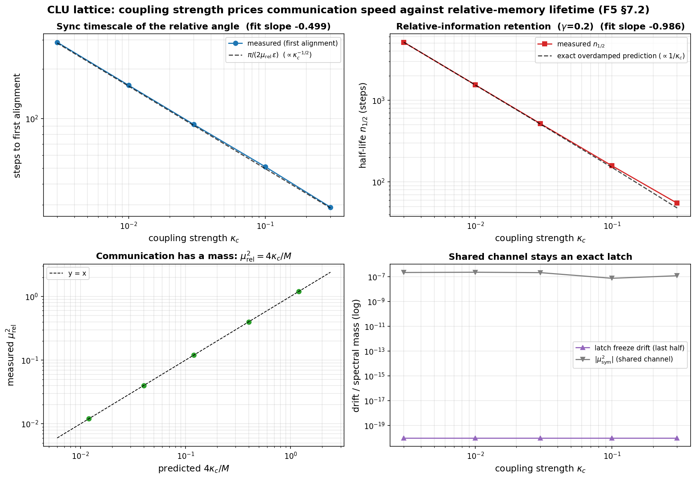
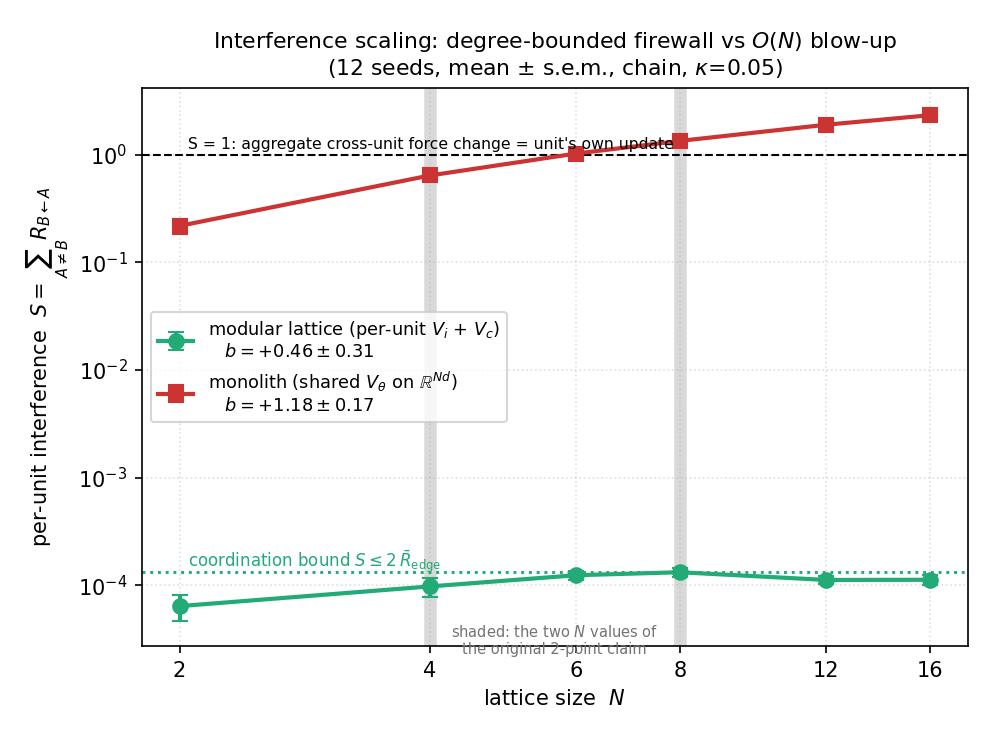
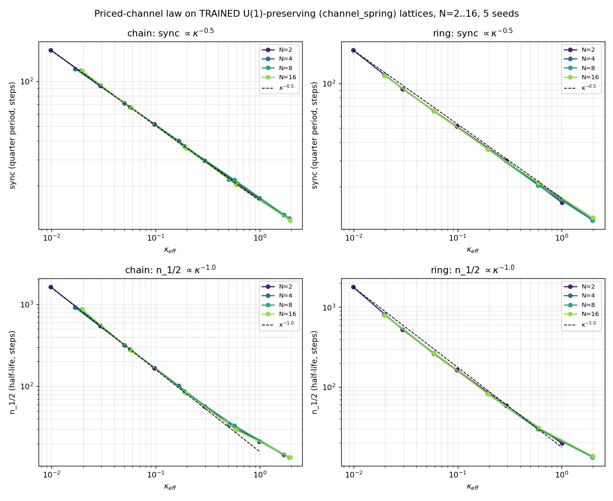
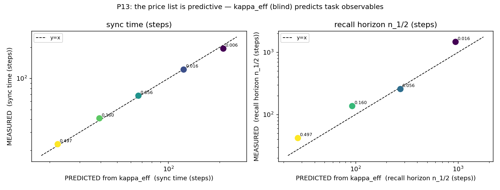
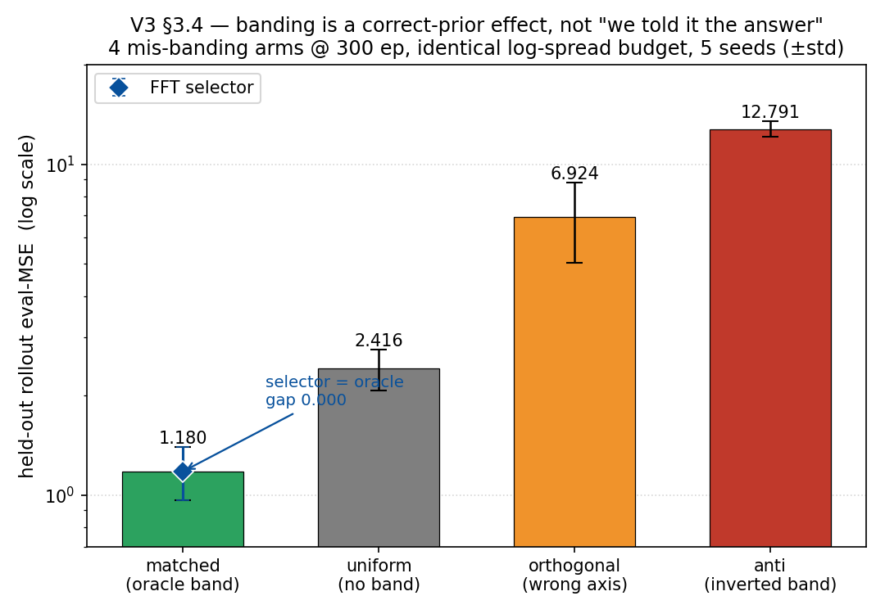
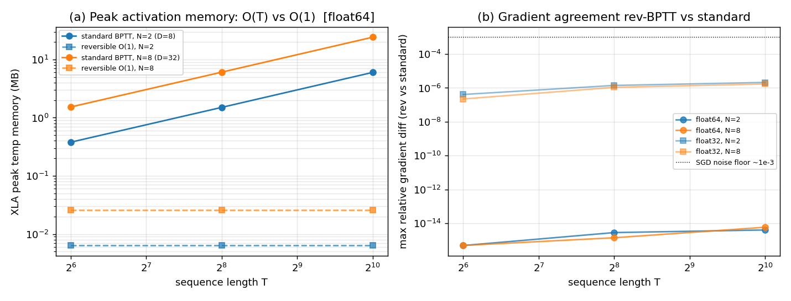
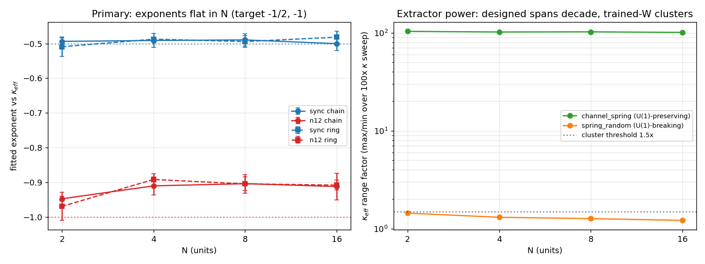
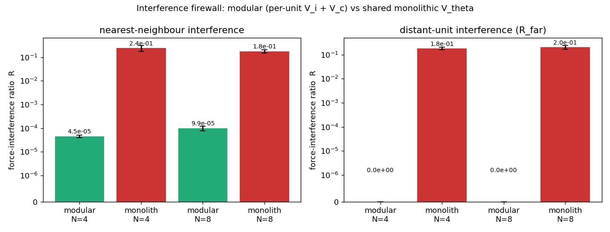
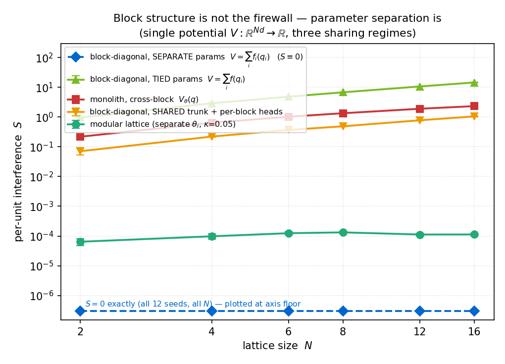
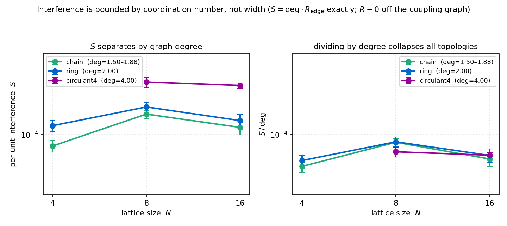

# [WORKING TITLE: Composing a Conservative Memory Primitive: a Degree-Bounded Interference Firewall and a Priced Channel Through It]

> *Title note (C-10 workshop, do not freeze).* The pending $N>2$ pricing experiment has now **landed positive**: the priced-channel price law holds flat in $N$ to $N\le16$ on U(1)-preserving trained lattices of designed $SO(2)$ units (§3.3, Figures 9–10; `v3-pricing-n-scaling`, $5$ seeds, both topologies, pre-registered), so **"Scaling" may now legitimately attach to the priced channel** — the physics-specific contribution spans the same $N\le16$ range as the composition law and its degree-bounded firewall, with the one honest qualifier that the coupling preserve the $U(1)$ symmetry (§3.3). The title is left as a placeholder for the C-10 workshop; a working slug that now reads honestly: "Scaling a Conservative Memory Primitive under One Hamiltonian: a Degree-Bounded Interference Firewall and a Priced Channel That Scales to $N\le16$." Alternate banked (the de-scoped v0.5 slug, retained in case the workshop prefers to keep "scaling" off the title): "Composing Conservative Memory Units under One Hamiltonian: a Degree-Bounded Interference Firewall and a Priced Communication Channel."

**Authors:** [AUTHORS PLACEHOLDER]

**Venue class:** ML4PS-shaped workshop short (4–5 pp + appendices). Final venue pending the Jul-11 scout.

> *Draft status:* canonical markdown draft (`draft.md`). LaTeX build in `draft.tex`. One-line-per-revision history in `CHANGELOG.md`. Every quantitative statement traces to a source report and inherits a flag-provenance table (Appendix A). **Headline figure = Figure 1 (interference scaling, $N\in\{2,4,6,8,12,16\}$, 12 seeds: the degree-bounded modular lattice vs the width-linear shared-potential monolith).** Designed-testbed results are labeled *verification*; learned-system results are labeled *evidence*; integrator/autodiff-graph results are labeled *structural* (reporting discipline, §1; each figure caption repeats its grade). Per the positioning charter (C-1, reversed 2026-07-07: "no audit confession"), **no defensive physics-audit paragraph appears in this paper**; the class-level theory of the corrected mechanisms lives in the companion theory note as neutral theorems.

---

## Abstract

We ask what happens to a conservative, physics-structured memory *primitive* when it is scaled from one unit to many, and answer it for a lattice of damped-symplectic recurrent units advanced by a single **joint Hamiltonian** with **sparse position-only coupling**. The construction inherits its per-unit guarantees by composition — joint conformal symplecticity, an exact vanishing-coupling reduction, a per-unit Noether budget, and a mass-anisotropic causal cap all hold on the joint state to machine precision, and the communication cost predicted for a shared channel (relative-mode retention $\propto\kappa^{-1}$, synchronization $\propto\kappa^{-1/2}$) is verified on designed lattices to fitted slopes $-0.986$ / $-0.499$. Three results are then measured on lattices with learned MLP potentials. **(1) The interference firewall is measured, and it is *degree-bounded*, not width-dependent:** a localized cross-unit contrastive-divergence update displaces a non-adjacent unit's basin by **exactly zero** ($0$ of $4{,}656$ off-graph entries nonzero over $72$ runs; $R\equiv0$ off the coupling graph in all three topologies tested), so per-unit received interference obeys the exact identity $S=\deg\cdot\bar R_{\rm edge}$ (to six decimals) with a per-edge leak $\bar R_{\rm edge}\approx6.5\times10^{-5}$ of the intended change; at fixed degree $S$ is statistically flat in $N$ (ring, $\deg\equiv2$: slope $b=+0.07\pm0.18$, $p=0.39$) and a degree-$4$ circulant is $2\times$ the ring. A same-family, same-width shared-potential monolith has no such confinement (the arms are width-matched, not parameter-matched; §5 and the capacity controls below): it displaces *every* other unit by $\approx0.19$ with no spatial structure and grows as $N^{1.18\pm0.17}$, so that by $N\approx6$ its aggregate cross-unit force perturbation exceeds a unit's own update magnitude — **degree-bounded vs width-linear**, slopes diverging (Welch $p=3.3\times10^{-4}$), separation $\times20{,}649$ at $N=16$ ($N\le16$, chain/ring/circulant-$4$, $8$–$12$ seeds, $2$-dim units, MLP potentials, $\kappa=0.05$, measured at initialization, laptop-CPU). The firewall is bought by **parameter separation, not block structure**: a block-diagonal single potential with *shared* parameters still interferes (a permutation-equivariant deep-sets potential worst of all, per-pair $\bar R=0.97$), while one with *separate* per-block parameters gives $S\equiv0$ exactly; the modular lattice is that firewall plus an $O(\kappa^2)$ graph-local leak, bought in exchange for communication. This is the paper's thesis in one line: **modularity is the firewall, and the physics is the priced channel one gets to keep while having it** (§3.2(iii), §3.3) — a single joint symplectic Hamiltonian under which units talk at a measured, graph-local cost. **(2) That priced channel obeys a predictive price list, and the list is not an $N=2$ artifact** (trained lattices, $N\le16$): an effective coupling curvature $\kappa_{\rm eff}$ read *blind* from the learned coupling potential predicts recall-horizon ranking (Spearman $1.0$, $n=5$, exact $p=0.008$) and synchronization time to $\le7.5\%$ of the registered prediction across a $91\times$ decade on trained $2$-unit lattices ($3$ seeds), and the underlying price law ($\text{sync}\propto\kappa_{\rm eff}^{-1/2}$, $n_{1/2}\propto\kappa_{\rm eff}^{-1}$) holds **flat in $N$** at $N\in\{2,4,8,16\}$, both chain and ring, on U(1)-preserving (`channel_spring`) trained lattices of designed $SO(2)$ units ($5$ seeds; sync exponent $-0.49\pm0.02$, $n_{1/2}$ exponent $-0.91\pm0.03$, $R^2\ge0.998$), all predictions registered before measurement — so the physics-specific priced channel spans the same $N\le16$ range as the firewall, provided the coupling preserves the $U(1)$ symmetry. **(3) Banding is a method, not an oracle gift** (trained $2$-unit lattices, $16\times$ ratio, $5$ seeds): a correct inertial-mass prior halves the held-out error, a wrong prior of identical spread costs up to $10.8\times$, and a cheap from-data spectral (FFT) selector recovers the oracle band exactly (MSE gap $0.000$, $5/5$ seeds) *when timescales are spectrally separable*. We close with the price of the physics prior, now measured through the horizon: a param-matched unconstrained twin leads by $1$–$2$ orders of magnitude to $\approx500$ steps, is overtaken at $\approx700$, and diverges (MSE $196$ at $5000$ steps vs the single CLU unit's bounded $0.20$–$0.23$ plateau — this control is a single unit, $N=1$, dim $4$). As a systems corollary, the separable Hamiltonian makes the $\gamma=0$ lattice exactly reversible, giving recompute-backwards BPTT at $O(1)$-in-$T$ activation memory ($946\times$ lower peak memory at $T=1024,N=2$) with float-indistinguishable gradients (relative difference $\le2.1\times10^{-6}$, float32) — exact only along the conservative direction ($\gamma=0$; $\gamma>0$ gives a finite reversal horizon $\propto(1-\gamma)^{-n}$), and validated on *untrained* models, not yet wired into the shipped trainer. All experiments are laptop-CPU; designed-testbed numbers are labeled verification, learned-system numbers evidence, and integrator/autodiff-graph numbers structural.

---

## 1. Introduction

A structure-preserving alternative to gated recurrence advances a latent state $(q,p)$ by a **damped symplectic (velocity-Verlet) step of a learnable separable Hamiltonian** $H(q,p)=T(p)+V_\theta(q)$, with an optional per-step momentum damping $p\mapsto(1-\gamma)p$ supplying controllable forgetting. Our reference unit is the **CLU (Causal Learning Unit), introduced as CHLU in Jawahar & Pierini (2026)**; the exactly-solvable single-unit theory it obeys is developed in a companion note (Anonymous, 2026; hereafter *the theory note*). This paper is about the **scaling** question that a single unit cannot answer: when you build a *network* of such units, do the per-unit guarantees survive, what does inter-unit communication cost, and can the per-unit timescales be chosen rather than gifted?

Our answer is a **CLU-Net**: a lattice of units under one joint Hamiltonian $H=\sum_i[T_i(p_i)+V_{\theta,i}(q_i)]+\sum_{(i,j)\in E}V_{c}(q_i,q_j)$ with sparse, **position-only** couplings on a graph $E$ (so a joint symplectic step is well-defined and momentum coupling is impossible by construction). This is not a new cell but a *composition law*, and the paper's thesis is threefold and, deliberately, ML-first: a joint Hamiltonian with sparse coupling **composes a conservative memory primitive** — with **(i)** a *measured* interference firewall that turns the catastrophic-interference risk of parameter sharing into a cost bounded by the coupling graph's **coordination number rather than the network's width**, **(ii)** a *predictive* communication price list read blind from learned curvature, and **(iii)** a *method* (not an oracle gift) for allocating per-unit timescales.

**What the physics buys, and what it does not (the paper's central composition, stated up front).** We put this here because a reader will otherwise assemble it from a concession in §3.2(iii) and a scope line in §3.3, and a paper should compose its own argument for the reviewer rather than leave it to be discovered. The interference firewall — contribution (i), and our headline — is **not bought by anything physics-specific**: *parameter isolation* buys it, and buys it strictly better. A single potential built from **disjoint per-unit parameter blocks** has *exactly zero* cross-unit interference (§3.2(iii)), where our lattice retains a small graph-local leak; it needs no Hamiltonian, no symplectic structure and no coupling graph. **Modularity is the firewall; the physics is what one gets to keep *while* having it.** What a single joint symplectic Hamiltonian keeps — and what a bag of disconnected potentials throws away — is a **priced channel** through the firewall: units that *communicate* under one conservative dynamics, at a cost that is measured, graph-local and $O(\kappa^2)$ (contribution (ii), §3.3), together with the reversibility (§3.5), conserved charges (§3.1), and per-unit budget laws that come with a shared Hamiltonian. That priced channel is our physics-specific claim: its predictive parity is demonstrated on **trained $2$-unit lattices** (§3.3), and the underlying price law is **no longer an $N=2$ result** — it holds **flat in $N$ at $N\in\{2,4,8,16\}$**, both topologies, on U(1)-preserving trained lattices of designed $SO(2)$ units (§3.3, Figure 9), so the physics-specific contribution now **spans the same $N\le16$ range as the firewall** rather than being stranded at $N=2$. The one qualifier is that the coupling must preserve the $U(1)$ symmetry: a symmetry-breaking random-`W` coupling clusters $\kappa_{\rm eff}$ so the exponent becomes unfittable — which is itself the resolution of Appendix C's earlier "inconclusive on trained lattices" (§3.3, App. C), not a limitation of the law.

**Nomenclature (used throughout, do not conflate).** Two quantities both get called "mass" and run in opposite directions: the **inertial mass** $M_i$ (the learned diagonal of $T_i$; larger $M\Rightarrow$ slower) and the **spectral mass** $\mu_k$ (normal-mode frequency; larger $\mu\Rightarrow$ shorter memory). Per-unit timescales are set by the inertial-mass **band** $\{M_i\}$; retention statements use $\mu$.

**Contributions.**
1. **The CLU-Net and its guarantees-by-composition (§3.1, verification).** A joint-Hamiltonian $N$-unit lattice under which per-unit guarantees compose to machine precision — joint conformal symplecticity ($<10^{-12}$, $x64$), an *exact* bit-level vanishing-coupling reduction, the joint Noether decay law $(1-\gamma)^n$, a mass-anisotropic causal cap $v_i^{\max}=c/\sqrt{M_i}$ — and on which the theory note's communication price law is verified on designed lattices (fitted slopes $-0.986$/$-0.499$ vs predicted $-1$/$-\tfrac12$).
2. **The interference firewall, measured — and it is *degree-bounded*, not width-dependent (§3.2, headline evidence).** Cross-unit contrastive-divergence basin displacement is **exactly zero off the coupling graph** (0/4,656 entries over 72 runs), giving the exact identity $S=\deg\cdot\bar R_{\rm edge}$; at fixed degree $S$ is statistically flat in $N$ (ring, $b=+0.07\pm0.18$), while the shared-potential monolith is **width-linear** ($N^{1.18\pm0.17}$; slopes diverge, Welch $p=3.3\times10^{-4}$) — measured at $N\le16$ on chain/ring/circulant-4 lattices of 2-dim units with MLP potentials, $\kappa=0.05$, 8–12 seeds, at initialization, laptop-CPU. The leak is $\propto\kappa^2$ and mass-independent, and the firewall is bought by **parameter separation, not block structure** (block-diagonal-with-shared-parameters still interferes; separate per-block parameters give $S\equiv0$ exactly).
3. **The price list is predictive, and it scales (§3.3).** *Evidence:* a coupling curvature read blind from the learned potential predicts recall-horizon ranking (Spearman $1.0$) and sync time (to $\le7.5\%$ of the registered prediction) across a $91\times$ decade, registered before measurement (2-unit trained lattices, 3 seeds). *Verification (across composition):* the underlying price law holds **flat in $N$ to $N\le16$** (sync exponent $-0.49\pm0.02$, $n_{1/2}$ exponent $-0.91\pm0.03$, $R^2\ge0.998$) on U(1)-preserving `channel_spring` trained lattices of designed $SO(2)$ units (both topologies, $5$ seeds, pre-registered) — so the priced channel spans the same $N\le16$ range as the firewall (contribution 2).
4. **Banding as a method (§3.4, evidence).** A correct inertial-mass band halves the held-out error and a wrong band of equal spread costs up to $10.8\times$; a from-data spectral selector recovers the oracle band exactly when timescales are spectrally separable; a mass-specific learning-rate is a partial optimizer-native inducer (ordering yes, magnitude no).
5. **Reversible $O(1)$-memory training (§3.5, structural).** At $\gamma=0$ the separable-Hamiltonian lattice admits exact recompute-backwards BPTT: gradients match stored-activation BPTT to $\le2.1\times10^{-6}$ (float32) at peak activation memory $O(1)$-in-$T$ vs $O(T)$ ($946\times$ at $T=1024,N=2$; CPU/small-$D$), exact only at $\gamma=0$ ($\gamma>0$: finite reversal horizon $\propto(1-\gamma)^{-n}$), and validated on **untrained** models — the gradient mechanics only, not yet wired into the shipped `train_chlu`.
6. **The price of the physics prior, measured through the horizon (§3.6, evidence).** The fit gap decomposes into a dominant *contraction-forbidden* term and a secondary *reach-priced* term; the twin's short-horizon fit advantage is a **loan called at $\approx700$ steps**.

Per our reporting discipline, results on architecturally-invariant potentials with analytic couplings are labeled **verification of the theory's exactness**; results on *learned/anharmonic* lattices are labeled **evidence**; results that are properties of the integrator and the autodiff graph rather than of any trained parameter values are labeled **structural**. Every figure caption repeats its grade. All experiments are laptop-CPU (2-dim units, $N\le16$ for interference, $N\le8$ elsewhere, $3$–$12$ seeds).

---

## 2. Setup

**The joint map.** One dissipative velocity-Verlet step advances the concatenated state $(\mathbf q,\mathbf p)=\big((q_i),(p_i)\big)$ by a kick–drift–kick of the joint $H$ followed by $\mathbf p\mapsto(1-\gamma)\mathbf p$. Because $H$ is separable and couplings enter only through positions, the joint step is **conformally symplectic**: $J^\top\Omega J=(1-\gamma)\Omega$ and $\det J=(1-\gamma)^d$ on the full $d=\sum_i d_i$-dimensional state (with a per-unit-$\gamma$ variant $\det J=\prod_i(1-\gamma_i)^{d_i}$ when the conformality-pairing caveat is accepted). Each unit's kinetic term is $T_i(p_i)=\tfrac12 p_i^\top M_i^{-1}p_i$ (learned inertial band) or its relativistic form (imposing the causal cap $v_i^{\max}=c/\sqrt{M_i}$); the coupling $V_c$ is a channel spring $\kappa_c\lVert W_iq_i-W_jq_j\rVert^2$ (learnable $W$, **static $\kappa_c$** so the swept knob is not absorbed by the optimizer) or a small MLP, on chain edges by default.

**The relative mode and the price law (theory note, §7.2).** For a two-unit channel the coupling opens a relative mode of spectral mass $\mu_{\rm rel}^2=4\kappa_c/M$; its retention half-life obeys the same GMOR law as a single mode, $n_{1/2}\propto\mu_{\rm rel}^{-2}\propto\kappa_c^{-1}$, and two units synchronize in $\approx\pi/(2\mu_{\rm rel}\,\mathrm{dt})\propto\kappa_c^{-1/2}$. This is the **communication price list**: stronger coupling buys faster synchronization at the cost of shorter *relative*-memory lifetime. Retention/latch statements inherit the single-unit constants of the theory note — the latch displacement $q_\infty=q_0+\varepsilon p_0/(M\gamma)$ (infinite half-life along a flat direction, $\gamma>0$), the Noether charge decay $(1-\gamma)^n$, the crossover $h^*\approx\gamma/2$, and the mass-independent floor $2\ln2/(-\ln(1-\gamma))$ past it.

**Trained lattices.** Unless noted, learned-system results use $N$-unit chains of $2$-dim units with `newtonian_learned` kinetic terms, `mlp` potentials (hidden $32$), spring coupling, $\mathrm{dt}=0.05$, trained on `two_timescale_orbits` data whose two timescales come from the inertial band alone (shared stiffness $k_i=M_i\omega_i^2=1$). Full flag-provenance in Appendix A.

---

## 3. Results

### 3.1 The CLU-Net and its guarantees-by-composition

*(Designed testbed, analytic couplings ⇒ **verification of the theory's exactness**. Source: `v3-lattice-build` items 1–4, seed 42 + $x64$ tests, $N\le8$, laptop-CPU.)*

The per-unit guarantees compose onto the joint state, each checked as a contract:

- **Exact vanishing-coupling reduction.** At $\kappa_c=0$ the joint step reduces **bit-for-bit** (`jnp.array_equal`, *no tolerance*) to independent single-unit steps — verified across heterogeneous unit dims ($2{+}3$), mixed `newtonian_learned`/`relativistic` kinetics, $\gamma\in\{0,0.05\}$, and both empty-edge and $\kappa{=}0$-spring graphs. The composition adds nothing until coupling is switched on.
- **Joint conformal symplecticity** holds to $<10^{-12}$ ($x64$) at $N=2,4$, and the per-unit-$\gamma$ volume law $\det J=\prod_i(1-\gamma_i)^{d_i}$ to $<10^{-12}$.
- **Communication *is* charge flow.** The joint Noether charge is conserved to $<10^{-10}$ at $\gamma=0$ and decays as the exact $(1-\gamma)^n$ law to $<10^{-9}$ at $\gamma>0$; the *single-unit* charge is **not** conserved once $\kappa_c>0$ (drift $>10^{-3}$) — coupling is literally charge flowing between units.
- **Mass-anisotropic causal cap.** With relativistic kinetics the latent speed saturates at $v_i^{\max}=c/\sqrt{M_i}$ per band to $10^{-9}$, the heavy band strictly slower — the many-unit form of the single scalar speed being insufficient once $M\ne I$.

On this lattice the **communication price law is verified** (designed 2-unit $SO(2)$ pair, $\gamma_{\rm probe}=0.2$, $\mathrm{dt}=0.05$, seed 42): sweeping $\kappa_c$ over two decades, the relative spectral mass matches $\mu_{\rm rel}^2=4\kappa_c/M$ to six decimals at every $\kappa_c$, synchronization time follows a fitted log-log slope $-0.499$ (predicted $-\tfrac12$), and the relative-memory half-life follows slope $-0.986$ (predicted $-1$); the shared channel is a bit-frozen latch (drift exactly $0.0$) at every $\kappa_c$, and the $n_{1/2}=1544$ anchor at $\mu^2=0.04,\gamma=0.2$ reproduces the theory note's App-N value bit-for-bit. Two deviations are both understood and small (a $+15\%$ first-crossing kick-phase ripple at the largest $\kappa_c$ as $h\to h^*$, and a $+1\%$ anharmonic sync offset at finite amplitude).

> **Figure 4 [verification] — The communication price law on a designed lattice.** Sweeping the static coupling $\kappa_c$ over two decades on a designed $2$-unit $SO(2)$ pair ($\gamma_{\rm probe}=0.2$, $\mathrm{dt}=0.05$, seed 42): synchronization time follows $\propto\kappa_c^{-1/2}$ (fitted slope $-0.499$) and relative-memory half-life $\propto\kappa_c^{-1}$ (slope $-0.986$), matching the theory note's predicted $-\tfrac12$ / $-1$. Architecturally-invariant potential with analytic coupling $\Rightarrow$ **verification of the theory's exactness**, not a discovery. Source: `v3-lattice-build`.

**The composition is cheap.** A scaling smoke test (chains, MLP potentials, laptop-CPU) gives joint symplectic error $5.4/4.9/4.4\times10^{-8}$ at $N=2/4/8$ (**constant in $N$ to within the $f32$ Hessian floor**) and $233\mathrm{k}/125\mathrm{k}/35\mathrm{k}$ steps/s — sub-linear-to-mild cost growth to $D=16$, adequate for laptop prototyping. A gated-edge "wormhole" skeleton (a smooth energy-gated direct coupling) is present and $C^1$: an open aligned gate moves a distant unit's force by $3.7\times10^{-3}$ while a closed gate suppresses the coupling energy by five orders ($1.2\times10^{-9}$); we report it as a *built, not yet load-bearing* mechanism (§5).

### 3.2 The interference firewall, measured: degree-bounded, not width-dependent (headline)

*(**Evidence**: measured on lattices with learned MLP potentials. Sources: `v3-interference-extra` (12 seeds, $N\in\{2,4,6,8,12,16\}$, scaling + block-monolith controls; 8 seeds, 3 topologies) and `v3-interference-ntk` items 1–3 (3 seeds; $\kappa$-sweep, through-training). $2$-dim units, MLP potentials, $\kappa_c=0.05$, measured at initialization unless stated, laptop-CPU. **Headline = Figure 1.**)*

The credibility question for any *shared-parameter* scaling of a memory is catastrophic interference: does updating one unit corrupt the others? We make it a measurement. The operational interference of unit $A$ on unit $B$ is the **basin displacement** — the force-field change over $B$'s block induced by a localized contrastive-divergence (wake/sleep) update on $A$, normalized by the intended change at $A$:
$$ R_{B\leftarrow A}=\frac{\lVert\Delta F|_{B}\rVert}{\lVert\Delta F|_{A}\rVert},\qquad \Delta F=\nabla_q V_{\rm new}-\nabla_q V_{\rm old}\ \text{after}\ \theta\leftarrow\theta-\eta[\nabla_\theta V(\text{wake})-\nabla_\theta V(\text{sleep})]. $$
$R_{B\leftarrow A}=0$ iff $B$'s basin is untouched, and the aggregate interference *received* per unit is $S_B=\sum_{A\ne B}R_{B\leftarrow A}$ (we report $S=\mathrm{mean}_B\,S_B$). We compare the **modular lattice** (per-unit $V_{\theta,i}$, sparse coupling) against a **shared-potential monolith** — a single $V_\theta:\mathbb R^{Nd}\to\mathbb R$ of the same family and width, the honest "no firewall" baseline — and, below, against three *block-diagonal* potentials that separate the two things "modular" could mean.

**(i) The structural result: interference is confined to the coupling graph, exactly.** Across all $72$ modular runs ($6$ lattice sizes $\times$ $12$ seeds), **every non-edge entry of $R$ is exactly zero in float32** — $0$ nonzero of $4{,}656$ off-graph entries, against $4{,}656/4{,}656$ nonzero for the monolith. This is not a small number; it is a structural identity. Wake and sleep configurations differ only in unit $A$'s block, so $\nabla_\theta[V(q_{\rm wake})-V(q_{\rm sleep})]$ vanishes identically on every own-potential $\theta_{V_B}$ ($B\ne A$) and on every coupling module not incident to $A$; only $\theta_{V_A}$ and the $\le\deg(A)$ couplings touching $A$ move. Hence

$$ \boxed{\,S_B=\deg(B)\cdot\bar R_{\rm edge}\,}\qquad\text{verified }S/(\deg\cdot\bar R_{\rm edge})=1.000000\ \text{in every topology}\times N\ \text{cell.} $$

**Per-unit received interference is therefore bounded by the coupling graph's coordination number, not by the network's width.** A topology control makes this a measurement rather than an inference ($8$ seeds; $N\in\{4,8,16\}$):

| topology | degree | $S(N{=}4)$ | $S(N{=}8)$ | $S(N{=}16)$ | slope $b$ (95% CI) | $H_0\!:b=0$ | non-edge $R$ |
|---|---|---|---|---|---|---|---|
| chain | $1.50\to1.88$ (ramps) | $7.93\times10^{-5}$ | $1.50\times10^{-4}$ | $1.15\times10^{-4}$ | $+0.264\pm0.171$ | $p=0.008$ | $0$ (exact) |
| **ring** | $2.00$ (fixed) | $1.19\times10^{-4}$ | $1.72\times10^{-4}$ | $1.32\times10^{-4}$ | $\mathbf{+0.071\pm0.183}$ | $p=0.391$ (flat) | $0$ (exact) |
| **circulant-4** | $4.00$ (fixed) | — | $2.83\times10^{-4}$ | $2.64\times10^{-4}$ | $-0.066\pm0.315$ | $p=0.636$ (flat) | $0$ (exact) |

At fixed degree $S$ is **statistically flat in $N$** (ring, $\deg\equiv2$: $b=+0.07\pm0.18$, $p=0.39$); doubling the degree scales $S$ by $2.01\times$ at $N=16$ (the identity above is exact per-run; the cross-arm ratio inherits the $\pm30\%$ init scatter of $\bar R_{\rm edge}$, so we quote the identity, not "$2.0\times$" as a constant). Non-edge $R$ is exactly zero even for the circulant, where graph distance and index distance disagree: **the firewall follows the coupling graph, not the index layout.**

**We state the one residual preemptively.** A *chain* is not degree-constant: its mean degree ramps $2(N{-}1)/N=1.0\to1.88$ over $N=2\to16$. Its $S$ therefore carries a small real positive slope ($b=+0.46\pm0.31$ over $N\in[2,16]$, 12 seeds; $+0.26\pm0.17$, $p=0.008$, in the 8-seed topology control) which a pure coordination effect predicts as $+0.289$, and which **vanishes under degree normalization** ($b(S/\deg)=+0.17\pm0.31$, consistent with $0$). We therefore never describe a chain as "flat in $N$": the correct statement is *degree-bounded*, and the ring is where flatness is measured.

**(ii) The growth result: degree-bounded vs width-linear (Figure 1).** With $12$ seeds and six lattice sizes the two arms' log-log slopes **diverge**: modular $b=+0.46\pm0.31$ vs monolith $b=+1.18\pm0.17$ (95% CI, non-overlapping; Welch $p=3.3\times10^{-4}$, paired-by-seed $p=5.5\times10^{-4}$; the monolith is steeper in $11/12$ seeds). The modular curve saturates and then decreases ($S(8)=1.32\times10^{-4}\to S(16)=1.13\times10^{-4}$, $b_{[8,16]}=-0.23\pm0.37$) while the monolith keeps climbing ($b_{[8,16]}=+0.79\pm0.09$).

| arm | $N{=}2$ | $N{=}4$ | $N{=}6$ | $N{=}8$ | $N{=}12$ | $N{=}16$ | slope $b$ over $[2,16]$ |
|---|---|---|---|---|---|---|---|
| **modular** (banded $\equiv$ uniform) | $6.41\times10^{-5}$ | $9.76\times10^{-5}$ | $1.24\times10^{-4}$ | $1.32\times10^{-4}$ | $1.12\times10^{-4}$ | $1.13\times10^{-4}$ | $+0.463\pm0.311$ |
| **monolith** (shared $V_\theta$) | $2.18\times10^{-1}$ | $6.40\times10^{-1}$ | $1.02$ | $1.34$ | $1.90$ | $2.32$ | $+1.184\pm0.170$ |

*(mean $\pm$ s.d. over 12 seeds; separation $\times20{,}649$ at $N=16$.)* The monolith's per-pair displacement is $\approx0.19$ with **no spatial structure**, and its aggregate crosses $S=1$ at $N\approx5.9$: **the aggregate cross-unit force perturbation a monolithic unit receives exceeds the magnitude of its own intended update** ($S(4)=0.640$, $S(6)=1.024$). We phrase this as a force-perturbation statement, not a storage-capacity statement: reading it as "interferes with itself more than it stores" would require the *dynamical* interference half-life, which we have not measured (Appendix C).

The modular residual leak is coupling-mediated: a $\kappa_c$-sweep ($N=4$, 3 seeds) gives log-log slope $1.99$, i.e. $\bar R_{\rm edge}\propto\kappa_c^2$, and **exactly $0$ at $\kappa_c=0$** — so the per-edge leak is a tunable price set by the coupling strength, not a fixed floor. The firewall is **mass-independent** — banded and uniform lattices give *bit-identical* $R$ ($\max|R_{\rm banded}-R_{\rm uniform}|=0.000\times10^{0}$ over $6$ $N$ $\times$ $12$ seeds), so banding and modularity are orthogonal knobs, the potential NTK never seeing the inertial mass — and the separation **persists through training** where we have measured it (2-unit lattices, 3 seeds: modular $R_{\rm off}$ $4.2\times10^{-5}\to8.9\times10^{-5}$ over epochs $0/150/300$, monolith $O(0.1\text{–}0.4)$ throughout; $N>2$ through-training is unmeasured, Appendix C).

**(iii) What actually buys the firewall: parameter separation, not block structure.** A reviewer's first question is "is this modularity, or did you just train $N$ nearly-separate networks?" We answer it with a control (12 seeds, $N\le16$): a **single** potential $V:\mathbb R^{Nd}\to\mathbb R$ with an explicitly block-diagonal Hessian, in three parameter-sharing regimes.

| arm | params ($N{=}2\to16$) | $S(N{=}8)$ | $S(N{=}16)$ | per-pair $\bar R$ | slope $b$ over $[2,16]$ | non-edge $R$ |
|---|---|---|---|---|---|---|
| **block-untied** $V=\sum_i f_i(q_i)$, separate $\theta_i$ | $2{,}370\to18{,}960$ | $\mathbf{0.0}$ | $\mathbf{0.0}$ | $\mathbf{0.0}$ | undefined ($S\equiv0$) | $0$ (exact) |
| **modular lattice** ($\kappa_c=0.05$) | $2{,}382\to19{,}112$ | $1.32\times10^{-4}$ | $1.13\times10^{-4}$ | ${\approx}6.5\times10^{-5}$ | $+0.46\pm0.31$ | $0$ (exact) |
| block-trunk (shared trunk, per-block heads) | $1{,}218\to1{,}680$ | $4.88\times10^{-1}$ | $1.05$ | $0.065$ | $+1.51\pm0.36$ | nonzero |
| monolith (cross-block $V_\theta$) | $1{,}253\to2{,}177$ | $1.34$ | $2.32$ | $0.19$ | $+1.18\pm0.17$ | nonzero |
| **block-tied** $V=\sum_i f(q_i)$ (deep-sets) | $1{,}185$ (constant) | $6.78$ | $1.45\times10^{1}$ | $\mathbf{0.97}$ | $+1.29\pm0.01$ | nonzero |

Three things follow, and the last two are uncomfortable for the naive telling of this story. **Block structure alone recovers nothing:** `block-trunk` and `block-tied` have strictly block-diagonal Hessians and still show $O(1)$ per-pair interference and width-linear aggregate growth — sharing *any* parameters across blocks, even only a trunk, reopens the channel. **Block structure plus disjoint parameters recovers the firewall completely and for free:** `block-untied` gives $S\equiv0$ *exactly*, at every $N$ and every seed (diagonal $R[A,A]=1.000000$ throughout, so this is a genuine zero, not a dead self-response). **Interference is not a capacity effect:** the worst arm is the $1{,}185$-parameter tied potential (constant in $N$), the perfect arm is the $18{,}960$-parameter untied one — which kills the "you just gave the modular arm more parameters" confound in the cleanest way available.

The honest reading, which we prefer to the flattering one, is this: **nothing physics-specific buys the firewall — parameter separation does, and `block-untied` is a strictly *better* firewall than our lattice ($S\equiv0$ vs $\bar R_{\rm edge}\approx6.5\times10^{-5}$).** The modular lattice *is* `block-untied` plus an $O(\kappa^2)$ graph-local leak, and that leak is exactly the price of having a coupling graph at all (it is $0.0$ at $\kappa_c=0$). What the physics buys is that the lattice pays that price while retaining a **single joint symplectic Hamiltonian with priced, graph-local communication** — units that can talk, under one conservative dynamics, with the cost of talking measured and bounded (§3.3). A network of disconnected potentials has a perfect firewall and nothing to say across it.

Our monolith foil is, correspondingly, a *mild* one. The permutation-equivariant deep-sets potential $V=\sum_i f(q_i)$ — a real architecture, not a strawman — interferes $6.2\times$ harder in aggregate at $N=16$ and has per-pair $\bar R=0.97$: an update aimed at unit $A$ moves *every* other unit's basin by $\approx97\%$ of the intended amount, because the shared $f$ moves coherently at every block. It exceeds $S=1$ already by $N=4$. We report both foils and quote the naive monolith's numbers in the headline, which understates our case.

> **Figure 1 [evidence] — Headline: interference is degree-bounded, not width-dependent.** Per-unit received interference $S=\mathrm{mean}_B\sum_{A\ne B}R_{B\leftarrow A}$ vs lattice size $N$ (log–log; mean $\pm$ s.e.m. over **12 seeds**; chain, $\kappa_c=0.05$, 2-dim units, MLP potentials, at initialization, laptop-CPU). The shared-$V_\theta$ monolith is **width-linear** ($b=+1.18\pm0.17$) and crosses $S=1$ at $N\approx5.9$ (dashed line: aggregate cross-unit force change equals a unit's own update). The modular lattice tracks the exact identity $S=\deg\cdot\bar R_{\rm edge}$ (its aggregate stays below $2\bar R_{\rm edge}$, dotted, because the chain's mean degree is $<2$) and saturates ($b=+0.46\pm0.31$ over $[2,16]$, entirely the chain's degree ramp $1.5\to1.88$; $b=-0.23\pm0.37$ over $[8,16]$); slopes diverge, Welch $p=3.3\times10^{-4}$. Shaded: the $N$ range accessible to a two-point measurement, shown to make explicit why two points could not separate these slopes (App. G). **On the rendered asset's title:** the "$O(N)$" label refers to the **monolith**, whose *fitted* exponent is $1.18\pm0.17$; no arm of this paper's modular lattice is described as "$O(1)$" or "flat in $N$" in any figure or sentence — the correct statement is degree-bounded vs width-linear. Source: `v3-interference-extra`.

> **Metric discipline (do not use the NTK cosine; Appendix D).** The *raw* potential-NTK cosine is $\approx0.99$ for **both** architectures — shared low-level features make $\nabla_\theta V$ correlated regardless of structure — so it does **not** distinguish them. The firewall lives in the *wake$-$sleep difference* structure, which the operational basin-displacement $R$ measures and the raw kernel does not. We report $R$, never the NTK cosine, as the interference metric.

### 3.3 The price list is predictive, not descriptive

*(**Evidence**: trained 2-unit lattices, prediction registered before measurement. Source: `v3-interference-ntk` item 2, $3$ seeds, laptop-CPU.)*

A price list is only useful if it *predicts*. For each trained lattice we read an effective coupling curvature $\kappa_{\rm eff}$ from the **learned** coupling potential alone — the mass-weighted Hessian of $V_c$ along the relative mode, blind to any rollout — and **then** predict the recall horizon $n_{1/2}$ and synchronization time from the theory note's price law. Only after registering the prediction do we measure. Varying the static coupling across a decade makes $\kappa_{\rm eff}$ genuinely span $91\times$ (fixing the identifiability clustering that supervised training otherwise causes):

| $\kappa_{\rm eff}$ (learned, blind) | sync **pred** | sync **meas** | $\lvert\Delta\rvert_{\rm sync}$/pred | $n_{1/2}$ **pred** | $n_{1/2}$ **meas** | $\lvert\Delta\rvert_{n_{1/2}}$/pred |
|---|---|---|---|---|---|---|
| $0.0055$ | $210.9$ | $195$ | $7.5\%$ | $2773.4$ | $\infty$ (censored, $>11{,}600$) | — |
| $0.0163$ | $123.1$ | $122$ | $0.9\%$ | $943.1$ | $1468$ | $55.7\%$ |
| $0.0556$ | $66.6$ | $68$ | $2.1\%$ | $273.9$ | $257$ | $6.2\%$ |
| $0.1602$ | $39.2$ | $41$ | $4.5\%$ | $92.9$ | $137$ | $47.5\%$ |
| $0.4970$ | $22.3$ | $23$ | $3.2\%$ | $27.5$ | $42$ | $52.8\%$ |

The **ranking is exact** — Spearman$(n_{1/2}^{\rm pred},n_{1/2}^{\rm meas})=1.0$ and Spearman$(\kappa_{\rm eff},n_{1/2}^{\rm meas})=-1.0$ (higher price $\Rightarrow$ strictly shorter recall horizon), both over $n=5$ lattices (exact $p=0.008$ under the null; the top-ranked, weakest-coupling lattice's $n_{1/2}$ is **right-censored** at $>11{,}600$ steps and enters the correlation as a near-latch, not a point measurement). The continuous **sync** observable is predicted **pointwise to $\le7.5\%$ relative to the registered prediction** across the whole $91\times$ decade (residuals $\{7.5,0.9,2.1,4.5,3.2\}\%$; the maximum sits on the weakest-coupling lattice, $210.9$ predicted vs $195$ measured — which is $8.2\%$ if one instead normalizes by the measured value, so we state the denominator). The **recall horizon $n_{1/2}$ itself is predicted in rank, not pointwise**: on the four *uncensored* lattices its pointwise residuals are $\{55.7,6.2,47.5,52.8\}\%$ (table above) — the first-crossing scatter expected of a threshold-hitting-time observable — so we claim the *ranking* of $n_{1/2}$ and the *pointwise* value of sync, and nothing stronger. We print both columns rather than the sync column alone so the reader can see exactly which observable the price law predicts pointwise and which only in rank. **The measured $\kappa_{\rm eff}$, read blind from coupling curvature, tells you which trained lattice has the longer recall horizon and its sync time before the task is run** — demonstrated pointwise on trained $2$-unit lattices, and, crucially, **not an $N=2$ artifact: the underlying price law holds flat in $N$ to $N\le16$** (Figure 9, next), so the priced channel spans the same range as the firewall.

**The price list is not an $N=2$ artifact — it holds flat in $N$ to $N\le16$ [verification, `v3-pricing-n-scaling`].** This is the designed-$SO(2)$/frozen-coupling testbed of Figure 4 (§3.1) extended across $N$, so it is labeled *verification of the theory's exactness across composition*, not a learned-system discovery; the learned-coupling arm is the control below. The underlying price law ($\text{sync}\propto\kappa_{\rm eff}^{-1/2}$, $n_{1/2}\propto\kappa_{\rm eff}^{-1}$) holds to its **pre-registered** tolerance not only at $N=2$ but at $N\in\{2,4,8,16\}$, **both chain and ring, $5$ seeds**, on U(1)-preserving (`channel_spring`) trained lattices of designed $SO(2)$ units: fitted sync exponent $-0.49\pm0.02$ and $n_{1/2}$ exponent $-0.91\pm0.03$ (the $\approx-0.91$ vs $-1.0$ is the pre-registered first-crossing/kick-phase ripple), with $\mu_{\rm rel}^2$ residual $\le0.45\%$ and $R^2\ge0.998$, and — the load-bearing observation — **flat in $N$**, with no monotonic drift toward zero and $\kappa_{\rm eff}$ exact against its analytic value at every $N$ (Figure 9). The prediction was registered before measurement. This closes the composition gap the firewall/price-list split otherwise opens (§1, §5): the physics-specific priced channel now spans the **same** $N\le16$ range at which the degree-bounded firewall is established, rather than living at $N=2$.

Appendix C's earlier concession that the trained-lattice scaling exponent was "inconclusive" is now **attributed**, not merely retracted: it was an **artifact of the shipped random-`W` coupling's $U(1)$ breaking**, not a physics degradation. That coupling clusters $\kappa_{\rm eff}$ into a $\le1.4\times$ range across a $100\times$ $\kappa$-target sweep, so the exponent fit spans too small a range of $\kappa_{\rm eff}$ to read the $-\tfrac12$/$-1$ law (control $R^2\le0.47$, exponents $\pm12$ to $\pm887$; App. C, Figure 10); the symmetry-preserving coupling resolves it. The control's failure to fit is therefore itself the *explanation* of App C, not a weakness. **Scope (stated, C-5/C-6):** designed $SO(2)$ units, a **frozen $U(1)$-preserving `channel_spring` coupling** (the one qualifier that gates the exponent claim — a symmetry-breaking coupling clusters $\kappa_{\rm eff}$ and the law becomes unfittable), $N\le16$, both topologies, $5$ seeds, wake-only training, laptop-CPU.

> **Figure 9 [verification] — The price list holds flat in $N$ to $N\le16$.** Per-$N$ log–log fits of synchronization time and recall horizon $n_{1/2}$ against the blind-read $\kappa_{\rm eff}$ on U(1)-preserving `channel_spring` trained lattices of designed $SO(2)$ units, $N\in\{2,4,8,16\}$, chain and ring, $5$ seeds: the price-law slopes ($-0.49\pm0.02$ sync, $-0.91\pm0.03$ recall) are **flat in $N$** ($R^2\ge0.998$, $\mu_{\rm rel}^2$ residual $\le0.45\%$), so the law is not an $N=2$ artifact. Architecturally-invariant potential with a frozen $U(1)$-preserving coupling $\Rightarrow$ **verification of the theory's exactness across composition** (Figure 4 is the $N=2$ point of this same testbed). Pre-registered; predictions committed before measurement. Source: `v3-pricing-n-scaling`.

> **Figure 3 [evidence] — The price list is predictive.** Predicted vs measured synchronization time across a $91\times$ $\kappa_{\rm eff}$ decade on *trained* $2$-unit lattices, $\kappa_{\rm eff}$ read blind from the learned coupling potential and the prediction registered before measurement; points hug the parity line (max residual $7.5\%$ of the prediction; ranking exact, Spearman $1.0$). $3$ seeds, laptop-CPU. Source: `v3-interference-ntk` item 2.

### 3.4 Banding as a method, not an oracle gift

*(**Evidence**: trained 2-unit ($16\times$-ratio) lattices, $5$ seeds (items 1–2) / $3$ seeds (item 3, $N\in\{2,4\}$). Source: `v3-band-selection` items 1–3; `mass-lr-doctrine-test`. **Figure 2.**)*

A reviewer's fair objection to a *designed* inertial band is "you told the model the answer." We answer it three ways.

**(i) A wrong band costs — the confound is killed.** Four arms spend the *identical* log-scale-spread budget, differing only in where the spread is placed: **matched** (the oracle band on the data axis), **anti** (inverted), **orthogonal** (the same spread on an axis the isotropic data carry no signal on), and **uniform** (no band). At $300$ epochs, $5/5$ seeds:
$$ \text{matched }1.180 \ <\ \text{uniform }2.416\ <\ \text{orthogonal }6.924\ <\ \text{anti }12.791\quad(\text{held-out MSE}). $$
A correct prior is $0.49\times$ the uniform error; an inverted band of *identical spread* is $5.3\times$ worse than uniform and $10.8\times$ worse than matched, and a misplaced band $2.9\times$ worse than uniform. Banding is therefore **not** "any structure helps" and **not** "the answer for free" — it is a correct-prior effect with a steep, measured price for guessing wrong.

> **Figure 2 [evidence] — Banding is a correct-prior effect, not an oracle gift.** Held-out rollout MSE at $300$ epochs (log scale, $5$ seeds, $\pm$ s.d.) for four arms spending the *identical* log-scale-spread budget on a $2$-unit lattice at $16\times$ ratio: matched (oracle band) $1.180\pm0.216$ < uniform (no band) $2.416\pm0.345$ < orthogonal (spread on a no-signal axis) $6.924\pm1.883$ < anti (inverted band) $12.791\pm0.698$; matched beats every arm on $5/5$ seeds. Diamond: the from-data FFT selector lands on the oracle band (selector–oracle MSE gap $0.000\pm0.000$, $5/5$ seeds) — *when timescales are spectrally separable*. Source: `v3-band-selection` items 1–2.

**(ii) The band can be chosen from data, cheaply and exactly — with a stated qualifier.** A per-unit spectral (FFT) timescale estimator maps each unit's dominant frequency to $M_i\propto1/\omega_i^2$ and recovers the oracle band $[4.0,0.25]$ with a **selector–oracle MSE gap of $0.000\pm0.000$ on $5/5$ seeds**, at the cost of one FFT over the training set. **Qualifier (stated, per our certificate discipline):** the zero gap relies on the task's clean spectral signature — well-separated per-unit frequencies. On data whose timescales are *not* cleanly separable the FFT estimate degrades and the gap opens; the recipe is "cheap and exact **when timescales are spectrally separable**." An optimizer-native alternative — induce the ordering with a mass-specific learning-rate, then snap to oracle magnitudes — is a **fragile foil**: it induces the correct ordering on $4/5$ seeds but the single inversion snaps to the anti-band and pays the *full* mis-banded penalty (MSE $12.5$).

**(iii) The optimizer induces the ordering, not the magnitude.** A mass-specific learning-rate multiplier is characterized across $N\in\{2,4\}\times$ ratio $\in\{4\times,16\times\}$ ($3$ seeds, $1500$ epochs): a multiplier $\approx10$ **reliably induces the correct mass *ordering*** (Spearman alignment $+0.80$ to $+1.00$, healthy log-spread $0.44$–$0.61$) and is the safe default; but no induced run reaches the designed *magnitude* (the designed band fits $7$–$14\times$ better in held-out MSE). A high multiplier ($\ge30$) is harmful in a **ratio- and $N$-dependent** way. At the $16\times$ ratio, mult $30$ *degrades* the ordering (alignment $+1.00\to+0.20$–$+0.33$) and $100\times$ *inverts* it (alignment $-1.00$ at $N=2$, $-0.20$ at $N=4$); at the $4\times$ ratio the ordering instead *holds* under $100\times$ but a **global-mass runaway** appears at $N=4$ (held-out MSE $35.3\pm47.3$, $3$ seeds — the sample s.d. *exceeds* the mean, so this is a seed-dominated single-run blow-up rather than a characterized effect; at $N=2$, $4\times$, $100\times$ the ordering holds and MSE is $0.373$). Because a global mass rescale can *lower* MSE while inverting the ordering, the hierarchy must be read off **alignment/spread, never MSE** (full grid: App. E). (Full grid + over-lr failure modes: Appendix E.)

### 3.5 Reversible $O(1)$-memory training

*(**Structural measurement on untrained models** — a property of the integrator and the autodiff graph, independent of parameter values, so not a learned-system claim. Source: `v3-reversible-o1` ($3$ seeds, float32 **and** float64), CPU, $D\le16$, laptop.)*

Because the CLU-Net's separable Hamiltonian gives the dissipative velocity-Verlet step a closed-form exact inverse, and the lattice rollouts are already `lax.scan`-pure, at $\gamma=0$ training admits **exact recompute-backwards BPTT via analytic leapfrog inversion**: the backward pass reconstructs each previous state by the inverse map instead of storing the forward tape. We measure the resulting memory–compute trade directly. Reconstructed gradients match standard stored-activation BPTT to $\le2.1\times10^{-6}$ relative in **float32** (the training default; $\le5.8\times10^{-15}$ in float64) at $T$ up to $1024$ — five-plus orders below typical SGD gradient noise; whether that makes them *training-indistinguishable* is **untested**, because these reconstructed gradients have not yet been used to train (§5). Peak activation memory is **$O(1)$ in sequence length vs $O(T)$**: at $T=1024,N=2$ the reversible pass uses $6.3$ KB against the standard pass's $6.00$ MB — a **$946\times$ reduction** — with the standard cost growing linearly in $T$ while the reversible cost stays flat (scaling only with state size $D$); the $946\times$ ratio grows without bound in $T$. Wall-time is $\approx0.9\times$ standard (parity), but **only in the CPU / small-$D$ regime measured here** ($D\le16$, small potential MLP, laptop): on a GPU or with large per-unit potentials the recompute would likely surface as up to a $\sim2\times$ overhead, so we claim parity only for this regime while the $O(T)\!\to\!O(1)$ *memory* scaling is structural and does generalize.

**The exactness is honest only at $\gamma=0$.** Any $\gamma>0$ (the forgetting knob) makes the $(1-\gamma)$ contraction invertible only in exact arithmetic and amplifies reconstruction error as $(1-\gamma)^{-n}$, giving a *finite* usable reversal horizon: $\approx3.3\times10^{4}$ steps at $\gamma=10^{-3}$ and $\approx5\times10^{2}$ steps at $\gamma=0.05$ (float64; $\sim100\times$ shorter in float32). This is not a bug but the boundary of the claim, and it dovetails with the program's budget framing: the memory that is **reversibly $O(1)$-trainable is exactly the conservative ($\gamma=0$) memory** — *reversibly-trainable memory is conservative memory* — while dissipative segments must fall back to stored activations or gradient checkpointing (§4). **Scope caveat (stated, C-6):** this is the gradient mechanics only, validated on untrained models with a final-state loss; it is **not yet wired into the shipped `train_chlu`** (whose windowed per-step loss the $O(1)$ reverse-scan can accommodate but which we have not run through it), so this is a structural systems result, not yet a trained-lattice measurement (§5).

> **Figure 5 [structural] — Reversible $O(1)$-memory training ($\gamma=0$).** (left) peak activation memory vs sequence length $T$: standard BPTT grows $O(T)$ while recompute-backwards stays flat, $O(1)$-in-$T$ ($946\times$ at $T{=}1024,N{=}2$); (right) reconstructed-gradient relative difference vs $T$ in float32/float64 ($\le2.1\times10^{-6}$ f32, $\le5.8\times10^{-15}$ f64 — five-plus orders below typical SGD gradient noise; training-indistinguishability is untested, §5). **Structural measurement on untrained models** (a property of the integrator and the autodiff graph), CPU, $D\le16$, $3$ seeds; exact only at $\gamma=0$; memory metric is the XLA compiler scratch estimate, a proxy for tape size rather than runtime peak RSS (Appendix A.6). Source: `v3-reversible-o1`.

### 3.6 The price of the physics prior, measured through the horizon

*(**Evidence**: learned MLP-potential controls, param-matched, on a **single CLU unit ($N=1$)** — this section is the price of the per-unit prior, not a lattice measurement. Source: `minus-the-physics` Part A ($3$ seeds); `fit-gap-anatomy` items 1–3 ($3$ seeds). Single unit ($N=1$), dim $2$–$4$, synthetic, laptop-CPU.)*

Symplectic volume conservation buys **bounded (BIBO) dynamics, a protected near-flat memory direction, and vacuum robustness under contrastive-divergence training**; the leapfrog structure buys the **latch**; the physics prior **costs raw fit**. Against a param-matched (to $\pm0.05\%$) unconstrained twin and a broken-volume ablation, the "which component buys what" table reads: BIBO settled-fraction $1.00$ (CLU) vs $0.33$ (broken-volume) vs $1.00$ (twin); protected flat spectral $\mu^2$ $0.008$ (CLU) vs $0.122$ (broken-volume); latch coset drift $0.19$ (CLU) vs $1.15$ (twin, $\sim6\times$ looser); and the vacuum **survives** wake–sleep CD for the CLU where the broken-volume arm collapses to $r^*=0$ — vacuum survival under CD is itself a symplecticity payoff. Two of these entries need a word of care. **The BIBO claim is against the broken-volume ablation** ($1.00$ vs $0.33$): the twin *matches* the CLU's settle-fraction ($1.00$) on this short settle-probe, but its boundedness is empirical rather than structural and it *diverges* on long rollout (cumulative MSE $196$ at $5000$ steps, App. F.1), whereas the CLU is bounded by construction. The measured cost is specifically **contraction-forbidden** (volume conservation; the broken-volume arm recovers $\approx2.4\times$ fit by *leaking* volume), **not** the causal cap, which is inactive in this arm: the unconstrained twin fits $\approx15\times$ better in raw MSE ($0.013$ vs $0.190$). *(These are the `minus-the-physics` dim-4 numbers; the recovery ladder in App. F.2 uses a **distinct circle-vacuum probe** whose absolute MSEs — twin $0.0047$, CLU $0.207$, latch drift $0.778$ — are on a different testbed and are **not** comparable digit-for-digit to the dim-4 pair here.)*

**The loan is called at $\approx700$ steps.** Made quantitative against the matched control on a stationary vacuum, the twin leads by **$1$–$2$ orders of magnitude out to $\approx500$ steps**, is **overtaken at $\approx700$ steps**, and then **diverges** (cumulative MSE $196$ at $5000$ steps) while the CLU is the only arm flat *by construction* (bounded plateau $0.20$–$0.23$). We claim the crossing and the boundedness-by-construction; we do **not** claim the lowest long-horizon plateau (broken-volume $0.14$ and LSTM $0.13$ sit slightly *below* the CLU's $0.22$) — the CLU asset is *boundedness by construction*, not lowest steady-state MSE. The **reach** term is real but secondary and aggregate-only: with the causal cap active it costs $+77\%$ MSE at $c=0.5$ and collapses to the uncapped baseline once $v_{\max}\ge$ the required speed ($c\ge2$), with **no per-step far-region concentration** ($\mathrm{corr}(\text{err},|\dot q|)\approx0$).

**Paid mechanisms rent back specific cheats (they are not interchangeable).** On the circle-vacuum probe (App. F.2), adding a **global $\gamma$** recovers **$92\%$ of the *absolute* contraction-forbidden fit gap, with BIBO, latch, and $\mu^2$ all preserved** (licensed uniform contraction, $\det J=(1-\gamma)^d$); the recovered unit still **trails the twin by $\approx4.6\times$ in ratio** ($0.0216$ vs $0.0047$ eval-MSE), but is bounded by construction — we use V2's exact wording for this shared number. Adding a **position-gated friction field $\gamma_\varphi$** does **not** recover fit ($-24\%$) — it is a targeted-forgetting tool, the wrong lever for this gap. A squeeze $S^{(M)}$ rents *reach* with an exact **matched-quadratic-$H$ certificate** (oracle placement; $\det=1$ to $3\times10^{-7}$, energy injection $\le e^{2|\zeta|}$, a single $\zeta=1$ squeeze grants $\Delta q=2.18>$ the required $2.0$). The recovery ladder and its negatives are in Appendix F.

---

## 4. Related work

**Hamiltonian and symplectic recurrence (home turf).** Our unit is a *learned-Hamiltonian, symplectically-integrated* recurrent cell, so the nearest architectural cousin is the **Symplectic Recurrent Neural Network** (Chen, Zhang, Arjovsky & Bottou, 2020), which learns a Hamiltonian and advances it with a symplectic integrator under multi-step training; Hamiltonian and Lagrangian Neural Networks (Greydanus, Dzamba & Yosinski, 2019; Cranmer et al., 2020) likewise learn the energy from data, while stability-oriented recurrences — Lipschitz RNNs (Erichson et al., 2021) and the coupled-oscillator coRNN (Rusch & Mishra, 2021) / LEM (Rusch et al., 2022) — engineer bounded dynamics without a symplectic form. The classic gated baseline our Appendix F.1 compares against is the LSTM (Hochreiter & Schmidhuber, 1997). Against all of these our contribution is deliberately orthogonal: **not a better single cell but a *composition law* for many such cells.** The measured interference firewall (§3.2), the coupling price list (§3.3), and the reversible-$O(1)$-memory corollary (§3.5) are statements about what happens when learned-Hamiltonian units are *coupled into a lattice*, a regime none of these single-cell works address. The conformal-symplectic (damped-leapfrog) structure and its $h<2$ stability limit we rely on are standard for dissipative geometric integrators (Hairer, Lubich & Wanner), read here as *memory* statements for a learnable $H$.

**Symmetry and memory lifetime.** Mo (2026) proves that an exactly equivariant recurrent *flow* has $\dim(G/H)$ zero Lyapunov exponents along the group orbit and that a "pseudo-gap" of a formerly-protected direction predicts a finite memory lifetime. That is the *kinematics* of protection and is silent on what *sets* the gap; our lattice supplies a constitutive, mass-controlled gap and — the scaling contribution here — a measured account of how protection composes across *many* coupled units. (Positioning drawn from `mo-deep-read`.)

**Geometry-first structured recurrence.** A line of work engineers recurrence from a chosen symmetry/geometry (Di Bernardo et al.; Keller). We apply the guard-rail from `di-bernardo-skim`: we do not headline "we choose $G/H$"; we headline the *pricing and budget* consequences of a coupling once the geometry is fixed. (Positioning drawn from `di-bernardo-skim`.)

**Modular vs. monolithic parameter sharing and catastrophic interference.** Catastrophic interference — the abrupt overwriting of stored function when a distributed network learns new content — has been understood since McCloskey & Cohen (1989) and French (1999) as a consequence of *shared* representations. Two families of remedy exist. The first **prevents** interference by construction: modular architectures and mixtures-of-experts route different content to different parameters (Jacobs et al., 1991; Shazeer et al., 2017), and parameter-isolation continual learners freeze or mask per-task subnetworks (Kirkpatrick et al., 2017; Mallya & Lazebnik, 2018). The second **measures** interference so it can be minimized during optimization: the NTK-overlap matrix quantifies cross-task forgetting (Doan et al., 2021), and gradient-alignment / gradient-surgery methods treat conflicting (negative-inner-product) updates as the interference signal to suppress (Riemer et al., 2019; Yu et al., 2020). Our lattice sits at the intersection: interference between units is neither merely prevented nor globally minimized but **measured as a coupling-resolved kernel**. In a shared-potential monolith a single unit's contrastive update displaces every other unit's basin by $\approx0.19$ of the intended change, spatially unstructured and growing **width-linearly** ($N^{1.18\pm0.17}$); in the modular lattice the same update displaces a graph neighbour by $\approx6.5\times10^{-5}$ and a non-adjacent unit by *exactly* zero, the residual nearest-neighbour leak scaling as the square of the coupling strength ($\propto\kappa^2$, exactly zero at $\kappa=0$). The interference thus obeys an architectural **degree-bounded vs. width-linear** separation and an explicit coupling power-law — a *priced*, graph-local firewall rather than the diffuse, data-dependent overlap measured on monolithic networks (Doan et al., 2021) or the sample-complexity separation established for modular tasks (Boopathy et al., 2025). Our controls locate the mechanism precisely, and not where a physics-first reading would put it: **parameter separation, not block structure or geometry, is what closes the channel** — a block-diagonal potential with tied parameters (a permutation-equivariant, deep-sets-style summed potential) interferes *worse* than the unstructured monolith, while the same potential with per-block parameters gives exactly zero interference. In that sense our firewall is the parameter-isolation family's guarantee (Kirkpatrick et al., 2017; Mallya & Lazebnik, 2018) obtained *by construction* rather than by penalty or mask; what the joint Hamiltonian adds is not a better firewall but a **priced channel through it** (§3.3), so that units may communicate under a single conservative dynamics at a coupling cost that is measured, graph-local, and $O(\kappa^2)$. *(Scope: 2-dim units, chain/ring/circulant-4 topologies, MLP potentials, $N\le16$, $\kappa=0.05$, 8–12 seeds, measured at initialization; see §3.2, Appendix D, Appendix H.)*

**Reversible / $O(1)$-memory training.** Trading stored activations for recomputation is the standard route to memory-cheap backpropagation: gradient checkpointing recovers activations by partial recomputation at $O(\sqrt T)$ memory, and reversible architectures (the RevNet / momentum-network / reversible-integrator lineage) reconstruct them exactly at $O(1)$ memory by making the forward map analytically invertible. The damped-symplectic lattice is invertible for the *physics* reason that a separable Hamiltonian's leapfrog step has a closed-form inverse; §3.5's contribution is to *measure* the resulting trade on this primitive — exact $O(1)$-in-$T$ memory at $\gamma=0$ with float-indistinguishable gradients — and to make explicit the honest boundary the general reversible framing hides here: the exactness holds only along the conservative ($\gamma=0$) direction, so a network interleaving forgetting ($\gamma>0$) blocks must fall back to checkpointing on those segments. Positioning against the checkpointing $O(\sqrt T)$ middle-ground and accelerator-scale measurement are the open follow-ups (§5). *(Specific published anchors — checkpointing and RevNet/momentum-net — to be finalized from the scout bibliography; see report.)*

---

## 5. Limitations and horizon

**Scope.** Every learned-system number here is on $2$-dimensional units, MLP potentials, laptop-CPU, synthetic two-timescale data: $N\le16$ and $8$–$12$ seeds for interference, $N\le8$ and $3$–$5$ seeds elsewhere. We claim the composition law and the three measured properties *at that scale*; industrial-scale and real-data behavior are untested (the largest open gap).

**The composition, owned (so no reviewer has to assemble it).** Two facts sit hundreds of lines apart in this paper and a reader will compose them, so we do it here. **(a)** The interference firewall is our headline but it is **not our physics**: a potential built from disjoint per-unit parameter blocks is a *strictly better* firewall than our lattice ($S\equiv0$ exactly vs $\bar R_{\rm edge}\approx6.5\times10^{-5}$, §3.2(iii)) with no Hamiltonian at all — *parameter isolation*, not the symplectic structure, is what confines interference. **(b)** Our physics-specific claim is the **priced channel** (§3.3), and it is **no longer stranded at $N=2$**: its predictive parity is demonstrated on trained $2$-unit lattices with *learned* couplings (evidence, §3.3), and the underlying price law is now **verified to hold flat in $N$ at $N\in\{2,4,8,16\}$**, both topologies, on the designed-$SO(2)$/frozen-$U(1)$-preserving-coupling testbed — the same substrate as the $N=2$ verification (§3.1), extended across composition (Figures 9–10; pre-registered, $5$ seeds). Appendix C's earlier "inconclusive on trained lattices" is resolved: it was an **artifact of a symmetry-breaking coupling** (a *learned* random-`W` coupling clusters $\kappa_{\rm eff}$ into a $\le1.4\times$ range so no law is fittable), which the $U(1)$-preserving coupling fixes — the control's failure is the *explanation*, not a weakness. Composed: the degree-bounded firewall is established (evidence) at $N\le16$, and the priced channel it lets through is now verified across the **same** $N\le16$ range, so the composition gap is closed — the physics-specific contribution spans the firewall's range rather than living at $N=2$. The residual honest scope: the exponent's cross-$N$ authority is the designed testbed (as at $N=2$), and reading the *fitted exponent* off freely-**learned** couplings at $N>2$ (rather than the ranking/parity map, which already survives learning) remains a follow-up — but no main-text claim now bounds on an $N=2$ limitation. The thesis composes without a residual: **modularity is the firewall; a single joint symplectic Hamiltonian is what lets the modules talk, at a price we measure — across the full range at which the firewall is established.**

**Certificate altitude (stated next to the claims).** The firewall's "exactly zero" beyond the graph is a property of the position-only coupling and the locality of the contrastive update (it holds on chain, ring and circulant-4 graphs, and is analytic, not fitted); it is measured on the potential NTK / force field (basin displacement $\Delta F$), not a full re-settle of attractors, so the $S=1$ crossing is a statement about force perturbation and not about storage, and the **dynamical interference half-life** is **unmeasured** (Appendix C). Interference is measured **at initialization**: the exact zeros are training-invariant by construction, but the finite magnitude $\bar R_{\rm edge}\approx6.5\times10^{-5}$ is an init-scale quantity, and through-training persistence is measured only at $N=2$ (Appendix C). A **second, trajectory-mediated interference channel** — banding changes *which states* training visits — is **unmeasured** (Appendix C). The arms are not parameter-matched ($19{,}112$ modular vs $2{,}177$ monolith at $N=16$); the confound is bounded rather than eliminated by the block-tied ($1{,}185$ params, worst) and block-untied ($18{,}960$ params, zero) controls, and a width-matched monolith sweep is not run. The $\propto\kappa^2$ leak law is established at $N=4$ only. The pricing prediction is registered on $2$-unit trained lattices. The banding selector's zero gap is contingent on spectral separability (§3.4). The wormhole edge (§3.1) is built and $C^1$ but not yet shown to beat a dense-MLP baseline; the **intra-unit** wormhole is a design hypothesis, not a result.

**Reversible-training scope.** The $O(1)$-memory result (§3.5) is the gradient mechanics measured on *untrained* models with a final-state loss on CPU; it is **not yet wired into the shipped `train_chlu`** (windowed per-step loss), the wall-time parity is CPU/small-$D$ only, and the exactness is $\gamma=0$-only. Wiring it into the real trainer, an accelerator-scale (GPU/HBM) memory and honest wall-time measurement at $T\gtrsim4\mathrm{k}$ where standard BPTT OOMs, and a gradient-checkpointing ($O(\sqrt T)$) Pareto baseline are the load-bearing follow-ups before it becomes an ICLR systems claim.

**Horizon.** The reversible-training follow-ups above; through-training interference at $N\in\{4,8,16\}$ and a parameter-matched monolith; a $\kappa$-sweep at $N=16$ to close $S=\deg\cdot c\,\kappa^2$ into a fully closed-form price for the firewall; 2-D grid and small-world topologies (where a wormhole edge should add exactly its own degree contribution — a *quantitative price for a wormhole*); the irrep firewall (does the NTK factor across irreps of an $SO(2)$ unit?); and real-data banding.

---

# Appendices

## Appendix A — Flag-provenance tables (C-7)

All results are laptop-CPU, JAX. Numbers are transcribed from the source reports, not recomputed here.

**A.1 — CLU-Net construction & pricing (§3.1; `v3-lattice-build`, verification).**

| field | value |
|---|---|
| code commits | `c124103` (CLULattice core) · `9c39b12` (two_timescale data) · `79dcac9` (tests); config fix `b2ce79f` |
| lattice | `build_lattice`, chain edges, `SpringCoupling` (static $\kappa_c$), `newtonian_learned`/`relativistic` units |
| pricing run | designed 2-unit Mexican-hat $SO(2)$ pair, $f{=}M{=}\lambda{=}1$, $\gamma_{\rm probe}=0.2$, $\mathrm{dt}=0.05$, seed 42, $f32$; $\kappa_c\in\{0.003,0.01,0.03,0.1,0.3\}$ |
| tests | $x64$: joint symplectic $<10^{-12}$; $\kappa{=}0$ reduction `jnp.array_equal`; Noether $<10^{-10}$/$<10^{-9}$; caps to $10^{-9}$ |
| scaling smoke | chain, MLP potentials, $f32$, $N\in\{2,4,8\}$; sym err $5.4/4.9/4.4\times10^{-8}$; $233\mathrm{k}/125\mathrm{k}/35\mathrm{k}$ steps/s; energy drift $4.5\times10^{-4}/2.8\times10^{-5}/5.9\times10^{-5}$ over 2000 steps |

**A.2 — Interference firewall, $\kappa$-sweep and through-training (§3.2; `v3-interference-ntk`, evidence).**

| field | value |
|---|---|
| commit (read-only) | `9a13455` (lattice core `c124103`) · chlu 0.2.4, JAX CPU |
| seeds | $\{0,1,2\}$ every item |
| lattice | unit_dims $[2]\times N$, potential `mlp` (hidden 32), `newtonian_learned`, spring coupling, chain, coupling_dim 2, proj_init_scale 0.1 |
| monolith control | single `CHLU(dim=2N,hidden=32,newtonian_learned,mlp)` = one shared $V_\theta$ over $\mathbb R^{Nd}$ |
| probe | CD wake/sleep, $\eta=0.05$, memory radius $r=0.5$; all units at memory loci, only $A$ perturbed (sleep $=m_A+0.6\,\mathcal N$) |
| $\kappa$ | items 1,3: $0.05$; sweep $\{0,0.01,0.03,0.1,0.3\}$ at $N=4$; through-training epochs $\{0,150,300\}$ at **$N=2$** |
| non-defaults | `newtonian_learned` for lattices (banding needs `log_mass`); item-2 sleep disabled (`sleep_frequency=1e9`), $x64$ |
| supersession | the $N\in\{4,8\}$, 3-seed scaling numbers of this run are superseded for the *growth* claim by A.2b (12 seeds, 6 sizes); the two harnesses agree **bit-exactly** on the shared cells (max rel diff $0.00\times10^{0}$), so the differences are seed sampling, not metric drift (Appendix D) |

**A.2b — Interference scaling, topology and block-monolith controls (§3.2 (i)–(iii); `v3-interference-extra`, evidence).**

| field | value |
|---|---|
| commit (read-only; `git status --porcelain` empty before & after) | `37dc664` |
| env | main venv, **JAX 0.9.0**, CPU (`CpuDevice(id=0)`), equinox, chlu 0.2.4, scipy 1.17.0, x32 default precision |
| seeds | $\{0\ldots11\}$ (12) scaling + block items; $\{0\ldots7\}$ (8) topology control |
| $N$ grid | $\{2,4,6,8,12,16\}$ (scaling/block); $\{4,8,16\}$ (topology) |
| lattice | `build_lattice`, unit_dims $[2]\times N$, potential `mlp` (hidden 32), kinetic `newtonian_learned`, coupling `spring`, coupling_dim 2, proj_init_scale 0.1, $\kappa_c=0.05$, edges = chain (default) / ring / circulant-4 |
| banding | `mass_scales` $=4.0$ (even idx) / $0.25$ (odd idx); `uniform` $=$ None |
| monolith | single `CHLU(dim=2N, hidden=32, newtonian_learned, mlp)` |
| block monoliths | single $V:\mathbb R^{2N}\to\mathbb R$, per-block MLP `Linear(2,32)→tanh→Linear(32,32)→tanh→Linear(32,1)` $+\,0.05\lVert q\rVert^2$ (mirrors `PotentialMLP` exactly); regimes `block_untied` / `block_trunk` (shared trunk, per-block heads) / `block_tied` |
| probe | **identical code path** to A.2 (`force_interference` imported verbatim): $\eta=0.05$, $r_{\rm probe}=0.5$, all units at memory loci, only unit $A$ perturbed (wake $=m_A$, sleep $=m_A+0.6\,\mathcal N$), $R$ row-normalized by $R[A,A]$ |
| measurement point | **initialization** ($R$ is a property of the parameterization); no training in this run |
| NTK cosine | not computed (uninformative, $\approx0.99$ both arms; $O(N^2K^2)$ cost) |
| non-defaults | `kinetic=newtonian_learned` (banding needs `log_mass`); no training $\Rightarrow$ training config inapplicable |
| metric-identity anchor | re-running this harness on seeds $\{0,1,2\}$ at $N\in\{4,8\}$ reproduces `v3-interference-ntk/interference_init.json` to **max relative difference $0.00\times10^{0}$** (bit-exact), for both modular and monolith |
| statistics | per-seed OLS of $\log_{10}S$ on $\log_{10}N$, then mean $\pm$ 95% CI over seeds ($t$, dof $=11$); Welch and paired-by-seed $t$-tests for the slope difference |

**A.3 — Pricing prediction (§3.3; `v3-interference-ntk` item 2, evidence).** Wake-only, lr $10^{-3}$, $\mathrm{dt}=0.05$, $\gamma_{\rm probe}=0.2$, $x64$, Mexican-hat $SO(2)$ pair $f{=}M{=}\lambda{=}1$, $\kappa_{\rm static}\in\{0.01,0.03,0.1,0.3,1.0\}$, 200 epochs, window 256, seeds $\{0,1,2\}$.

**A.3b — Price law flat in $N$ to $N\le16$ (§3.3, Figures 9–10; `v3-pricing-n-scaling`, verification across composition; pre-registered).** Commit `e3c8931` (main), JAX 0.9.0, CPU, $x64$. Wake-only training (sleep off, per V2 Finding 0), $M=1$, $\mathrm{dt}=0.05$, 60 epochs, window 128; $\gamma=0$ for sync, $\gamma_{\rm probe}=0.2$ for $n_{1/2}$. **Units:** designed $SO(2)$ MexicanHat ($f{=}M{=}\lambda{=}1$), start at the analytic vacuum ($\kappa_{\rm eff}$ moved $0.1981\to0.1983$ over 60 epochs — frozen-coupling stability). **Primary arm:** coupling `channel_spring` ($U(1)$-preserving, frozen), grid $N\in\{2,4,8,16\}\times\{$chain,ring$\}\times\kappa_{\rm target}\in\{0.01,0.03,0.1,0.3,1.0\}\times$ seeds $\{0\text{–}4\}$ (198/200 rows; only ring/$N{=}16$/$\kappa{=}1.0$ is 3 seeds, fits to $\pm0.014$). **Control arm:** `spring_random` (legacy random-$W$, $U(1)$-breaking, trainable $W$, static $\kappa_S=0.1$), chain $\times$ same $\kappa\times$ seeds $\{0\text{–}4\}$ (100 rows). **Extractor:** $\kappa_{\rm eff}=\tfrac14 M\lambda_{\max}$(mass-weighted coupling Hessian) $=0.5\,\kappa\,\lambda_{\max}(L)$, confirmed to 5 dp as a pre-measurement identity. **Statistics:** per-arm OLS of $\log$(observable) on $\log\kappa_{\rm eff}$, 95% CI over seeds; pre-registered decision rule (HOLDS iff $s_N\in[-0.55,-0.45]$, $h_N\in[-1.15,-0.80]$ $\forall N$, no drift vs $N{=}2$, $\mu_{\rm rel}^2<2\%$) applied verbatim. Non-defaults vs repo: `coupling_type=channel_spring` (primary), `langevin`: n/a (wake-only), sleep off.

**A.4 — Banding (§3.4; `v3-band-selection` + `mass-lr-doctrine-test`, evidence).**

| field | value |
|---|---|
| band-selection base | `main`@`9a13455`; module commit `c4bc004` (`chlu/data/band_selection.py`, +tests; additive only) |
| testbed | $N$-unit `CLULattice`, `newtonian_learned`, hidden 32, spring $\kappa_c=0.01$, $\mathrm{dt}=0.05$, lr $10^{-3}$, window 64/512 |
| data | `generate_two_timescale_orbits`, shared $k=1\Rightarrow\omega_i=1/\sqrt{M_i}$, geomean-1 masses spanning `ratio`, radius 1, $n_{\rm traj}=64$ |
| non-defaults | `training.mass_lr_mult∈{1,3,10,30,100}`; else `get_default_config()` (langevin_noise legacy, lyapunov max, sleep_freq 5, sleep_steps 500, sleep_temperature 0.5) |
| seeds | items 1/2: $\{0,1,2,3,4\}$; item 3: $\{0,1,2\}$ |
| ⚠ env caveat | band-selection worktree venv `uv sync`'d to **JAX 0.10.2** (main $=0.9.0$); one bit-level lattice test flips only under 0.10.2; headline numbers **version-stable** (item-1 reproduces `seed-sweeps` `b1782b0` bit-for-bit) |
| mass-lr base | `main`@`db3369b`; flag commits `be12b73`,`df11483`; 2-unit lattice, data masses $[4.0,0.25]$, seq_len 256, seeds $\{0..4\}$; `mass_lr_mult` default 1.0 = bit-compatible |

**A.5 — Price of physics (§3.6; `minus-the-physics` + `fit-gap-anatomy`, evidence).**

| field | value |
|---|---|
| minus-physics base | `main`@`db3369b`; branch commits `9533ef3`/`c33b41f`/`b41410f`; dim 4, hidden 64, `newtonian_learned`, `mlp` potential, $\mathrm{dt}=0.05$, 150 ep, seeds $\{42,43,44\}$; wake-only (sleep_frequency$\to$1e9) except erosion sub-run (sleep_freq 5, steps 500); lr $10^{-3}$, batch 64, lyapunov max, langevin legacy, sleep_friction 0 |
| fit-gap base | `9a13455` (read-only); item 1 reach: dim 2/hidden 64, relativistic $c\in\{0.5,1,2,4,8\}$, 200 ep, seeds $\{0,1,2\}$; item 2 loan: dim 4, 150 ep, arms chlu/broken_volume/twin(matched)/LSTM; item 3 ladder: twin/CLU($\gamma{=}0$)/CLU$+\gamma$/CLU$+\gamma_\varphi$ |
| param match | chlu 4549 / broken_volume 4557 / twin 4551 |

**A.6 — Reversible $O(1)$-memory training (§3.5; `v3-reversible-o1`, structural).**

| field | value |
|---|---|
| commit (read-only) | `63fea62` (main @ wave-6); JAX **0.9.0**, Equinox, device **cpu** (no GPU); repo untouched (inverse map reconstructed from $H$, validated against shipped `velocity_verlet_step`) |
| item 1 (exactness) | `CHLU(dim=8,hidden=16)`, `newtonian_learned`, `mlp`, $\mathrm{dt}=0.05$, **untrained** random init (q-key 1, p-key 2 from key 0); $\gamma\in\{0,10^{-4},10^{-3},10^{-2},0.05,0.1,0.3\}$; float32 **and** float64; $T$ to $16384$ |
| item 2 (BPTT trade) | `build_lattice(unit_dims=[2]\cdot N)`, $N\in\{2,8\}$, hidden 16, spring $\kappa_c=0.05$, chain; seeds $\{0,1,2\}$; float32 **and** float64; loss = final-state MSE; $T\in\{64,256,1024\}$; **untrained** |
| memory metric | XLA `compiled.memory_analysis().temp_size_in_bytes` (compiler scratch estimate — deterministic, reproducible; a proxy for tape size, not runtime peak-RSS) |
| key numbers | grad rel-diff $\le2.1\times10^{-6}$ (f32) / $\le5.8\times10^{-15}$ (f64) @ $T=1024$; peak temp $6.00$ MB (std) vs $6.34$ KB (rev) @ $T{=}1024,N{=}2$ ($946\times$); $24.20$ MB vs $25.7$ KB @ $N{=}8$ ($940\times$); wall-time median $0.86\times$ (f64) / $0.94\times$ (f32) |
| γ>0 horizons (f64) | usable reversal $n(\gamma)$ (round-trip rel-err $<10^{-6}$): $\ge1.3\times10^{5}$ @$10^{-4}$, $3.3\times10^{4}$ @$10^{-3}$, $4.1\times10^{3}$ @$10^{-2}$, $5.1\times10^{2}$ @$0.05$, $1.3\times10^{2}$ @$0.1$; $\sim100\times$ shorter in f32 |
| ⚠ scope | untrained models + final-state loss (not the shipped windowed-per-step trainer); CPU, $D\le16$; wall-time parity regime-specific; memory $O(T)\!\to\!O(1)$ scaling is structural |

## Appendix B — The mis-banding price panel and over-lr failure modes (C-9)

**B.1 — Degradation curve, both budgets ($5$ seeds; `v3-band-selection` item 1).**

| budget | matched | uniform | orthogonal | anti |
|---|---|---|---|---|
| 60 ep | $2.812\pm0.327$ | $3.751\pm0.336$ | $8.874\pm2.198$ | $14.905\pm0.686$ |
| 300 ep | $\mathbf{1.180\pm0.216}$ | $2.416\pm0.345$ | $6.924\pm1.883$ | $12.791\pm0.698$ |

matched beats every arm $5/5$ seeds at both budgets; $300$-ep ratios matched/uniform $=0.488$, matched/orthogonal $=0.170$, matched/anti $=0.092$.

**B.2 — Selection recipe (5 seeds; item 2).** uniform $2.416\pm0.345$; oracle $1.180\pm0.216$; **selector $1.180\pm0.216$ (gap $+0.000\pm0.000$)**; masslr-init $3.527\pm4.493$ (correct ordering $4/5$; seed-2 inversion $\to$ MSE $12.5$).

**B.3 — Over-lr failure modes (N8/N9; $3$ seeds, 1500 ep; item 3 / `mass-lr-doctrine-test`).** At the $16\times$ ratio, $100\times$ lr $\to$ alignment $-1.00$ (ordering inverted), and $\mathrm{unitM}=(3.90,5.34)$ (the *fast* unit ends heaviest) with the *lowest* MSE $0.324$ — a trap (**N8**: read alignment, not MSE). At the $4\times$ ratio, $100\times$ lr does not invert but drives a global-mass runaway (MSE $35.3\pm47.3$, $N=4$). Slow-first curriculum did not help — arguably hurt (align $-0.54\pm0.72$ at 1500 ep; **N9**). Safe operating point: multiplier $\approx10$.

## Appendix C — Honest unmeasured list (open items)

- **Trajectory-mediated banding channel.** §3.2 measures the potential NTK directly and finds banding mass-independent; but banding changes mass-dependent rollouts, hence *which* wake/sleep loci drive updates — an indirect interference channel that is **unmeasured**. Follow-up: repeat 3.2 driving loci from actual banded-vs-uniform rollouts.
- **Irrep firewall (F5 cat. ii).** Whether the NTK factors across irreps of an $SO(2)$ unit (an architecture-dependent firewall analogous to the dynamical one) is **unmeasured**.
- **~~Block-structured monolith (cat. iii)~~ — MEASURED (§3.2(iii), Appendix H).** The "is it modularity or is it just separate nets" question is now answered: it is the separate *parameters*. Retained here as a record of the open item's discharge.
- **Dynamical interference half-life.** We map basin displacement $\Delta F$, not the *dynamical* half-life of an interference event; how long an induced error in $B$'s stored memory persists (and whether it obeys the $\kappa^2$ leak law) is **unmeasured**. This is the one thing still blocking a *storage* reading of the $S=1$ crossing (§3.2(ii)).
- **Through-training interference at $N>2$.** $R$ is measured at initialization for $N\in\{2,\ldots,16\}$; the exact zeros ($R_{\rm far}$, `block_untied`) are training-invariant by construction, but the finite magnitude $\bar R_{\rm edge}$ is an init-scale quantity and only $N=2$ has been tracked through $300$ epochs. **Unmeasured** at $N\in\{4,8,16\}$.
- **Parameter-matched monolith.** The arms differ in parameter count ($19{,}112$ modular vs $2{,}177$ monolith at $N=16$). The block-tied/block-untied pair decouples capacity from interference (worst arm has the fewest parameters; the perfect arm the most), but a width-matched monolith sweep is **unrun**.
- **$\kappa$-sweep beyond $N=4$.** The $\propto\kappa^2$ leak law is established at $N=4$. Confirming it at $N=16$ would close $S=\deg\cdot c\,\kappa^2$ into a closed-form price for the firewall. **Unmeasured.**
- **Non-MLP potentials and richer graphs.** No `so2_invariant` / `deep_mlp` potentials; no 2-D grid or small-world topologies (where a wormhole edge should contribute exactly its own degree). **Unmeasured.**
- **~~Trained-coupling scaling exponent (N16)~~ — RESOLVED (§3.3, Figure 9; `v3-pricing-n-scaling`).** The earlier reading — that the trained-lattice $\kappa_{\rm eff}$-scaling exponent was "inconclusive" — is now **attributed to the shipped random-`W` coupling's $U(1)$ breaking, not a physics degradation.** Pre-registered, the two arms separate cleanly: the U(1)-breaking `spring_random` control clusters $\kappa_{\rm eff}$ into a $\le1.4\times$ range across a $100\times$ $\kappa$-target sweep, so no exponent is fittable (control $R^2\le0.47$; fitted exponents scatter from $\pm12$ to $\pm887$, $\mu_{\rm rel}^2$ residual $3.5$–$6.2\%$), whereas the $U(1)$-preserving `channel_spring` coupling (frozen, on designed $SO(2)$ units) reads the law cleanly at every $N$: sync exponent $-0.49\pm0.02$, $n_{1/2}$ exponent $-0.91\pm0.03$, $\mu_{\rm rel}^2$ residual $\le0.45\%$, $R^2\ge0.998$, **flat in $N$** at $N\in\{2,4,8,16\}$, both chain and ring, $5$ seeds (Figure 10). So the price law's exactness is now **verified across composition to $N\le16$** (the $N$-extension of the §3.1 / Figure 4 verification), and the App-C "inconclusive" is understood as a property of the *learned symmetry-breaking coupling*, not of $N$. The one open piece is reading the *fitted exponent* off freely-learned couplings at $N>2$ (the ranking/parity map already survives learning, §3.3); the exponent's cross-$N$ authority is the designed/frozen-coupling testbed, as it is at $N=2$. Retained here as a record of the open item's discharge (designed $SO(2)$ units, frozen coupling, wake-only, laptop-CPU).
- **Intra-unit wormhole.** A design hypothesis (a within-unit gated nonlocal channel wrapping $V_\theta$, inheriting the symplectic/bounded-energy/closed-gate-reduction certificates); its discriminating test — beating a dense-MLP baseline on a reach task — does not yet exist.

> **Figure 10 [verification/control] — The price-law exponents are flat in $N$; the $U(1)$-breaking control is unfittable.** Fitted sync and $n_{1/2}$ exponents vs lattice size $N\in\{2,4,8,16\}$ on the $U(1)$-preserving `channel_spring` arm (chain and ring, $5$ seeds): both cluster tightly on the theory's $-\tfrac12$ / $-1$ with no monotonic drift toward zero (sync $-0.49\pm0.02$, $n_{1/2}$ $-0.91\pm0.03$, $R^2\ge0.998$). The `spring_random` control (U(1)-breaking) is off-scale with $95\%$ CIs spanning $\pm12$ to $\pm887$ — the direct cause of App. C's earlier "inconclusive," now resolved. Pre-registered decision rule applied verbatim. Source: `v3-pricing-n-scaling`.

## Appendix D — Metric discipline: why not the NTK cosine (CM-9 tail); and the resolved-spatial-structure panel

The potential-NTK cosine $C_{\rm off}=\cos\angle(\nabla_\theta V(q_A),\nabla_\theta V(q_B))$ is $\approx0.99$ for **both** the modular lattice and the shared monolith (shared low-level MLP features make $\nabla_\theta V$ correlated across any inputs), so it is **uninformative** about the firewall. The firewall lives in the *contrastive* (wake$-$sleep) difference, where the off-unit gradient components cancel for the modular architecture and do not for the monolith. The operational basin-displacement $R_{B\leftarrow A}$ (§3.2) captures exactly this and is the metric we report. Reviewers reproducing the firewall must use $R$, not the raw kernel.

**D.1 — Spatial structure of $R$ (3 seeds, $N\in\{4,8\}$; `v3-interference-ntk` items 1/3).** The first measurement of the firewall resolved $R$ by graph distance. It is retained because it is the only place the *spatial* structure (neighbour vs non-adjacent) is printed per-arm; its aggregate $S$ values are superseded, for the growth claim, by the 12-seed six-size measurement of §3.2(ii).

| config | $R_{\rm off}$ mean | $R_{\rm nn}$ (neighbour) | $R_{\rm far}$ (non-adjacent) |
|---|---|---|---|
| **modular** $N=4$ | $2.26\times10^{-5}$ | $4.53\times10^{-5}$ | $\mathbf{0.000}$ (exact) |
| **monolith** $N=4$ | $2.12\times10^{-1}$ | $2.42\times10^{-1}$ | $1.82\times10^{-1}$ |
| **modular** $N=8$ | $2.48\times10^{-5}$ | $9.92\times10^{-5}$ | $\mathbf{0.000}$ (exact) |
| **monolith** $N=8$ | $1.98\times10^{-1}$ | $1.78\times10^{-1}$ | $2.04\times10^{-1}$ |

**Reconciliation (no contradiction; C-7).** These are $3$-seed values ($\{0,1,2\}$); §3.2 quotes $12$-seed values ($\{0,\ldots,11\}$) from a harness that reproduces this JSON **bit-exactly on the shared seeds and sizes** (max relative difference $0.00\times10^{0}$). The differences (e.g. per-edge leak $4.53\times10^{-5}$ here vs $\bar R_{\rm edge}=6.51\times10^{-5}$ at $N=4$ over 12 seeds) are seed sampling of an init-scale quantity with $\pm30\%$ scatter, not metric drift. **A negative worth recording (C-9):** on $3$ seeds the $N=4\to8$ *growth factors* were modular $\times2.56$ vs monolith $\times2.18$ — an apparent "same slope, different offset" reading. The per-seed $95\%$ CI on that modular growth factor is $\pm2.27$: the comparison was pure noise. With $12$ seeds the same window gives modular $\times1.36$ vs monolith $\times2.09$, and the full six-size slopes separate at $p=3.3\times10^{-4}$. Two-point scaling claims on a heavy-tailed init quantity are not claims; this is why §3.2 leads with the exact structural identity and reports the growth claim only with $12$ seeds and six sizes.

> **Figure 6 [evidence] — Spatial structure of the interference kernel.** Cross-unit basin displacement $R$ resolved by graph distance for the modular lattice ($\approx10^{-5}$ neighbour, exactly zero non-adjacent) vs the shared-potential monolith ($\approx0.2$, spatially unstructured: $R_{\rm nn}\approx R_{\rm far}$), $N\in\{4,8\}$, $3$ seeds, laptop-CPU. Source: `v3-interference-ntk` items 1/3 (aggregate growth superseded by Fig. 1).

## Appendix E — The mass-lr inducer: full grid (CM-5; N7)

$3$ seeds, 1500 ep, uniform init (banding *not* designed in); `align` $=$ Spearman(learned $M$ ordering, true band), `spread` $=$ std(log $M$).

| $N$ | ratio | mult | align | log-spread | eval-MSE |
|---|---|---|---|---|---|
| 2 | 4× | 3 | $+1.00$ | 0.263 | 0.274 |
| 2 | 4× | **10** | $+1.00$ | 0.553 | 0.033 |
| 2 | 4× | 30 | $+1.00$ | 0.767 | 0.022 |
| 2 | 4× | 100 | $+1.00$ | 1.171 | 0.373 |
| 2 | 16× | 3 | $+1.00$ | 0.386 | 1.372 |
| 2 | 16× | **10** | $+1.00$ | 0.488 | 0.633 |
| 2 | 16× | 30 | $+0.33$ | 0.071 | 0.366 |
| 2 | 16× | 100 | $-1.00$ | 0.176 | 0.332 |
| 4 | 4× | 3 | $+1.00$ | 0.222 | 0.149 |
| 4 | 4× | **10** | $+1.00$ | 0.442 | 0.028 |
| 4 | 4× | 30 | $+1.00$ | 0.646 | 0.067 |
| 4 | 4× | 100 | $+1.00$ | 1.718 | $35.27\pm47.26$ |
| 4 | 16× | 3 | $+0.93$ | 0.347 | 0.680 |
| 4 | 16× | **10** | $+0.80$ | 0.611 | 0.296 |
| 4 | 16× | 30 | $+0.20$ | 0.678 | 0.197 |
| 4 | 16× | 100 | $-0.20$ | 1.459 | 0.800 |

**N7 (designed-not-emergent, a reframe not a wall).** The prior "$\sim0.08$ narrowness ceiling / optimizer never finds it" reading is a $300$-epoch training-budget artifact: at $1500$ ep the uniform lattice orders masses correctly on $5/5$ seeds (Spearman $+0.89$), and a $10\times$ mass-lr amplifies the spread to $0.52$ ($6.5\times$ the old ceiling) — but the designed *magnitude* is never reached (designed fits $7$–$14\times$ better). Ordering is inducible; magnitude must be designed.

## Appendix F — Recovery ladder and loan curve (CM-1; C-9)

**F.1 — Loan curve (cumulative MSE, 3 seeds; `fit-gap-anatomy` item 2).**

| horizon | twin | chlu | broken_vol | LSTM |
|---|---|---|---|---|
| 10 | $2.9\times10^{-6}$ | $2.2\times10^{-5}$ | $1.1\times10^{-4}$ | $7.5\times10^{-2}$ |
| 100 | $2.4\times10^{-4}$ | $1.2\times10^{-2}$ | $4.1\times10^{-3}$ | $4.9\times10^{-2}$ |
| 500 | $1.1\times10^{-2}$ | $1.8\times10^{-1}$ | $9.7\times10^{-2}$ | $7.7\times10^{-2}$ |
| 1000 | $3.2\times10^{-1}$ | $\mathbf{2.0\times10^{-1}}$ | $1.2\times10^{-1}$ | $9.9\times10^{-2}$ |
| 5000 | $\mathbf{1.96\times10^{2}}$ | $2.2\times10^{-1}$ | $1.4\times10^{-1}$ | $1.3\times10^{-1}$ |

The loan is called between horizon $500$ and $1000$ (crosses at $\approx700$). Do **not** read the CLU as the lowest plateau — broken-vol $0.14$ and LSTM $0.13$ sit below CLU $0.22$; the CLU asset is boundedness by construction.

**F.2 — Recovery ladder (circle-vacuum; twin gap $=0.202$; `fit-gap-anatomy` item 3).**

| rung | eval MSE | % twin gap recovered | BIBO | latch drift | flat $\mu^2$ |
|---|---|---|---|---|---|
| twin (no physics) | 0.0047 | 100% (def.) | 1.00 | — | — |
| CLU conservative ($\gamma{=}0$) | 0.2066 | 0% (def.) | 1.00 | 0.778 | $5.2\times10^{-3}$ |
| **$+\gamma$ global** | 0.0216 | **92%** | 1.00 | 0.778 | $5.2\times10^{-3}$ |
| $+\gamma_\varphi$ learned field | 0.2548 | $-24\%$ | 1.00 | 0.706 | $2.1\times10^{-2}$ |

$+\gamma$ global recovers $92\%$ with **every CM-1 guarantee preserved**; $+\gamma_\varphi$ does **not** recover fit — the paid mechanisms are not interchangeable. Reach rungs (certificate-only): $+S^{(M)}$ squeeze $\det=1$ ($3\times10^{-7}$), H-injection $2.28\le e^{2}=7.39$, $\Delta q=2.18>$ req $2.0$; $+$inter-unit wormhole $\kappa{=}0$ bit-exact reduction re-verified.

## Appendix G — Prominent negatives registry (C-9)

- **N7** — Mass hierarchy not emergent; designed magnitude never induced (a reframe: ordering *is* inducible). App E. Source `mass-spectrum-peek`/`seed-sweeps`/`mass-lr-doctrine-test`.
- **N8** — $100\times$ mass-lr inverts the ordering (global-mass runaway). App B.3. `mass-lr-doctrine-test`.
- **N9** — Slow-first curriculum did not help mass differentiation. App B.3. `mass-lr-doctrine-test`.
- **N12** — Governor $+$ learned friction field do **not** compose (Pareto-dominated by both parts); deploy the field alone. `seed-sweeps` item 3a.
- **N16** — Trained-coupling $\kappa_{\rm eff}$-scaling exponents were read as "inconclusive" — **now RESOLVED and re-attributed** (not a physics degradation): the inconclusiveness was an artifact of the shipped random-`W` coupling's $U(1)$ breaking, which clusters $\kappa_{\rm eff}$ to a $\le1.4\times$ range. On a $U(1)$-preserving `channel_spring` coupling (designed $SO(2)$ units, frozen coupling) the exponent is **verified flat across $N\le16$** ($-0.49\pm0.02$ / $-0.91\pm0.03$, both topologies, $5$ seeds, pre-registered) — the $N$-extension of the §3.1 verification; the residual open piece is the fitted exponent on freely-*learned* couplings at $N>2$ (the ranking map already survives, §3.3). §3.3, Figs 9–10, App. C. `v3-pricing-n-scaling` (negative-turned-resolved, C-9).
- **N22** — Friction never stabilizes a saddle; the governor is blind to isoenergetic escape (proven negatives, theory note §5). V3 assumes the licensed-contraction ($\gamma$-global) forgetting column, not a saddle-stabilization claim.
- **Superseded internal measurement (process negative; App D.1).** A $3$-seed, $2$-point ($N\in\{4,8\}$) reading of the interference growth suggested modular and monolith curves had the same slope ($\times2.56$ vs $\times2.18$). The per-seed $95\%$ CI on the modular factor was $\pm2.27$ — the comparison carried no information. The $12$-seed, six-size measurement (§3.2) reverses the reading ($\times1.36$ vs $\times2.09$; slopes diverge, $p=3.3\times10^{-4}$). Recorded because the discipline it enforces — never fit a scaling exponent to two points of a heavy-tailed init quantity — is the reason §3.2 leads with the exact identity rather than the fitted slope.
- **The firewall is not a physics result (App H).** A block-diagonal potential with *separate per-block parameters* has $S\equiv0$ *exactly* — a strictly better firewall than our lattice's $\bar R_{\rm edge}\approx6.5\times10^{-5}$, obtained with no Hamiltonian, no symplectic structure and no coupling graph. Nothing physics-specific buys interference confinement. What the lattice buys is a **priced channel** through the firewall (§3.3); the honest claim is a joint conservative dynamics with graph-local, $O(\kappa^2)$-priced communication, not a superior firewall.

---

## Appendix H — The block-monolith and coordination-number controls (§3.2(i),(iii))

*(Source: `v3-interference-extra`; flag-provenance A.2b. 12 seeds (block/scaling), 8 seeds (topology), $N\le16$, measured at initialization.)*

**H.1 — Full five-arm block-monolith table.** A **single** potential $V:\mathbb R^{Nd}\to\mathbb R$ (one module; no lattice, no coupling graph, no Hamiltonian coupling) with an explicitly block-diagonal Hessian ($\partial^2V/\partial q_i\partial q_j=0$ for $i\ne j$), in three parameter-sharing regimes, against the modular lattice and the naive monolith.

| arm | params ($N{=}2\to16$) | $S(N{=}2)$ | $S(N{=}4)$ | $S(N{=}8)$ | $S(N{=}16)$ | per-pair $\bar R$ | $b$ over $[2,16]$ | non-edge $R$ |
|---|---|---|---|---|---|---|---|---|
| **block-untied** $V=\sum_i f_i(q_i)$, separate $\theta_i$ | $2{,}370\to18{,}960$ | $\mathbf{0.0}$ | $\mathbf{0.0}$ | $\mathbf{0.0}$ | $\mathbf{0.0}$ | $\mathbf{0.0}$ | undefined ($S\equiv0$) | $0$ (exact) |
| **modular lattice** ($\kappa_c=0.05$) | $2{,}382\to19{,}112$ | $6.4\times10^{-5}$ | $9.8\times10^{-5}$ | $1.3\times10^{-4}$ | $1.1\times10^{-4}$ | ${\approx}6.5\times10^{-5}$ | $+0.46\pm0.31$ | $0$ (exact) |
| block-trunk (shared trunk, per-block heads) | $1{,}218\to1{,}680$ | $7.08\times10^{-2}$ | $2.20\times10^{-1}$ | $4.88\times10^{-1}$ | $1.05$ | $0.065$ | $+1.51\pm0.36$ | nonzero |
| monolith (cross-block $V_\theta$) | $1{,}253\to2{,}177$ | $2.18\times10^{-1}$ | $6.40\times10^{-1}$ | $1.34$ | $2.32$ | $0.19$ | $+1.18\pm0.17$ | nonzero |
| **block-tied** $V=\sum_i f(q_i)$ (deep-sets) | $1{,}185$ (constant) | $9.64\times10^{-1}$ | $2.90$ | $6.78$ | $1.45\times10^{1}$ | $\mathbf{0.97}$ | $+1.29\pm0.01$ | nonzero |

Exact-zero audit over all seeds and sizes (max off-diagonal $R$; count of nonzero far-field entries): modular $9.34\times10^{-4}$ / **0** of 4,656; `block_untied` $0.000000\times10^{0}$ / **0**; monolith $6.22\times10^{-1}$ / 4,656; `block_trunk` $3.50\times10^{-1}$ / 4,656; `block_tied` $1.27$ / 4,656. Diagonal $R[A,A]=1.000000$ in all $72$ runs of every arm, so the `block_untied` zero is a genuine zero and not a degenerate normalization of a dead self-response.

Readings: (a) **block structure alone recovers nothing** — `block_trunk` shares only a trunk and still leaks ($\bar R=0.065$, width-linear $b=+1.51$); (b) **block structure + disjoint parameters is a perfect firewall** ($S\equiv0$); (c) **interference is not capacity** — the $1{,}185$-parameter tied arm (constant in $N$) is the worst, the $18{,}960$-parameter untied arm exactly zero, and `block_tied`'s $S=14.5$ at $N=16$ is $129{,}033\times$ the modular value and $6.2\times$ the naive monolith; (d) the modular lattice equals `block_untied` at $\kappa_c=0$ (measured $0.0$), so its $\approx6.5\times10^{-5}$ leak is **precisely the price of having a coupling graph**, not residual sloppiness.

> **Figure 7 [evidence] — Parameter separation, not block structure, buys the firewall.** Per-unit received interference $S$ vs $N$ for five arms (12 seeds; log-$y$). `block_untied` is drawn at the axis floor with an explicit "$S=0$ exactly" annotation; `block_tied` (deep-sets, $1{,}185$ parameters constant in $N$) is the worst arm, above the naive monolith. Source: `v3-interference-extra`.

**H.2 — Coordination-number control (chain / ring / circulant-4).** 8 seeds; the identity $S=\deg\cdot\bar R_{\rm edge}$ holds to $S/(\deg\cdot\bar R_{\rm edge})=1.000000$ in **every** cell:

| topology | $N$ | mean degree | $S$ | $\bar R_{\rm edge}$ | $S/(\deg\cdot\bar R_{\rm edge})$ | non-edge nonzero |
|---|---|---|---|---|---|---|
| chain | 4 | 1.50 | $7.934\times10^{-5}\pm3\times10^{-5}$ | $5.289\times10^{-5}$ | $1.000000$ | 0 |
| chain | 8 | 1.75 | $1.496\times10^{-4}\pm3\times10^{-5}$ | $8.549\times10^{-5}$ | $1.000000$ | 0 |
| chain | 16 | 1.88 | $1.148\times10^{-4}\pm4\times10^{-5}$ | $6.124\times10^{-5}$ | $1.000000$ | 0 |
| ring | 4 | 2.00 | $1.189\times10^{-4}\pm4\times10^{-5}$ | $5.944\times10^{-5}$ | $1.000000$ | 0 |
| ring | 8 | 2.00 | $1.724\times10^{-4}\pm5\times10^{-5}$ | $8.622\times10^{-5}$ | $1.000000$ | 0 |
| ring | 16 | 2.00 | $1.315\times10^{-4}\pm5\times10^{-5}$ | $6.575\times10^{-5}$ | $1.000000$ | 0 |
| circulant-4 | 8 | 4.00 | $2.829\times10^{-4}\pm8\times10^{-5}$ | $7.072\times10^{-5}$ | $1.000000$ | 0 |
| circulant-4 | 16 | 4.00 | $2.642\times10^{-4}\pm4\times10^{-5}$ | $6.605\times10^{-5}$ | $1.000000$ | 0 |

Slopes: chain $+0.264\pm0.171$ ($p=0.008$, a real end-effect from the degree ramp), ring $+0.071\pm0.183$ ($p=0.391$, flat), circulant-4 $-0.066\pm0.315$ ($p=0.636$, flat). Ring$\to$circulant-4 scales $S$ by $2.01\times$ at $N=16$ ($1.64\times$ at $N=8$); the shortfall at $N=8$ is $\bar R_{\rm edge}$ init scatter ($\pm30\%$ across lattices), **not** a degree effect — the identity is exact per-run, so we quote the identity and never "$2.0\times$" as a measured constant.

> **Figure 8 [evidence] — Interference is bounded by coordination number, not width.** (left) $S$ vs $N$ separates by graph degree (chain $1.50$–$1.88$, ring $2.00$, circulant-4 $4.00$); (right) dividing by degree collapses all three topologies onto one curve. $R\equiv0$ off the coupling graph in every topology — including the circulant, where graph distance and index distance disagree. 8 seeds, laptop-CPU. Source: `v3-interference-extra`.

**H.3 — Banding orthogonality, exact.** $\max|R_{\rm banded}-R_{\rm uniform}|=0.000\times10^{0}$ over $6$ lattice sizes $\times$ $12$ seeds: the banded and uniform interference kernels are **bit-identical**, upgrading the earlier "equal to every printed digit." $V_\theta$ has no `log_mass` dependence; banding and the firewall are orthogonal knobs.

---

## Figures (asset map; all embedded in `draft.md` + `draft.tex` as of v0.4 — local copies under `figures/`)

Per-figure grade labels are printed in the captions themselves ([verification] / [evidence] / [structural]).

- **Figure 1 [evidence] (headline, §3.2, `figures/fig1_scaling_curve.png`)** — interference scaling, 6 sizes $\times$ 12 seeds: modular degree-bounded ($b=+0.46\pm0.31$, at the coordination bound $S\le2\bar R_{\rm edge}$) vs monolith width-linear ($b=+1.18\pm0.17$, crossing $S=1$ at $N\approx5.9$); slopes diverge, Welch $p=3.3\times10^{-4}$. Source `v3-interference-extra/fig_scaling_curve.png`. *(The v0.3 swap note is discharged: the 6-point curve has landed and replaces the bars figure as headline; the bars panel moves to Appendix D as Figure 6.)*
- **Figure 2 [evidence] (§3.4, `figures/fig2_banding.png`)** — banding degradation curve (matched $1.180$ < uniform $2.416$ < orthogonal $6.924$ < anti $12.791$, log-$y$, 5 seeds $\pm$ s.d.) with the FFT-selector diamond on the matched bar (gap $0.000$). Source `v3-band-selection/fig_banding.png` (asset delivered by `v3-banding-figure`). *(v0.3 missing-asset flag discharged.)*
- **Figure 3 [evidence] (§3.3, `figures/fig3_pricing_parity.png`)** — pricing parity (predicted vs measured sync across the $91\times$ $\kappa_{\rm eff}$ decade).
- **Figure 4 [verification] (§3.1, `figures/fig4_lattice_pricing.png`)** — designed-lattice communication price law (sync $\propto\kappa^{-1/2}$ slope $-0.499$, $n_{1/2}\propto\kappa^{-1}$ slope $-0.986$). Source `v3-lattice-build/exp_lattice_pricing.png`.
- **Figure 5 [structural] (§3.5, `figures/mem_grad_summary.png`)** — reversible $O(1)$-memory trade: (a) peak memory vs $T$ (standard $O(T)$ vs flat reversible $O(1)$); (b) gradient rel-diff vs $T$ (float32/float64).
- **Figure 6 [evidence] (Appendix D, `figures/fig1_interference_bars.png`)** — spatial structure of $R$ (neighbour vs non-adjacent), 3 seeds, $N\in\{4,8\}$; demoted from headline, aggregate growth superseded by Figure 1.
- **Figure 7 [evidence] (Appendix H, `figures/fig_block_monolith.png`)** — five-arm block-monolith control; `block_untied` at the axis floor ($S=0$ exactly), `block_tied` (deep-sets) the worst arm.
- **Figure 8 [evidence] (Appendix H, `figures/fig_coordination.png`)** — $S$ separates by graph degree (left) and collapses under $S/\deg$ (right), chain/ring/circulant-4.
- **Figure 9 [verification] (§3.3, `figures/fig5_pricing_law_N.png`)** — the price law holds flat in $N$ to $N\le16$ (per-$N$ log-log sync/recall fits on U(1)-preserving `channel_spring` trained lattices of designed $SO(2)$ units; $N\in\{2,4,8,16\}$, chain+ring, 5 seeds; sync $-0.49\pm0.02$, $n_{1/2}$ $-0.91\pm0.03$, $R^2\ge0.998$; the $N$-extension of the Fig 4 verification). Source `v3-pricing-n-scaling/fig_pricing_law.png`.
- **Figure 10 [verification/control] (Appendix C, `figures/fig6_exponent_vs_N.png`)** — fitted exponents vs $N$ (flat; U(1)-preserving arm) with the $U(1)$-breaking `spring_random` control off-scale/unfittable — the resolution of the former App-C "inconclusive." Source `v3-pricing-n-scaling/fig_exponent_vs_N.png`.

*Note on Figure 1's own title:* the asset's title reads "degree-bounded firewall vs $O(N)$ blow-up" — the $O(N)$ refers to the **monolith**, whose fitted exponent is $1.18\pm0.17$; no arm of this paper's modular lattice is described as "$O(1)$" or "flat in $N$" anywhere in figure or text.

## References (hermetic; C-8)

> ⚠ **Open bibliography slots (v0.4).** Three strings remain unresolved and are marked, never fabricated: (a) **Mo (2026)**; (b) **Di Bernardo et al. / Keller**; (c) the **checkpointing $O(\sqrt T)$ + RevNet / momentum-network** anchors cited in the §4 reversible paragraph. They were scheduled to land with the venue scout's bibliography sub-task, whose report does not exist at this revision. Flagged to the Hub; no citation is invented to fill them.

- Jawahar, P. & Pierini, M. (2026). *[CHLU reference — the primitive's introduction].*
- Anonymous (2026). *The theory note* [F5 arXiv note; citation string pending the live arXiv id — claims-matrix §4 open slot].
- Mo, [·] (2026). *[Equivariant recurrent memory / Lyapunov-lifetime].* (per `mo-deep-read`).
- Di Bernardo et al.; Keller, [·]. *[Geometry-first structured recurrence].* (per `di-bernardo-skim`).
- [·] *[Gradient checkpointing, $O(\sqrt T)$ memory].* — **marked slot**, §4 reversible paragraph.
- [·] *[RevNet / momentum networks / reversible integrators].* — **marked slot**, §4 reversible paragraph.
- McCloskey, M. & Cohen, N. J. (1989). Catastrophic Interference in Connectionist Networks: The Sequential Learning Problem. *Psychology of Learning and Motivation* 24, 109–165. doi:10.1016/S0079-7421(08)60536-8.
- French, R. M. (1999). Catastrophic forgetting in connectionist networks. *Trends in Cognitive Sciences* 3(4), 128–135. doi:10.1016/S1364-6613(99)01294-2.
- Jacobs, R. A., Jordan, M. I., Nowlan, S. J. & Hinton, G. E. (1991). Adaptive Mixtures of Local Experts. *Neural Computation* 3(1), 79–87. doi:10.1162/neco.1991.3.1.79.
- Shazeer, N., Mirhoseini, A., Maziarz, K., Davis, A., Le, Q., Hinton, G. & Dean, J. (2017). Outrageously Large Neural Networks: The Sparsely-Gated Mixture-of-Experts Layer. *ICLR 2017*. arXiv:1701.06538.
- Kirkpatrick, J. et al. (2017). Overcoming catastrophic forgetting in neural networks. *PNAS* 114(13), 3521–3526. arXiv:1612.00796.
- Mallya, A. & Lazebnik, S. (2018). PackNet: Adding Multiple Tasks to a Single Network by Iterative Pruning. *CVPR 2018*, 7765–7773. arXiv:1711.05769.
- Doan, T., Bennani, M. A., Mazoure, B., Rabusseau, G. & Alquier, P. (2021). A Theoretical Analysis of Catastrophic Forgetting through the NTK Overlap Matrix. *AISTATS 2021*, PMLR 130. arXiv:2010.04003.
- Riemer, M., Cases, I., Ajemian, R., Liu, M., Rish, I., Tu, Y. & Tesauro, G. (2019). Learning to Learn without Forgetting by Maximizing Transfer and Minimizing Interference. *ICLR 2019*. arXiv:1810.11910.
- Yu, T., Kumar, S., Gupta, A., Levine, S., Hausman, K. & Finn, C. (2020). Gradient Surgery for Multi-Task Learning. *NeurIPS 2020*. arXiv:2001.06782.
- Boopathy, A., Jiang, S., Yue, W., Hwang, J., Iyer, A. & Fiete, I. (2025). Breaking Neural Network Scaling Laws with Modularity. *ICLR 2025*. arXiv:2409.05780.
- Chen, Z., Zhang, J., Arjovsky, M. & Bottou, L. (2020). Symplectic Recurrent Neural Networks. *ICLR 2020*. arXiv:1909.13334.
- Greydanus, S., Dzamba, M. & Yosinski, J. (2019). Hamiltonian Neural Networks. *NeurIPS 2019*. arXiv:1906.01563.
- Cranmer, M., Greydanus, S., Hoyer, S., Battaglia, P., Spergel, D. & Ho, S. (2020). Lagrangian Neural Networks. *ICLR 2020 Workshop DeepDiffEq*. arXiv:2003.04630.
- Erichson, N. B., Azencot, O., Queiruga, A., Hodgkinson, L. & Mahoney, M. W. (2021). Lipschitz Recurrent Neural Networks. *ICLR 2021*. arXiv:2006.12070.
- Rusch, T. K. & Mishra, S. (2021). Coupled Oscillatory Recurrent Neural Network (coRNN): An accurate and (gradient) stable architecture for learning long time dependencies. *ICLR 2021*. arXiv:2010.00951.
- Rusch, T. K., Mishra, S., Erichson, N. B. & Mahoney, M. W. (2022). Long Expressive Memory for Sequence Modeling. *ICLR 2022*. arXiv:2110.04744.
- Hochreiter, S. & Schmidhuber, J. (1997). Long Short-Term Memory. *Neural Computation* 9(8), 1735–1780. doi:10.1162/neco.1997.9.8.1735.
- Hairer, E., Lubich, C. & Wanner, G. (2006). *Geometric Numerical Integration: Structure-Preserving Algorithms for Ordinary Differential Equations* (2nd ed.). Springer Series in Computational Mathematics 31.
